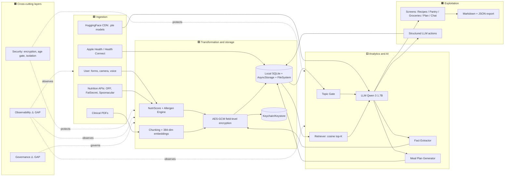

# 01 — Data Lifecycle

**Current state:** the app implements the four canonical phases (Ingestion → Transformation and storage → Analytics and AI → Exploitation) but compresses them all into the device. There is no physical Bronze/Silver/Gold separation and no orchestrated pipeline — the cycle runs synchronously inside the app process.

## 1.1. Ingestion phase

| Current component | Technology | Relevant files | Gaps |
|---|---|---|---|
| Manual onboarding | TextInput + DateOfBirthInput + Switches | `app/onboarding.tsx:289-532` | No strong client-side validation; no parental-age verification |
| Barcode scanner | `expo-camera` CameraView | `app/scanner.tsx:153-159` | EAN/UPC/QR only; no OCR for non-standard labels |
| Product photo | `expo-image-picker` | `app/scanner.tsx:17` | ⚠️ "photograph product" pipeline wires up the camera but lacks vision analysis — UI placeholder |
| Voice | `@react-native-voice/voice` | `package.json:23` | Listed, but only local transcription; no recording |
| Clinical PDFs | `expo-document-picker` + native Swift/Kotlin `expo-pdf-text` | `src/services/profileDocuments.ts:42-67`, `modules/expo-pdf-text/ios/ExpoPdfTextModule.swift` | No OCR for scanned PDFs (text-layer only) |
| Apple Health | `react-native-health` (dynamic require) | `src/modules/health/providers/appleHealth.ts:23-89` | Only reads `Steps` and `ActiveEnergyBurned`; no HR, HRV, or VO2max |
| Health Connect | `react-native-health-connect` (dynamic require) | `src/modules/health/providers/healthConnect.ts:24-103` | Same subset as Apple |
| OpenFoodFacts | `fetch` JSON | `src/services/openFoodFacts.ts:67-88` | No local cache (every scan is online) |
| FatSecret | OAuth2 client_credentials + `fetch` | `src/services/fatsecret.ts:110-145` | Credentials in `EXPO_PUBLIC_*` (risk in [§3.6](./03-security-encryption.md#36-secrets-management-in-the-repo)) |
| Spoonacular | API key + `fetch` with daily quota | `src/services/spoonacular.ts:35-47,150-158` | Same credentials problem |
| `.pte` models (HuggingFace) | `react-native-executorch` + `ExpoResourceFetcher` | `src/services/onDeviceLlm.ts:28,110-118` | No SHA verification before loading |

**Dominant access mode:** passive (forms + occasional scans) + active (batch catalog syncs).
**Dominant ingestion mode:** **batch one-shot** (model download, recipe sync) + **interactive on-demand** (each scan, each chat turn). No streaming.

## 1.2. Transformation and storage phase

| Current component | Technology | Relevant files | Gaps |
|---|---|---|---|
| NutriScore (calculation) | Pure function over `NutritionalInfo` | `src/services/nutriscore.ts` (referenced from scanner and FatSecret) | Simplified algorithm; ⚠️ missing official 2023 Santé Publique France version |
| Allergen detection | Regex/keyword over the EU-14 list | `src/seed/allergen-rules.ts`, `src/modules/profiles/allergenEngine.ts:5-105` | Soft warnings only for hypertension (`allergenEngine.ts:55-69`); missing coverage for celiac, diabetes |
| Field-level encryption | AES-GCM-256, `enc:v1:` prefix | `src/services/encryption.ts:56-75`, `src/modules/profiles/profileStorage.ts:14-37` | Only covers `aboutMeNotes`, `conditions`, `member_memories.text`, `doc_chunks.text` and `doc_chunks.embedding`. Does not cover: `weight`, `height`, `bloodPressure`, `hrv`, `spO2`, `dateOfBirth`, `allergies`. |
| PDF chunking | Sentence-aware splitter | `src/services/profileDocuments.ts:92-118` | No overlap; 80-450 char chunks |
| Embeddings | `react-native-executorch`, ALL_MINILM_L6_V2 | `src/services/embeddings.ts:85-101` | 384-dim, `Float32Array`; no explicit L2 normalization |
| PDF summarization | On-device LLM | `src/services/profileDocuments.ts:72-86` | 500-character cap; prompt forbids PII but no post-hoc validation |
| SQL migrations | Custom runner, idempotent, transactional | `src/db/database.ts:88-145` | No down-migrations, no versioned metadata schema |
| FatSecret token cache | AsyncStorage | `src/services/fatsecret.ts:110-145` | No TTL safety net (only provider expiry) |
| Spoonacular quota cache | AsyncStorage | `src/services/spoonacular.ts:35-43` | Resets by local solar day — not UTC |

## 1.3. Analytics and AI phase

| Current component | Technology | Relevant files | Gaps |
|---|---|---|---|
| Topic Gate | Normalized keyword stems | `src/services/topicGate.ts:128-140` | No semantic classifier; depends on ES/EN stems |
| LLM Qwen 3 1.7B (chat) | `react-native-executorch` LLMModule | `src/services/onDeviceLlm.ts:150-180` | ~32k context but prompt hard-capped at 4,500 chars (`src/services/prompts/system.ts:52`) |
| Token streaming | `activeTokenCallback` callback | `src/services/onDeviceLlm.ts:37,160-163`, `src/modules/ai-engine/AIContext.tsx:283-294` | Per-token strip of `<think>…</think>` |
| Semantic retrieval | Full-scan cosine in JS over `Float32Array` | `src/services/retrieval.ts:7-55` | Brute-force (sufficient for <100 chunks); no HNSW or IVF |
| Re-ranking | Keyword overlap (top-K) | `src/services/retrieval.ts:60-96` | Fallback for inventory and recipes |
| Fact extraction | LLM with structured-JSON prompt | `src/services/factExtractor.ts:75-100` | Single-flight; tolerant to malformed JSON |
| Weekly plan generator | LLM picker + algorithmic fallback | `src/modules/planner/mealPlanGenerator.ts:117-163` | No macros-balance guarantee |
| Structured actions | Regex parse of `<actions>` block | `src/services/aiActions.ts:59-86` | Only `add_favorite` / `remove_favorite` |

## 1.4. Exploitation phase

| Current component | Technology | Relevant files | Gaps |
|---|---|---|---|
| Main tabs | Expo Router | `app/(tabs)/*.tsx`, `app/_layout.tsx:51-81` | — |
| AI chat | Bottom-sheet host | `src/components/layout/AIAssistantHost.tsx:25-53` | Accessible only if `age ≥ 18` |
| Family export | Markdown with hidden JSON block | `src/services/familyExport.ts:36-69` | Export is not encrypted (local plaintext); ⚠️ protection is the user's responsibility |
| Family import | Parse the JSON block | `src/services/familyExport.ts:72-96` | No integrity verification (no signature) |
| AI actions | Apply `add_favorite`/`remove_favorite` | `src/modules/profiles/ProfilesContext.tsx:296-319` | Hallucinated IDs are silently ignored |
| Local notifications | `expo-notifications` | `src/services/aiNotifications.ts:48-54` | Only model downloaded/ready |
| Share / Print | `expo-sharing` | `app/settings.tsx:165-172` | Export only |

## 1.5. Cross-cutting layers

- **Security**: see [§3](./03-security-encryption.md).
- **Monitoring**: see [§7](./07-observability.md). ⚠️ Structural GAP.
- **Governance**: see [§6](./06-data-governance.md). ⚠️ Structural GAP.

**Phase-1 prioritized recommendations:**

1. Document this cycle in `CLAUDE.md` as an architecture contract (future devs must respect local-first).
2. Implement a **nightly on-device batch** to sync FatSecret over Wi-Fi (placeholder exists in `app/_layout.tsx:115-122` but does not respect network state or time of day).
3. Add an **idempotency check** to PDF ingestion (same hash → no re-indexing).
4. Introduce **structured (non-PII) events** in the Analytics → Exploitation cycle to feed [§7](./07-observability.md).
