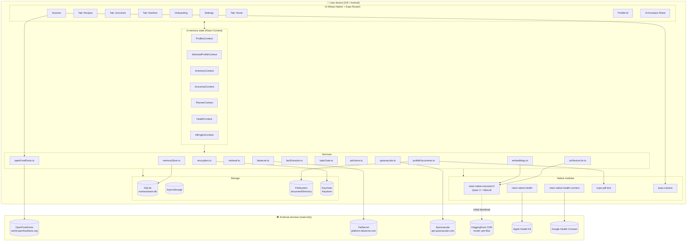
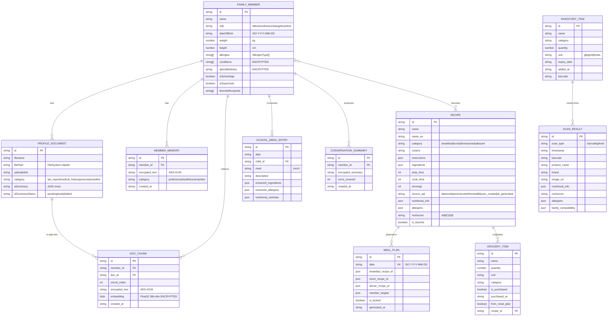

# 02 — Data Model & Architecture

**Current state:** **local-first single-tier** architecture. There is no server tier, no warehouse, no lake. Everything described below runs on the user's device.

## 2.1. Logical architecture diagram (AS-IS)

## 2.2. Data source classification

Unified table by source:

| Source | Access mode | Format | Expected latency | Ingestion mode | Evidence |
|---|---|---|---|---|---|
| User forms (onboarding, profile, pantry) | Active | Structured (TypeScript types) | Immediate (<10 ms) | Real-time | `app/onboarding.tsx:60-75`, `src/types/profiles.ts:50-83` |
| Product photo (camera) | Active | Unstructured (binary JPEG) | Camera latency + OS scan | Real-time | `app/scanner.tsx:153-159` |
| Voice | Active | Audio → transcription | OS speech-recognition latency | Real-time | `package.json:23` (no service that consumes it — ⚠️ placeholder feature) |
| Barcodes EAN/UPC/QR | Passive (decodes what's pointed at) | Semi-structured (string) | <500 ms | Real-time | `app/scanner.tsx:158` |
| OpenFoodFacts | Active (pull) | Semi-structured (JSON) | 200-800 ms | Real-time per scan | `src/services/openFoodFacts.ts:67-88` |
| FatSecret | Active (pull batch) | Semi-structured (JSON, heterogeneous nesting, `toArray` quirk) | 300-1500 ms / 200 ms between calls | Batch (bulk sync) | `src/services/fatsecret.ts:273-321` |
| Spoonacular | Active (pull batch) | Semi-structured (JSON) | 300-1500 ms; quota 10,000/day | Batch (bulk sync) | `src/services/spoonacular.ts:10,196-229` |
| Clinical PDFs | Active (upload) | Unstructured (PDF) → plain text | 1-5 s per document (native extraction) | Real-time on-demand | `src/services/profileDocuments.ts:42-67,72-86` |
| Apple Health | Active (pull) | Native structured (callbacks) | <1 s for the current day | Near real-time | `src/modules/health/providers/appleHealth.ts:65-89` |
| Health Connect | Active (pull) | Native structured (records) | <1 s | Near real-time | `src/modules/health/providers/healthConnect.ts:73-103` |
| Qwen 3 / MiniLM models (HuggingFace) | Active (pull) | Binary `.pte` + JSON tokenizers | ~10 min initial download over Wi-Fi | Batch one-shot | `src/services/onDeviceLlm.ts:110-118` |
| User telemetry | n/a | n/a | n/a | ⚠️ GAP — not collected | — |

## 2.3. Ingestion modes

- **Batch one-shot**: initial download of the LLM and embeddings (`app/_layout.tsx:132-145`). Once in the user's lifetime per model, controlled by the AsyncStorage flag `on_device_model_first_loaded_qwen3_1_7b_q`. Rationale: ~1 GB cannot ship on every launch.
- **Scheduled background batch**: FatSecret sync after login (`app/_layout.tsx:116-122`). Fires without checking Wi-Fi or charging state (⚠️ fix recommendation in [§9](./09-improvement-plan.md)).
- **On-demand batch**: manual source sync from Settings (`app/settings.tsx:91-110`), wipe & re-seed (`app/settings.tsx:131-155`).
- **Real-time (interactive)**: every chat turn, every scan, every user action (pantry CRUD, grocery check-off, etc.).
- **Near real-time**: Apple Health / Health Connect refresh when activating the provider or on `HealthContext.refresh()` (`src/modules/health/HealthContext.tsx:39-55`).
- **Streaming**: ⚠️ does not apply to the current state (no Kafka/Pub-Sub-style ingestion pipelines).

## 2.4. Storage models

| Type | In use? | Where | Justification |
|---|---|---|---|
| Relational (SQL) | ✅ | Local SQLite (`nutriassistant.db`), 12 migrations | Domain data with relations (recipes ↔ plans, scans ↔ inventory) and range queries (`meal_plans WHERE date BETWEEN`). See `src/db/migrations/001_initial.ts`, `src/modules/planner/plannerDB.ts:67-72` |
| NoSQL key-value | ✅ | AsyncStorage + Keychain | Flags, tokens, non-relational config, master key. See `src/modules/profiles/profileStorage.ts:5-8` |
| NoSQL document | 🟡 | Profiles as **serialized JSON** in AsyncStorage under `family_profiles` | It is JSON, but monolithic (not a doc store). Cost: full invalidation on edit; benefit: simple field-level encryption |
| NoSQL columnar | 🔴 | Not applicable | — |
| NoSQL graph | 🔴 | Not applicable | Relations exist (profile ↔ allergens ↔ recipes) but are modeled as flat tables with logical FKs |
| Vector store | 🟡 | `doc_chunks.embedding` encrypted BLOB in SQLite | Table with a BLOB column of 384 floats (1,536 raw bytes). Full-scan cosine search — no index. Rationale: a few hundred chunks per family, no HNSW needed |
| Data Lake | 🔴 | Not applicable | — |
| Data Warehouse | 🔴 | Not applicable | — |

## 2.5. Layered (medallion) architecture — logical proposal

Although the prototype is monolithic, we can map its elements onto the medallion model to prepare the TO-BE ([§8.1](./08-production-readiness.md#81-target-architecture-to-be)).

| Layer | Meaning | Equivalent in NutrIAssistant AS-IS | TO-BE proposal |
|---|---|---|---|
| **Bronze (raw)** | Untouched raw data | OFF/FatSecret/Spoonacular JSON responses in RAM, raw text extracted from PDFs in `rawText` (`src/services/profileDocuments.ts:74`), raw LLM outputs before stripping | S3/GCS bucket, append-only, jsonl per provider + raw_pdf_text per document. 30-day retention. |
| **Silver (standardized)** | Clean, typed, deduplicated | Output of `mapNutriments`, `mapNutrition`, `parseInstructions`, computed NutriScore, normalized allergens (`src/services/openFoodFacts.ts:34-48`, `src/services/spoonacular.ts:134-146`) | Tables `silver.recipes`, `silver.products`, `silver.health_signals` in Postgres + dbt tests |
| **Gold Unified** | Business model ready to serve | On-device SQLite tables (`recipes`, `inventory_items`, `meal_plans`, …) | Postgres with the same shape + per-device edge replication |
| **Gold Analytics (OLAP)** | Aggregations for insights | ⚠️ GAP in AS-IS | Snowflake/BigQuery with cubes `family_demographics`, `recipe_popularity`, `allergen_distribution` |

## 2.6. Entity-relationship model

## 2.7. Processing-architecture pattern

| Pattern | Applies to AS-IS? | TO-BE recommendation |
|---|---|---|
| **Lambda** (batch + speed + serving layer) | 🔴 Does not apply: no pipelines | Unnecessarily complex for NutrIAssistant. Would only apply if we add aggregated B2B analytics ([§8.8](./08-production-readiness.md#88-business-model-and-data-monetization)) |
| **Kappa** (streaming-only, replay from commit log) | 🔴 Does not apply | Reasonable if we add in-app events (meal consumption, grocery check-off) → CDC via Kafka/Pulsar. But this case does not yet exist |
| **Data Mesh** (domains + data-as-product) | 🔴 Does not apply to the prototype | **Recommendation**: when the team and the product grow, split into domains `Profiles`, `Catalogue` (recipes/products), `AI` (models/embeddings), `Engagement` (telemetry). Each with its steward and SLAs |

**Concrete architectural recommendation (justified for this app):**

> For a **local-first** mobile app handling health data, the target pattern is neither Lambda nor Kappa, but **Edge-Compute / On-Device Inference + a tightly scoped BFF**. This is consistent with the already-implemented `local-first` design and lets us add aggregated telemetry and compliance without breaking the privacy contract. Only when monetization moves to B2B2C ([§8.8](./08-production-readiness.md#88-business-model-and-data-monetization)) does an OLAP warehouse enter the picture, and even then a minimal Lambda pattern suffices (nightly batch + streaming of aggregated events from the BFF).

## 2.8. Versioning and migrations

| Attribute | Current implementation | Evidence | Gap |
|---|---|---|---|
| Versioned schema | `migrations(name UNIQUE, run_at)` table | `src/db/database.ts:91-97` | — |
| Forward-only | Yes, no down-migrations | `src/db/database.ts:25-27` (comment) | Acceptable on mobile; not useful for cloud TO-BE environments |
| Idempotency | Mandatory (`CREATE TABLE IF NOT EXISTS`, `tolerateDuplicate`, fn migrations with checks) | `src/db/database.ts:29-46,118-145` | Coverage: migrations 001-012 |
| Atomicity | `sql` wrapped in `withTransactionAsync`; `fn` migrations (008) manage PRAGMA manually | `src/db/database.ts:130-137,121-125` | — |
| Client-type migration | `migrateProfile` translates legacy fields (`age → dateOfBirth`) | `src/modules/profiles/ProfilesContext.tsx:43-50` | — |
| Failure tolerance | Recovery from a corrupted `migrations` table | `src/db/database.ts:99-115` | "Safe today only because every migration is idempotent" — fragile invariant |
| AI model versioning | AsyncStorage flag with model suffix (`on_device_model_first_loaded_qwen3_1_7b_q`) | `src/services/onDeviceLlm.ts:47` | Explicit cleanup of prior-model artifacts (`cleanupLegacyArtifacts`, `src/services/onDeviceLlm.ts:59-88`) |
| Prompt versioning | Inline in code (`/no_think`, hard-coded prompts) | `src/services/prompts/system.ts:240-256` | ⚠️ No "prompt registry"; any change requires a release |

## 2.9. Table & PII catalog

Legend: **PII** (personal data) / **Art. 9** (special categories: health, religion when it infers diet/restriction, etc.) / **Proposed retention**.

| Table / Field | Origin | Purpose | PII | Art. 9 | Current encryption | Proposed retention |
|---|---|---|---|---|---|---|
| `family_profiles` (AsyncStorage JSON) — `name`, `role` | Onboarding | Local family identification | Yes | No | ⚠️ Not encrypted | Until user deletes |
| `family_profiles.dateOfBirth` | Onboarding | Compute age, AI gate | Yes | No | ⚠️ Not encrypted | Same |
| `family_profiles.weight`, `height` | Onboarding | Calories and macros | Yes | **Yes (Art. 9 — health)** | ⚠️ Not encrypted | Same |
| `family_profiles.allergies[]` | Onboarding | Meal compatibility | Yes | **Yes (Art. 9)** | ⚠️ Not encrypted | Same |
| `family_profiles.conditions[]` | Onboarding | AI directives, warnings | Yes | **Yes (Art. 9)** | ✅ AES-GCM | Same |
| `family_profiles.aboutMeNotes` | Free-form profile | AI personalization | Yes | Possibly Art. 9 | ✅ AES-GCM | Same |
| `family_profiles.documents[]` (metadata) | PDFs | Document catalog | Yes | Possibly | ⚠️ Not encrypted (metadata) | Until deleted |
| Physical PDF file | User upload | Clinical document | Yes | **Yes (Art. 9)** | ⚠️ Plaintext in FileSystem | Until deleted |
| `inventory_items.*` | Scanner / manual | Pantry | Not directly | No | No | 365 d from `added_at` |
| `recipes.*` | External APIs + LLM | Catalog | No (reflects third parties) | No | No | No functional expiration |
| `meal_plans.*` | LLM + manual | Weekly plan | Linked to profile | No | No | 90-day rolling |
| `school_menu_entries.*` | School-PDF upload | School menu | Yes (child_id) | No | No (menu text) | 365 d |
| `scan_history.*` | Scans | Scan traceability | Linked | No | No | 180 d |
| `grocery_items.*` | Plan + manual | Grocery list | Not directly | No | No | Clear when all checked |
| `member_memories.encrypted_text` | LLM (fact extractor) | Personalized memory | Yes | **Yes (Art. 9)** | ✅ AES-GCM | Delete by member |
| `doc_chunks.encrypted_text` | Processed PDFs | RAG | Yes | **Yes (Art. 9)** | ✅ AES-GCM | Deleted when doc deleted |
| `doc_chunks.embedding` | Embeddings | RAG | **Yes (can invert content)** | **Yes** | ✅ AES-GCM | Same |
| `conversation_summaries.encrypted_summary` | LLM (pending process) | Long-term memory | Yes | **Yes** | ✅ AES-GCM | 30 d |
| Avatars | Picker | UI personalization | Yes | No | No (FileSystem) | Until deleted |
| FatSecret tokens (AsyncStorage `fs_token`) | OAuth | Third-party auth | Technical credential | No | No | Until expiration (`expires_in`) |
| Cached `.pte` model | HuggingFace CDN | Inference | No | No | No | Permanent (cleanup on model change) |

**Prioritized recommendations:**

1. **Encrypt every PII field in `family_profiles`** (not just `conditions` and `aboutMeNotes`). In particular `weight`, `height`, `dateOfBirth`, `bloodPressure`, `hrv`, `spO2`, `allergies`.
2. **Encrypt PDFs in FileSystem** (AES wrapper over the bytes; decrypt in memory before `extractPdfText`).
3. **Implement automatic retention** in SQLite for `scan_history`, `meal_plans`, and `conversation_summaries` (idempotent boot job that deletes rows past the limit).
4. **Move the schema to Zod or Valibot** for runtime client validation and auto-generated documentation (governance in [§6](./06-data-governance.md)).
5. **Version prompts** in `src/services/prompts/` with `VERSION = 'v2025-05-13'` and surface them through a logical registry (preparation for future A/B testing).
