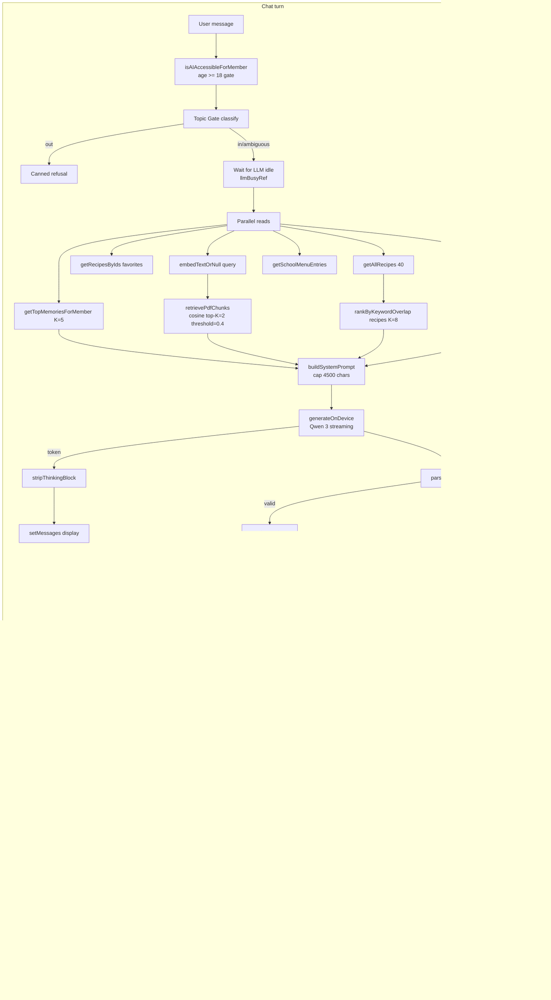
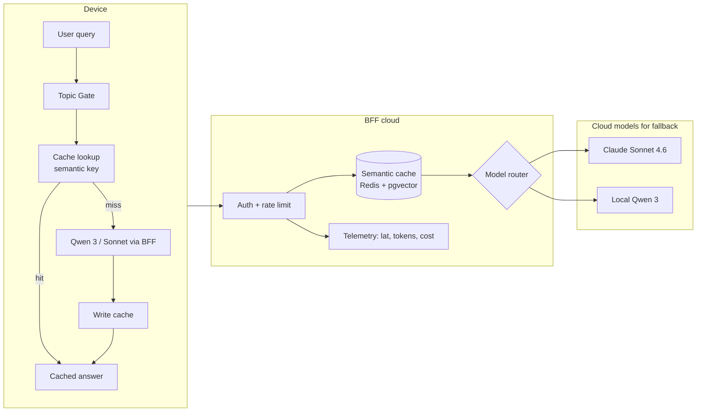
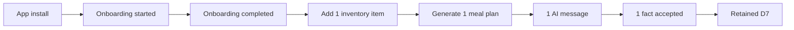

# 04 — AI Architecture & Engagement

**Current state:** the product's AI runs **entirely on-device** (Qwen 3 1.7B Quantized + all-MiniLM-L6-v2). No cloud provider is called for inference (`grep -r "openai\|anthropic\|huggingface.inference" src/` returns nothing). The system is composed of six layers: topic gate, RAG over clinical PDFs, prompt builder, LLM generation, action parser, fact extractor. Weekly plan generation uses the LLM with an algorithmic fallback. The whole pipeline was designed for privacy (data never leaves the phone) and for latency/cost (zero inference cost, ~2-5 s per turn on modern hardware).

**Model artifact delivery:** the `.pte` weights (~1.2 GB) and tokenizer JSONs are served by our Cloudflare Worker BFF (`/v1/llm/qwen3-1.7b/{model.pte,tokenizer.json,tokenizer_config.json}`) backed by R2. They were previously pulled directly from the HuggingFace CDN; mirroring through R2 gives us a stable POP near EU users (e.g. Madrid), control over availability during HF outages, and immutable 1-year edge cache. Inference itself is **still 100% on-device** — the BFF only hosts the static artifacts.

## 4.1. AI capability inventory

| Capability | Input | Output | Model | Version / params | Expected latency | Cost per inference | Evidence |
|---|---|---|---|---|---|---|---|
| Nutrition conversational chat | User prompt + system prompt builder | Streaming text + optional `<actions>` block | Qwen 3 1.7B Quantized (executorch `.pte`) | ~1 GB, 8-bit quant, ~32k native context | 2-5 s first token / 30-60 t/s after | **€0** (on-device) | `src/services/onDeviceLlm.ts:24,150-180`, `src/modules/ai-engine/AIContext.tsx:282-294` |
| Semantic embeddings for RAG | Chunk / query text | 384-dim Float32Array | ALL_MINILM_L6_V2 | ~28 MB | <500 ms per chunk | €0 | `src/services/embeddings.ts:20-22,84-101` |
| Medical-PDF summarization | PDF text (8,000 chars cap) | ≤500 chars in natural language | Qwen 3 | same | 5-15 s | €0 | `src/services/profileDocuments.ts:72-86` |
| Weekly recipe selector | Numbered list of 14 candidates | 7 CSV indices | Qwen 3 | same | 3-10 s per category | €0 | `src/modules/planner/mealPlanGenerator.ts:91-115,140-163` |
| Durable-fact extractor | Turn (user+assistant, 600-char cap each) | JSON `{facts:[{text,category}]}` | Qwen 3 with `/no_think` | same | 2-4 s in background | €0 | `src/services/factExtractor.ts:75-100` |
| Topic classifier (pre-LLM) | User query | `'in'|'out'|'ambiguous'` | EN+ES keyword stems | — | <1 ms | €0 | `src/services/topicGate.ts:128-140` |
| Allergen detection (heuristic) | Ingredient list | Subset of EU-14 | Regex/keyword over `ALLERGEN_KEYWORDS` | — | <10 ms per recipe | €0 | `src/modules/profiles/allergenEngine.ts:93-105`, `src/services/themealdb.ts:96-110` |
| NutriScore | NutritionalInfo | `A|B|C|D|E` | Pure function | — | <1 ms | €0 | `src/services/nutriscore.ts` (referenced, not opened) |
| Family compatibility check | Recipe + members | `Record<memberId, CompatibilityResult>` | Pure function + cross-reactivity rules | — | <50 ms per recipe | €0 | `src/modules/profiles/allergenEngine.ts:79-91`, `src/seed/allergen-rules.ts` |
| School-menu extraction (defined prompt) | School PDF | JSON array of entries | Qwen 3 (indirect via prompt) | `SCHOOL_MENU_EXTRACTION_PROMPT` | — | €0 | `src/services/prompts/schoolMenuExtraction.ts:1-15` |
| Food recognition from photo | Pantry photo | NutritionalInfo + name | ⚠️ GAP — UI placeholder; no vision model integrated | — | — | — | `app/scanner.tsx:184-193` ("photo" mode in UI) |
| Waste prediction | `expiryDate` + `quantity` | Alert | ⚠️ GAP — only `lowStockThreshold` in the type; no engine | — | — | — | `src/types/inventory.ts:18` |
| Voice conversation | Audio | Text | ⚠️ GAP — `@react-native-voice/voice` installed but not wired into chat | — | — | — | `package.json:23` |

## 4.2. AI pipeline (AS-IS and TO-BE)

### AS-IS



### TO-BE (recommended for production)



## 4.3. MLOps

| Aspect | State | Evidence | Recommendation |
|---|---|---|---|
| Model versioning | 🟡 Implicit — model-version suffix in the AsyncStorage flag (`_qwen3_1_7b_q_bff`, bumped on each CDN/model migration) | `src/services/onDeviceLlm.ts:47` | Persist a dict `{name, sha256, source_url, downloaded_at}` |
| Registry | 🔴 GAP | — | MLflow / Weights & Biases / minimal in-house in the BFF |
| Model CI/CD | 🟡 Partial — artifacts mirrored to R2 (`nutriassistant-llm-models`) via the BFF; SHA256 verified against HuggingFace upstream during upload (runbook in `infra/bff/README.md#mirroring-the-on-device-llm`); no automated workflow yet | `infra/bff/src/routes/llm.ts`, `infra/bff/README.md` | Wrap the `wrangler r2 object put` step in a GitHub Action that pins to a tagged HF release |
| Drift monitoring (data drift) | 🔴 GAP | — | With BFF and cache, compare query distribution week-over-week |
| Concept-drift monitoring | 🔴 GAP | — | Validation against a gold nutrition Q&A set |
| Retraining | 🔴 Not applicable — Qwen is a frozen model | — | — |
| Prompt A/B testing | 🔴 GAP | — | Feature flag `PROMPT_VERSION = 'v1'|'v2'` with experiment ID |
| Pre-release evaluation | 🔴 GAP — no golden set, no RAGAS | `src/__tests__/services/prompts/system.test.ts` tests the prompt's structure, not its responses | 50-100 validated medical-nutrition Q&A + human evaluation on every prompt release |
| Latency / tokens / cost | 🔴 GAP — not measured | — | Telemetry in the BFF; on-device timer + structured log |

## 4.4. Edge vs Cloud inference

| Decision | Current implementation | Justification documented in code | Tradeoff |
|---|---|---|---|
| **Edge LLM inference (on-device)** | Yes, **only option** | `src/services/onDeviceLlm.ts:7-9` "Required at runtime. In Expo Go we surface via getLLMStatus rather than falling back to any cloud service" | ✅ Maximum privacy (data never leaves the phone) ⚠️ Caps model capability (1.7B vs state-of-the-art ~70B+) ⚠️ Hardware-dependent latency ⚠️ ~1 GB initial download cost |
| **Edge embeddings** | Yes (MiniLM 384-dim) | `src/services/embeddings.ts:19-22` | ✅ Privacy ✅ Latency <500 ms ⚠️ Quality below OpenAI text-embedding-3-large (3,072-dim) |
| **No cloud fallback** | Firm policy | `src/services/onDeviceLlm.ts:7-9` | ✅ Trivial compliance ⚠️ Broken UX on older devices where Qwen 3 cannot load |
| **Inference for product scans** | Heuristics + catalog APIs (no vision AI) | `src/services/openFoodFacts.ts`, `src/modules/profiles/allergenEngine.ts:93-105` | ✅ Zero cost ⚠️ Only recognizes barcoded products |

**Recommendation**: for launch, **keep the on-device policy for all conversational features** (a competitive and marketing differentiator). Consider **cloud opt-in** for targeted premium tasks in a Pro tier: complex generative planning, deep analysis of long PDFs (>50 pages), food image recognition. Document in the privacy policy that opt-in means sending data to a European provider (Mistral, Aleph Alpha) and require granular consent.

## 4.5. RAG architecture

| Component | Implementation | Evidence |
|---|---|---|
| Knowledge sources | (i) Text of user-uploaded PDFs (medical recipe books, clinical reports) (ii) Auto-extracted durable memories (iii) `aboutMeNotes` of the active profile (iv) Recipe + pantry + plan + school menu (context without semantic RAG, injected directly into the prompt) | `src/modules/ai-engine/AIContext.tsx:218-278` |
| Vector store | SQLite table `doc_chunks` with an encrypted `embedding BLOB` | `src/db/migrations/011_memory_layer.ts:16-26`, `src/services/memoryStore.ts:114-167` |
| Embedding model | ALL_MINILM_L6_V2 (384-dim) | `src/services/embeddings.ts:19-22,33` |
| Chunking strategy | Sentence-aware splitter, target 450 chars, minimum 80 | `src/services/profileDocuments.ts:92-118` |
| Overlap | ❌ No overlap between consecutive chunks | `src/services/profileDocuments.ts:100-117` |
| Retrieval | Full-scan cosine; top-K=2; threshold 0.4 | `src/services/retrieval.ts:31-55`, `src/modules/ai-engine/AIContext.tsx:47,256-263` |
| Re-ranking | ❌ No dedicated re-ranker (cross-encoder). There is a `rankByKeywordOverlap` for pantry/recipes | `src/services/retrieval.ts:60-96` |
| Source citation | ✅ PDF filename injected into the context: `- [filename.pdf] <text>` | `src/services/prompts/system.ts:230-235` |
| Pantry / recipes / memories top-K | 10/8/5 respectively | `src/modules/ai-engine/AIContext.tsx:44-46` |

### Example of a complete prompt (extract, Spanish, ES_LOCALE)

```
/no_think
SCOPE: you answer questions about nutrition, food, health, meals, recipes, menu planning and groceries. If a question is clearly off-topic (programming, politics, sports, entertainment, etc.), decline briefly and redirect to scope. For anything else, answer in detail.

You are NutriBot, a family nutrition assistant. Today is 2026-05-13. Always reply in Spanish (Spain), friendly and concise.

PROFILE:
- id=member-xxx; Carlos (father, 41y); allergies=gluten; conditions=celiac; kcal=2100
  Favorites: Seafood paella, Mushroom risotto

ACTIVE USER: Carlos (id=member-xxx). Prioritize his allergies/conditions/calories. Address him in the second person.

ABOUT ME (user notes): I train 3 times a week, prefer light dinners

MEMORIES: · Does not like cucumber · Likes legumes

RELEVANT MEDICAL DOCUMENTS:
- [analisis_2025.pdf] low vitamin D (16 ng/mL); LDL cholesterol slightly elevated; Mediterranean diet and supplementation advised

PANTRY: tomato (3 units), brown rice (1 kg), chickpeas (400 g)

THIS WEEK'S PLAN:
2026-05-13: oats with banana / seafood paella / -
2026-05-14: greek yogurt / quinoa salad / vegetable soup

AVAILABLE RECIPES: id=em-a1b2c3 "Stewed lentils"; id=em-d4e5f6 "Baked salmon with vegetables"

GUIDELINES:
- ALWAYS check allergens and conditions before suggesting anything; when in doubt, flag a WARNING.
- Carlos (celiac): completely avoid gluten (wheat, barley, rye)
- Mediterranean base; vary proteins across the week.
- Concrete responses, based on the available pantry.
- If ingredients are missing, suggest what to buy.

ACTIONS: When the user explicitly asks you to add or remove a recipe from favorites, end your response with ONE <actions>JSON</actions> block [...]
```

**Hard cap of 4,500 chars** enforced by `src/services/prompts/system.ts:261-263`. Truncated from the tail → preserves the topic guardrail and active-member info (the most important pieces for correctness).

**Topic guardrail rewrite (2026-05):** the guardrail used to be a "respond EXACTLY: …" instruction with a verbatim few-shot example (User/Assistant pair). Qwen 3 1.7B over-applied that pattern and fired the refusal on clearly on-topic queries like *"recommend me a recipe"*. The current `TOPIC_GUARDRAIL_ES/EN` (`src/services/prompts/system.ts:83-93`) is a short directive with no literal example; "recipes" and "menu planning" are stated explicitly as in-scope. The hard pre-LLM topic gate (`src/services/topicGate.ts`) remains the real refusal filter. Companion mitigation: `buildPromptWithHistory` (`src/modules/ai-engine/AIContext.tsx`) now drops assistant turns starting with `Soy NutriBot` / `I'm NutriBot` from the rolled history before feeding it back to the model — otherwise a prior refusal poisoned the context and triggered a refusal loop.

## 4.6. AI Governance

Mapped to the **DAMA wheel**:

| DAMA aspect | NutrIAssistant AS-IS | Evidence | TO-BE recommendation |
|---|---|---|---|
| **Traceability of which data backed a recommendation** | 🟡 Partial — the prompt is deterministic and built by `buildSystemPrompt`, but the per-turn prompt snapshot is not persisted | `src/services/prompts/system.ts:163-264` | Persist hash + length + active sections in an encrypted `ai_turns_audit` table |
| **Mechanisms against hallucination** | 🟡 In place: tolerant parser (`tryParseActionList`), `memberId`/`recipeId` validation (`applyAIActions` ignores unknown IDs), `/no_think` directive, `stripThinkingBlock`, prompt hard cap | `src/services/aiActions.ts:36-57`, `src/modules/profiles/ProfilesContext.tsx:296-319` | Add post-checks: if the response mentions an allergen the user has listed, flag a warning |
| **Bias monitoring (diets, cultures, restrictions)** | 🔴 GAP — not measured. The Spoonacular catalog has 20 predefined cuisines (`src/services/spoonacular.ts`), biasing toward Western/Mediterranean | `src/services/edamam.ts` (Mediterranean explicitly biased via `cuisineType=mediterranean,italian,french,middle eastern`) | Define a balanced golden set across religious restrictions (halal, kosher), cultures, and dietary restrictions |
| **Model documentation (Model Cards)** | 🔴 GAP — no Model Card | — | Publish a Model Card for "Qwen 3 1.7B Quantized as deployed in NutrIAssistant", citing origin, known metrics (HF), limitations |
| **GDPR Art. 22 compliance** | 🟡 Partial — the LLM produces **suggestions** (not automated decisions that significantly affect the person). Actions (`add_favorite`) are cosmetic | `src/services/aiActions.ts:7-9` | Add explicit chat banner: *"Responses are guidance, not medical advice. Consult a healthcare professional."* + fact-extractor opt-out + global chat opt-out |
| **AI usage and limitations notice** | 🔴 GAP — no UI disclaimer | Search in `src/components/layout/AIAssistant.tsx` (not inspected in detail) | Add fixed copy at the top of the chat and in onboarding |
| **Human review** | 🟡 Implicit — pending facts require explicit user confirmation before persisting | `src/modules/ai-engine/AIContext.tsx:346-353,99-123` | Document this pattern as an ADR ([§10.4](./10-appendices.md#104-architectural-decision-records-adrs)) and keep it |
| **Explicit consent** | 🔴 GAP — chat is gated by age (≥18), not by Art. 9.2.a consent | `src/modules/ai-engine/aiAccess.ts:13-22` | Granular consent screen: (i) AI chat, (ii) personalization with notes, (iii) automatic fact extraction, (iv) clinical-PDF processing |

## 4.7. Engagement model

### In-app events that could already be instrumented (proposed taxonomy)

⚠️ Nothing below is measured today. This is the proposed taxonomy, anchored at the code points where each event could be emitted:

| Event | When | Suggested properties | Emission point |
|---|---|---|---|
| `onboarding_started` | `welcome` render | timestamp | `app/onboarding.tsx:199-222` |
| `onboarding_member_added` | step `memberDone` | step_index, member_count | `app/onboarding.tsx:144-150` |
| `onboarding_completed` | after `completeOnboarding` | members_count, has_school_age | `app/onboarding.tsx:614-619` |
| `inventory_item_added` | `addItem` | category, has_barcode | `src/modules/inventory/inventoryDB.ts` |
| `recipe_viewed` | tap on a recipe | source_api, cuisine, category | `app/recipe/[id].tsx` |
| `recipe_favorited` | toggle favorite | source_api, by_ai (true if from `<actions>`) | `src/modules/profiles/ProfilesContext.tsx:243-262` |
| `scan_success` | after `getProductByBarcode` ok | category, nutriscore | `app/scanner.tsx:71-103` |
| `meal_plan_generated` | after `selectWeekRecipes` | method ('llm'/'algorithmic'), elapsed_ms | `src/modules/planner/mealPlanGenerator.ts:140-163` |
| `ai_message_sent` | `sendMessage` | char_count, has_image | `src/modules/ai-engine/AIContext.tsx:125` |
| `ai_message_refused_topic` | `out` gate | reason='topic' | `src/modules/ai-engine/AIContext.tsx:146-159` |
| `ai_fact_accepted` | `acceptPendingFact` | category | `src/modules/ai-engine/AIContext.tsx:346-353` |
| `pdf_document_uploaded` | `pickAndCopyDocument` | category, page_count | `src/services/profileDocuments.ts:42-67` |
| `pdf_indexed` | `indexDocumentForRetrieval` | chunks_inserted | `src/services/profileDocuments.ts:124-148` |
| `health_provider_activated` | `activateProvider` | provider_id | `src/modules/health/HealthContext.tsx:58-71` |
| `family_exported` | `exportFamilyToMarkdown` | members_count | `src/services/familyExport.ts:36-69` |

### Adoption funnel (expected)



### Retention loops

- **Weekly plan**: the plan expires every 7 days → natural reason to return.
- **Local notifications**: model-ready alert (`notifyModelReady`, `src/services/aiNotifications.ts:52-54`) serves as post-install re-engagement. ⚠️ Missing a nutrition notifications loop (inventory expiration, "lentils today").
- **Cumulative memories**: every conversation adds context → the AI becomes more personalized over time → switching cost.
- **Gamification**: ⚠️ GAP — no points, streaks, badges.
- **Shared family**: ⚠️ GAP — no sync across devices (each device is an island).

### Segmentation

- **Families** (≥3 members with ≥1 child): focus on school menu + bulk planning.
- **Single** (1 member): focus on individual recipes + scanning.
- **Couple** (2 adult members): focus on balanced planning.
- ⚠️ This segmentation is implicit in code (not persisted; deduced from `profiles.length` and `isSchoolAge`).

### Privacy-respecting AI personalization

| Data feeding personalization | Where it is processed | Leaves the device |
|---|---|---|
| `aboutMeNotes` | RAM + encrypted AsyncStorage | ❌ Never |
| `member_memories` | RAM + encrypted SQLite | ❌ Never |
| `conditions` | RAM + encrypted | ❌ Never |
| `allergies` | RAM | ❌ Never |
| PDF embeddings | RAM + encrypted SQLite | ❌ Never |
| `dailyCalorieTarget`, `macroTargets` | RAM | ❌ Never |
| Any user query | RAM + local LLM | ❌ Never |

**Conclusion**: NutrIAssistant has **the best achievable privacy profile** for a personalized AI nutrition assistant. This must be a marketing pillar.

### Engagement KPIs (proposed)

| KPI | Definition | MVP threshold | Mature threshold |
|---|---|---|---|
| DAU/MAU | Unique active users day/month | 15% | 25% |
| Retention D1 | % users who return the next day | 40% | 55% |
| Retention D7 | Same, 7 days | 25% | 40% |
| Retention D30 | Same, 30 days | 12% | 25% |
| Churn 90d | % of new users who leave within 90 days | <60% | <40% |
| In-app NPS | Survey after D14 | >40 | >60 |
| Meal plans/user/week | Mean | 0.5 | 1.5 |
| AI messages/user/week | Mean | 2 | 8 |
| Time-to-first-meaningful-action | Minutes from install to first plan | <15 min | <8 min |

**Prioritized recommendations:**

1. **Instrument the proposed taxonomy** with non-PII events (no message text, no names). PostHog self-hosted EU or Plausible for the web demo, Aptabase for mobile, are EU-friendly privacy-compatible options.
2. **Medical disclaimer** persistent in chat + onboarding ("guidance, not medical advice").
3. **Granular consent** across 4 independent toggles: AI chat, Memories, PDF analysis, School-menu analysis.
4. **Opt-in smart notifications**: inventory expiration, today's meal reminder. Use `expo-notifications`, already installed.
5. **Build a Model Card and publish it** at `/docs/MODEL_CARD.md` (limitations, known biases, evaluation).
