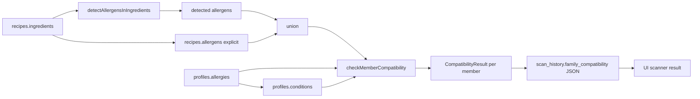
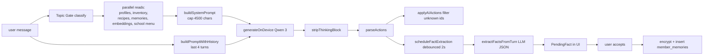
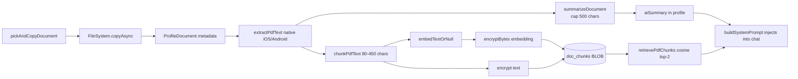
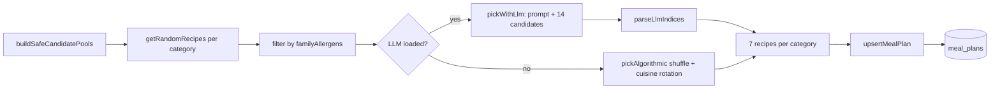

# 06 — Data Governance

**Current state:** the app implements, without naming them, several governance mechanisms (closed catalogs, domain validation, category-based encryption). There is no formal documentation or assigned roles. This section defines the **lightweight but real** governance that must accompany the product from day 1, mapped to the DAMA wheel.

## 6.1. Business glossary

| Term | Operational definition | Canonical implementation |
|---|---|---|
| **Family member** | Person registered on a NutrIAssistant device, identified by a client-generated internal UUID | `FamilyMember` in `src/types/profiles.ts:50-83` |
| **Super-user** | Member with administrative privileges: add/remove other members, edit other members' profiles, wipe, export/import | `FamilyMember.isSuperUser` (`src/types/profiles.ts:80`) |
| **AI age** | Minimum age (18) required to access the AI chat on this device | `ADULT_AGE = 18` (`src/modules/ai-engine/aiAccess.ts:13`) |
| **Allergen (EU-14)** | One of the 14 allergens that must be declared in the EU under Regulation (EU) 1169/2011 | `src/seed/allergen-rules.ts` constant `EU_14_ALLERGENS` |
| **Dietary preference** | Dietary pattern chosen by the member (none, mediterranean, vegetarian, vegan, pescatarian, keto) | `DietPreference` (`src/types/profiles.ts:8-9`) |
| **Health condition** | Chronic pathological state that affects the diet; closed catalog of 8 values | `CONDITION_GUIDANCE` (`src/services/prompts/system.ts:17-26`) |
| **NutriScore** | A-E label summarizing the nutritional quality of a food per the French Public-Health Authority's algorithm | `NutriScore` (`src/types/nutrition.ts:18`) |
| **Pantry (inventory)** | Set of physical products at home, with optional quantity and expiration | `InventoryItem` (`src/types/inventory.ts:8-20`) |
| **Recipe** | Reproducible set of ingredients + instructions + nutrition + category + cuisine | `Recipe` (`src/types/recipes.ts:23-48`) |
| **Meal plan** | Day → recipes assignment (breakfast/lunch/dinner) + per-member nutritional targets | `MealPlan` (`src/types/planner.ts:13-22`) |
| **Grocery list** | List of items pending purchase, possibly originating from the meal plan | `GroceryItem` (`src/types/groceries.ts:4-16`) |
| **Durable memory** | A factual, long-lived fact about a member, extracted by the assistant with user confirmation | `MemberMemory` (`src/services/memoryStore.ts:13-19`) |
| **Medical document** | Clinical PDF (report, lab, prescription) associated with a member | `ProfileDocument` (`src/types/profiles.ts:39-48`) |
| **Document chunk** | A text fragment of a PDF (~450 chars) with its 384-dim embedding, encrypted in SQLite | `DocChunkRow` (`src/services/memoryStore.ts:21-29`) |
| **Family compatibility** | Per-member outcome of evaluating a recipe/scan against their allergies and conditions | `CompatibilityResult` (`src/types/recipes.ts:5-11`) |
| **Family Nutrition Score** ⚠️ proposed | Aggregate metric (macros-target compliance + allergen presence) of the plan vs the family profile | Not implemented |

## 6.2. Data lineage (5 critical data points)

### 1. Daily steps (Health)

Evidence: `src/modules/health/providers/appleHealth.ts:65-89`, `src/modules/health/HealthContext.tsx:39-55`. Not persisted in SQLite. Refreshed on demand. ⚠️ The energy calculation is not logged.

### 2. Family compatibility of a recipe

Evidence: `src/modules/profiles/allergenEngine.ts:11-91`, `app/scanner.tsx:78-100`.

### 3. AI chat response

Evidence: `src/modules/ai-engine/AIContext.tsx:125-338`, `src/services/factExtractor.ts`, `src/services/memoryStore.ts`.

### 4. Clinical PDF → chat memory

Evidence: `src/services/profileDocuments.ts:42-148`, `src/services/memoryStore.ts:114-167`.

### 5. Weekly plan

Evidence: `src/modules/planner/mealPlanGenerator.ts:29-163`, `src/modules/planner/plannerDB.ts:30-51`.

## 6.3. Master & reference data

| Data | Type | Source | Maintainer | Versioning |
|---|---|---|---|---|
| EU-14 allergen catalog | Master | `src/seed/allergen-rules.ts` | Product team | In code (commit) |
| Health-condition catalog | Master | `CONDITIONS_LIST` in `app/settings.tsx:50` + `CONDITION_GUIDANCE` in `src/services/prompts/system.ts:17-26` | Product team | In code. ⚠️ Two sources; potential divergence |
| Family-role catalog | Master | `MemberRole` (`src/types/profiles.ts:1`) | Product team | In code |
| Quantity-unit catalog | Master | `QuantityUnit` (`src/types/inventory.ts:6`) | Product team | In code |
| Cuisine-with-flag catalog | Reference | `AREA_FLAGS` (`src/services/themealdb.ts:51-80`), `SPOONACULAR_CUISINE_QUERIES` (`src/services/spoonacular.ts:105-126`), `MEDITERRANEAN_QUERIES` (`src/services/fatsecret.ts:22-38`) | Product team | In code. **⚠️ Three parallel lists** — divergence risk |
| Retailers catalog (future) | Master | `RETAILERS` in `src/constants/retailers.ts:10-17` | Product team | In code |
| Recipe-category mapping catalog | Reference | `RECIPE_TYPE_TO_CATEGORY` (FatSecret, `src/services/fatsecret.ts:42-47`), `DISH_TYPE_TO_CATEGORY` (Spoonacular, `src/services/spoonacular.ts:85-93`), `CATEGORY_MAP` (TheMealDB, `src/services/themealdb.ts:8-13`) | Product team | In code |
| Allergen-keyword catalog | Reference | `ALLERGEN_KEYWORDS` in `src/seed/allergen-rules.ts` (not opened) and `ALLERGEN_PATTERNS` in `src/services/themealdb.ts:84-94` | Product team | In code. ⚠️ Two distinct engines |
| Nutritional-equivalence table | Reference | `CATEGORY_NUTRITION` in `src/services/themealdb.ts:16-31` (heuristic to substitute missing data) | Product team | In code. ⚠️ Estimated values, not from an official source |
| Languages | Reference | `src/i18n/en.ts`, `src/i18n/es.ts` | Product team | In code |

**Recommendation**: consolidate catalogs into a single `src/domain/masterData.ts` with coherence tests (e.g. "every allergen in `EU_14_ALLERGENS` has an entry in `ALLERGEN_KEYWORDS` and in each i18n").

## 6.4. Data quality

| Dimension | Current implementation | Evidence | Recommendation |
|---|---|---|---|
| Completeness | UX requires `dateOfBirth`, `weight`, `height` before advancing | `app/onboarding.tsx:374` (`canAdvance`) | ✅ — add E2E tests |
| Validity | Visual date validation (`DateOfBirthInput`), `parseFloat` with safe default | `app/onboarding.tsx:402,413` | Add ranges: weight 1-300, height 30-260, BPM 30-220 |
| Consistency | ⚠️ No cross-store guarantee (`recipes.allergens` vs `family_profiles.allergies` with different spacing/casing) | — | Normalize to snake_case from a single source |
| Uniqueness | PK enforced by SQLite, `INSERT OR REPLACE` on upserts | `src/modules/planner/plannerDB.ts:34-50`, `src/modules/scanner/scannerDB.ts:26-42` | ✅ |
| Integrity | `PRAGMA foreign_keys = ON` active, but ⚠️ no FKs declared in the migrations | `src/db/database.ts:55` vs `src/db/migrations/001_initial.ts` | Declare FKs in migration 013 with `REFERENCES family_profiles(id) ON DELETE CASCADE` |
| Timeliness | Real-time (data goes from UI straight to SQLite) | — | ✅ |
| Lineage / traceability | ⚠️ No `created_by`, `updated_by`, `source_user_id` columns | — | Add audit columns |
| Tooling | ⚠️ GAP — no Great Expectations, dbt tests, Zod runtime | — | Add runtime Zod validation on external-API payloads |

**Proposed quality rules (top-10):**

| # | Rule | Category | Severity |
|---|---|---|---|
| 1 | `dateOfBirth` is a valid ISO YYYY-MM-DD and yields age ∈ [0, 120] | Validity | Critical |
| 2 | `weight` ∈ [1, 300] kg | Validity | Critical |
| 3 | `height` ∈ [30, 260] cm | Validity | Critical |
| 4 | Every allergen in `family_profiles.allergies` ∈ EU_14_ALLERGENS | Consistency | Critical |
| 5 | Every condition in `family_profiles.conditions` ∈ CONDITIONS_LIST | Consistency | High |
| 6 | Every `recipes.source_api` ∈ {fatsecret, spoonacular, themealdb, user_created, ai_generated} | Validity | High |
| 7 | Every `meal_plans.date` unique | Uniqueness | Critical (enforced by UNIQUE constraint) |
| 8 | Every `doc_chunks.member_id` exists in `family_profiles` (RAM lookup) | Integrity | High |
| 9 | Sum of recipe macros vs `calories` (4×prot + 4×carb + 9×fat ≈ kcal ± 15%) | Consistency | Medium |
| 10 | `nutriscore` ∈ {A,B,C,D,E} or null | Validity | Medium |

**Instrumentation points**:

- On ingestion (external API → mapper): validate the payload with Zod before mapping.
- On transformation (allergen/nutriscore): assert preconditions.
- On exposure (UI reads SQLite): last line of defense with `safeJsonParse` (`src/db/dbUtils.ts:1-9`).

## 6.5. Governance metrics (3 layers)

### Business metrics (what value do the data bring to the product?)

| Metric | Meaning | Target |
|---|---|---|
| % profiles with `documents` ≥ 1 | Adoption of the medical RAG feature | >25% by D30 |
| % weekly plans accepted (not regenerated) | Meal-planner quality | >60% |
| % scans that result in "add to inventory" | Real usefulness of the scanner | >40% |
| Self-reported reduction in food waste | Product mission | -20% in a 90-day survey |
| % school menus processed without error | School-menu extractor quality | >85% |

### Data metrics (what is the quality?)

| Metric | Computation | Target |
|---|---|---|
| Rate of malformed OFF payloads | n_404_or_invalid / n_total | <2% |
| Rate of auto-detected vs declared allergens (precision) | true_positive / (TP+FP) over a gold dataset | >90% |
| Rate of failing embeddings (model not loaded) | n_null_embedding / n_total | <1% in steady state |
| Rate of low-similarity chunks (all <0.4) on health queries | n_below_threshold / n_total | <30% |
| Rate of LLM responses with first-token >10s | n_slow_ttfb / n_total | <5% |

### Process metrics (how do we manage the assets?)

| Metric | Computation | Target |
|---|---|---|
| Encryption coverage | n_pii_fields_encrypted / n_pii_fields_total | 100% |
| Unit-test coverage | jest coverage | >70% |
| Mean time from release to security backport | release data | <72h |
| Mean time to respond to DSR (Data Subject Request) | process data | <30 days |
| % idempotent migrations (test) | n_idempotent / n_total | 100% (already met) |

## 6.6. Roles (course's organizational model, adapted to a small team)

| Role | Person / Responsibility | Current state |
|---|---|---|
| **Data Owner** | Founder (Carlos) — owns decisions about which data is processed and for what | 🟡 Implicit |
| **Data Steward (catalog)** | Maintain glossary, master catalogs, quality. Product team | 🟡 Implicit |
| **Data Steward (operational)** | Quality rules, monitoring. DevOps | 🔴 Unassigned |
| **DPO** | GDPR compliance, AEPD liaison, DPIA | 🔴 Not designated |
| **ML Engineer / Data Engineer** | AI pipeline, MLOps, evaluation | 🟡 Implicit (founder) |
| **Security Engineer** | Crypto, secret management, threat modelling | 🔴 Unassigned |
| **App Reviewer / Compliance** | Apple Privacy Nutrition Labels, Play Data Safety, Schrems II | 🔴 Unassigned |

**Recommendation for a solo-founder team**: combine 3 roles in one person (Data Owner = Founder = ML Engineer) and contract 2 external services (external DPO + annual security audit).

## 6.7. Data sharing agreements with third parties

| Third party | Data we send | Data we receive | Needs DSA | Status |
|---|---|---|---|---|
| OpenFoodFacts | Barcodes | Product + nutrition + allergens | No (public data) | n/a |
| FatSecret | Search queries + OAuth credentials | Recipes, nutrition | Yes (commercial provider) | 🔴 Not signed — only FatSecret TOS accepted on account creation |
| Spoonacular | Queries + API key | Recipes, nutrition | Yes | 🔴 Not signed |
| HuggingFace | User-Agent + IP (initial download) | `.pte` models and tokenizers | Public | n/a (transparency recommended) |
| Apple | Nothing explicit | HealthKit events | Apple DPA (Apple is the controller) | ✅ (upon app publication) |
| Google | Nothing explicit | Health Connect records | Google Play DPA | ✅ (upon app publication) |
| Future BFF cloud provider | Anonymized telemetry + internal tokens | n/a | Yes | n/a (does not yet exist) |

**Recommendation**: sign Standard Contractual Clauses (SCC) with FatSecret and Spoonacular if international transfer is confirmed, and formalize the DSA list in `docs/legal/DATA_SHARING.md` before launch.

**Prioritized recommendations (section 6):**

1. **Consolidate master catalogs** in `src/domain/masterData.ts` with coherence tests.
2. **Add Zod schemas** to runtime-validate external-API payloads.
3. **Declare FKs** in a new migration 013 + integrity tests.
4. **Assign formal roles** (Data Owner, external DPO, fractional Security Engineer).
5. **Publish `docs/governance/GLOSSARY.md`** generated from `src/types/` (TypeDoc or typedoc-markdown).
