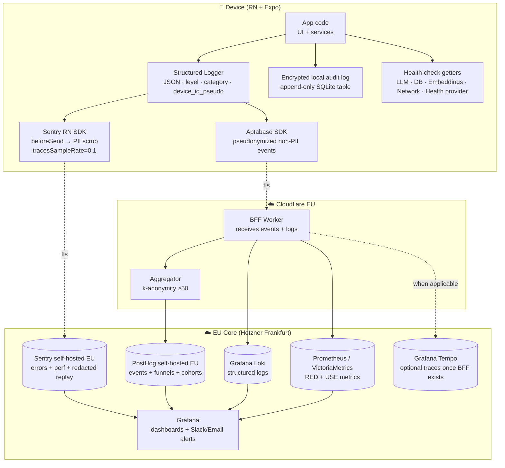

# 07 — Observability & Monitoring

**Current state:** 🔴 **this is the section with the largest structural gap in the project**. The app has **no** product observability system (APM, structured logs, audit logs, alerts, dashboards, metrics, traces). The only "monitoring" is **44 `console.log/warn/error` calls** scattered across 22 files (`grep -rn "console\." src/ | wc -l`), which are lost as soon as the debugger / Metro disconnects. There are **2 in-process health checks** (`getLLMStatus`, `getEmbeddingsStatus`) and **2 local notifications** (`notifyDownloadStarted`, `notifyModelReady`) — that is all. For an app processing **GDPR Art. 9 data** (weight, allergies, conditions, clinical PDFs), this observability level is **incompatible with a responsible launch**: without traces you cannot demonstrate accountability (Art. 5.2), notify a breach within 72h (Art. 33), measure whether the AI works, or evidence legitimate access to medical data.

## 7.1. Stack (logs, metrics, traces, alerts)

### 7.1.1. AS-IS — exhaustive inventory by pillar

| Pillar | State | Current implementation | Coverage | Evidence |
|---|---|---|---|---|
| **Application logs** | 🔴 GAP | `console.log/warn/error` with ad-hoc strings | 44 calls in 22 files | `grep -rn "console\." src/ --include="*.ts" --include="*.tsx"` |
| **Structured logs (JSON)** | 🔴 GAP | n/a | 0% | — |
| **Configurable levels** (trace/debug/info/warn/error/fatal) | 🔴 GAP | Only `log/warn/error` | 0% | — |
| **Log persistence** | 🔴 GAP | n/a | 0% | — |
| **Metrics** (counters, gauges, histograms) | 🔴 GAP | n/a | 0% | — |
| **RED metrics** (Rate / Errors / Duration) | 🔴 GAP | n/a | 0% | — |
| **USE metrics** (Utilization / Saturation / Errors) | 🔴 GAP | n/a | 0% | — |
| **Distributed tracing** | 🔴 GAP — not applicable to AS-IS (no services) | n/a | 0% | — |
| **On-device tracing** (AI transactions, render) | 🔴 GAP | n/a | 0% | — |
| **Unhandled errors** | 🔴 GAP | No Sentry, no React `ErrorBoundary`, no global promise-rejection handler | 0% | — |
| **Crash reporting (native)** | 🟡 Implicit via App Store Connect + Play Console (iOS crashes/ANRs only) | Only native crashes, no JS errors | Partial | — |
| **Alerts** | 🔴 GAP | n/a | 0% | — |
| **Audit log (PII access)** | 🔴 GAP — critical risk for Art. 9 | n/a | 0% | — |
| **In-process health checks** | 🟡 Two LLM-state getters | LLM on-device only | ~20% of runtime | `src/services/onDeviceLlm.ts:193-201`, `src/services/embeddings.ts:107-115` |
| **Operational local notifications** | 🟡 Two events: model downloading / ready | Only AI bootstrap | <5% of the flow | `src/services/aiNotifications.ts:48-54` |
| **Cost telemetry** | 🟡 Only Spoonacular counts calls/day (client-side, not aggregated) | 1 provider of 3 | Partial | `src/services/spoonacular.ts:24-43` |
| **Event versioning** | 🔴 GAP | n/a | 0% | — |

### 7.1.2. AS-IS — `console.*` inventory by domain

Distribution of the 44 current logs by emitting module. This is the **only observability surface that exists**, and a structured logger must preserve the same categorical structure:

| Domain | Files involved | Approx. calls | Predominant type | Representative example |
|---|---|---|---|---|
| `db` | `src/db/database.ts`, `src/db/dbUtils.ts` | 4 | `warn`, `log` | `[DB] Stale migrations table detected, resetting` (`src/db/database.ts:105`) |
| `ai-engine` | `src/modules/ai-engine/AIContext.tsx`, `src/services/onDeviceLlm.ts`, `src/services/factExtractor.ts`, `src/services/embeddings.ts`, `src/services/memoryStore.ts`, `src/modules/planner/mealPlanGenerator.ts` | 16 | `warn`, `error` | `[OnDeviceLLM] Failed to load LLM:` (`src/services/onDeviceLlm.ts:123`), `[MealPlan] LLM ${category} output unparseable, falling back` (`src/modules/planner/mealPlanGenerator.ts:128`) |
| `profiles` | `src/modules/profiles/ProfilesContext.tsx`, `src/modules/profiles/profileStorage.ts` | 4 | `error`, `warn` | `[profileStorage] Corrupt profiles data, resetting:` (`src/modules/profiles/profileStorage.ts:58`) |
| `health` | `src/modules/health/providers/appleHealth.ts`, `src/modules/health/providers/healthConnect.ts` | 3 | `warn` | `[AppleHealth] initHealthKit error:` (`src/modules/health/providers/appleHealth.ts:55`) |
| `network/catalog` | `src/services/edamam.ts`, `src/services/spoonacular.ts`, `src/services/bff/client.ts` | 4 | `warn` | `[Spoonacular] Daily quota exhausted, cannot fetch detail` (`src/services/spoonacular.ts`) |
| `pdf` | `src/services/profileDocuments.ts` | 2 | `warn` | `[profileDocuments] embeddings unavailable, skipping indexing` (`src/services/profileDocuments.ts:141`) |
| `planner` | `src/modules/planner/PlannerContext.tsx` | 2 | `warn` | — |
| `recipes` | `src/modules/recipes/syncRecipes.ts`, `src/modules/recipes/seedRecipes.ts` | 4 | `log`, `warn` | `[Init] Starting background Edamam sync...` (`app/_layout.tsx:118`) |
| `ui` (sheets / assistant) | `src/components/sheets/*`, `src/components/layout/AIAssistant.tsx` | 5 | `error` | — |
| **Total** | 22 files | **44** | — | — |

**Observations**:

- The bracketed prefix (`[DB]`, `[OnDeviceLLM]`, `[AIEngine]`, `[Spoonacular]`…) is the **only existing taxonomy**. It is ad-hoc and manual.
- ⚠️ No sampling: every warn is always emitted — console-spam risk and possible PII leakage into log backups if someone starts persisting them without filtering.
- ⚠️ Some warns include payload content (`json.slice(0, 80)` in `src/db/dbUtils.ts:6`, `[memoryStore] dropping corrupt chunk` with `r.id` in `src/services/memoryStore.ts:163`) — **once persisted without scrubbing, these could become PII**.

### 7.1.3. AS-IS — health-checks and operational notifications

| Capability | API | Returns | Real usage | Evidence |
|---|---|---|---|---|
| LLM status | `getLLMStatus()` | `OnDeviceLLMStatus { isDownloaded, isDownloading, isLoaded, downloadProgress }` | Polled every 5s from `AIContext` | `src/services/onDeviceLlm.ts:193-201`, `src/modules/ai-engine/AIContext.tsx:95-97` |
| Embeddings status | `getEmbeddingsStatus()` | `EmbeddingsStatus { isDownloaded, isDownloading, isLoaded, downloadProgress }` | Available but not consumed by UI | `src/services/embeddings.ts:107-115` |
| "LLM download started" notification | `notifyDownloadStarted()` | n/a (effect) | Only if `expo-notifications` loadable + permission granted | `src/services/aiNotifications.ts:48-50` |
| "AI model ready" notification | `notifyModelReady()` | n/a (effect) | Same | `src/services/aiNotifications.ts:52-54` |
| Spoonacular daily quota | `getSpoonacularCallsToday()`, `getSpoonacularCallsRemaining()` | Number | Shown in Settings | `src/services/spoonacular.ts:24-33`, `app/settings.tsx:78-79` |

**Conclusion**: the observable AS-IS is limited to (i) the on-device AI pipeline, (ii) the quota of a single external provider. **Everything else is opaque.**

### 7.1.4. TO-BE — proposed architecture



**Pillars and candidate vendors** (aligned with EU sovereignty + low cost for the prototype):

| Pillar | Need | Recommended option | EU alternative | US alternative (not preferred) | Justification |
|---|---|---|---|---|---|
| Error tracking | Crash + JS errors + breadcrumbs | **Sentry self-hosted on Hetzner** (official Docker Compose) | GlitchTip self-hosted (open-source Sentry-compatible) | Sentry SaaS US, Bugsnag | Self-hosting avoids Schrems II TIA and lowers cost beyond 5k DAU |
| Product events | Funnels, cohorts, retention | **PostHog self-hosted EU** | Aptabase Cloud (EU + privacy-first) | Amplitude, Mixpanel | EU + open source + native funnels |
| Structured logs | Search, aggregation | **Grafana Loki self-hosted** | Vector + Quickwit | Datadog Logs, New Relic | Same stack as metrics (Grafana) → unified cost and operation |
| Metrics | Time series + percentiles | **Prometheus + VictoriaMetrics** | Grafana Cloud Free tier (50GB logs, 14d retention) | Datadog Metrics | De facto standard, integrated ecosystem |
| Traces | Only when BFF exists | **Grafana Tempo** | Jaeger | Honeycomb | Same stack |
| Dashboards | Visualization + alerts | **Grafana** | Metabase | Looker, Tableau | Open source, EU-friendly |
| RUM (Real User Monitoring) | Latency, render, navigation | **Sentry Performance** | Datadog RUM | NewRelic Browser | Integrated with error tracking |

### 7.1.5. Structured logger — proposed design

Minimal API compatible with the existing `[Category]` pattern:

```ts
// TO-BE module pseudo-code — DOES NOT exist in the repo
type LogLevel = 'trace' | 'debug' | 'info' | 'warn' | 'error' | 'fatal'
type LogCategory =
  | 'db' | 'ai' | 'health' | 'network' | 'profiles'
  | 'planner' | 'recipes' | 'pdf' | 'ui' | 'auth' | 'crypto'

interface LogEntry {
  ts: string                    // ISO-8601 UTC
  level: LogLevel
  category: LogCategory
  msg: string                   // human text (PII-free)
  attrs?: Record<string, JSONPrimitive>  // no free-form PII — pseudonymized IDs only
  device_id_pseudo: string      // HMAC-SHA256(device_install_uuid, server_salt)
  app_version: string
  os: 'ios' | 'android' | 'web'
  schema_version: 'v1'
}

logger.warn('db', 'Stale migrations table detected, resetting')
logger.error('ai', 'Failed to load LLM', { model: 'qwen3_1_7b_q', errorCode: 'OOM' })
```

**Progressive migration from `console.*`**:

1. Create `src/utils/logger.ts` with the wrapper.
2. Replace every `console.warn(...)` with `logger.warn(category, msg, attrs)`. The 44 current occurrences map 1:1 because the `[Category]` prefix is already there.
3. Configure `console.warn/error` to also pipe to the logger during the transition (interceptor).
4. Enable the Sentry transport only at level `warn` and above.

### 7.1.6. Sentry init with PII scrubbing (proposed snippet)

⚠️ This snippet **does not exist in the repo** — it is the canonical proposal for integrating Sentry while minimizing Art. 9 risk.

```ts
// TO-BE module pseudo-code — DOES NOT exist in the repo
import * as Sentry from '@sentry/react-native'

const PII_PATTERNS: RegExp[] = [
  /enc:v\d+:[A-Za-z0-9+/=]+/g,           // ciphertexts
  /\bmember-[a-z0-9]+\b/g,               // local member IDs
  /\bdoc-[a-z0-9]+\b/g,                  // doc IDs
  /\bchk-[a-z0-9]+\b/g,                  // chunk IDs
  /\bmem-[a-z0-9]+\b/g,                  // memory IDs
  /\b\d{4}-\d{2}-\d{2}\b/g,              // ISO dates (potential DOB)
  /\b\d{8,13}\b/g,                       // EAN/UPC barcodes
  /\b[\w.+-]+@[\w-]+\.[\w.-]+\b/g,       // emails
]

function scrubString(s: string): string {
  return PII_PATTERNS.reduce((acc, re) => acc.replace(re, '[REDACTED]'), s)
}

Sentry.init({
  dsn: process.env.EXPO_PUBLIC_SENTRY_DSN_EU,
  environment: __DEV__ ? 'dev' : 'prod',
  tracesSampleRate: __DEV__ ? 1.0 : 0.1,
  beforeSend(event) {
    // Drop fully if user has not consented to telemetry (see §5.2 toggle 5)
    if (!getTelemetryConsent()) return null
    // Scrub stacks and messages
    if (event.message) event.message = scrubString(event.message)
    event.exception?.values?.forEach(v => {
      if (v.value) v.value = scrubString(v.value)
    })
    // Explicit tag/extras whitelist
    event.tags = pickTags(event.tags, ['category', 'level', 'app_version', 'os'])
    event.user = undefined  // never send user object with email/name
    return event
  },
  beforeBreadcrumb(crumb) {
    if (crumb.data) crumb.data = scrubObject(crumb.data)
    return crumb
  },
})
```

**Prioritized recommendations (§7.1):**

1. **Create `src/utils/logger.ts`** (S — 0.5d) and migrate the 44 `console.*` occurrences (S — 1d).
2. **Integrate Sentry RN self-hosted EU** with PII-safe `beforeSend` (M — 3-5d).
3. **Strip payload from logs** in `src/db/dbUtils.ts:6` and `src/services/memoryStore.ts:163` (S — 5 min).
4. **Unified health checks**: add `getDbStatus()`, `getNetworkStatus()` analogous to `getLLMStatus()` (S — 1d).

## 7.2. Key dashboards (technical and business)

**Current state:** ⚠️ GAP. No dashboard exists. This subsection defines the **minimum viable basket** for production.

### 7.2.1. Dashboard catalog by audience

| # | Dashboard | Audience | Refresh | Main metrics | Data source |
|---|---|---|---|---|---|
| D1 | **Technical health** | On-call engineering | 30s | Crash-free %, P50/P95/P99 chat latency, errors by category, LLM throughput (t/s) | Sentry + Prometheus |
| D2 | **On-device LLM health** | Engineering | 1m | Download ok/fail %, time-to-first-token, sustained t/s, OOM events, model_version distribution | Sentry transactions + custom events |
| D3 | **RAG health** | Engineering | 1m | Embedding model loaded %, retrieved chunks per query distribution, % queries with 0 chunks ≥ threshold | Custom events |
| D4 | **Onboarding funnel** | Product | 15m | Step-by-step conversion (welcome → familyName → memberCount → memberBasic → memberHealth → memberDone → allDone) | PostHog |
| D5 | **Engagement** | Product + Founder | 15m | DAU/MAU, retention D1/D7/D30, sessions/user, AI msgs/user, plans/user, scans/user | PostHog |
| D6 | **Catalog quality** | Engineering + Product | 1h | Recipes per `source_api`, % with image, % with instructions, sync ok/fail rate | Prometheus (publish from sync jobs) |
| D7 | **Compliance & DSR** | DPO | 1h | Open DSRs, mean response time, % users with fresh consent (<13m), deletions executed | Audit log + BFF |
| D8 | **Cost & quotas** | Engineering | 5m | Calls/day per provider, Spoonacular quota %, $ Sentry, monthly infra $ | Prometheus + cost APIs |
| D9 | **On-device privacy** | Engineering + DPO | 1h | % users on v2 encryption (post-rotation), decryption-failure rate, regenerated-key rate | Custom events |
| D10 | **External-API health** | Engineering | 1m | OFF success rate, Edamam P95 latency, Spoonacular P95 latency | Custom events |

### 7.2.2. Wireframe — D5 Engagement (sketch)

```
┌───────────────────────────────────────────────────────────────────────────┐
│ NUTRIASSISTANT · ENGAGEMENT                              📅 last 30d      │
├───────────────────────────────────────────────────────────────────────────┤
│                                                                           │
│   DAU            MAU            DAU/MAU        Crash-free                 │
│   ┌──────┐       ┌──────┐       ┌──────┐       ┌──────┐                   │
│   │ 1.2k │       │ 8.4k │       │ 14%  │       │ 99.3%│                   │
│   └──────┘       └──────┘       └──────┘       └──────┘                   │
│                                                                           │
│   Retention curve (install cohort 2026-04)                                │
│   100% ╳                                                                  │
│    75% │╲╲                                                                │
│    50% │ ╲╲___                                                            │
│    25% │     ╲___                                                         │
│     0% └──┬───┬──┬──┬──┬──                                                │
│         D1  D7 D14 D21 D28                                                │
│                                                                           │
│   Events per active user (P50)                                            │
│   AI messages   ▓▓▓▓▓▓▓▓░░░░░░░  8                                        │
│   Scans         ▓▓▓▓▓░░░░░░░░░░  3                                        │
│   Plans         ▓▓░░░░░░░░░░░░░  1                                        │
│   PDF uploaded  ▓░░░░░░░░░░░░░░  0.3                                      │
│                                                                           │
└───────────────────────────────────────────────────────────────────────────┘
```

### 7.2.3. Wireframe — D2 LLM Health

```
┌───────────────────────────────────────────────────────────────────────────┐
│ ON-DEVICE LLM · QWEN 3 1.7B Q                              🕐 last 24h    │
├───────────────────────────────────────────────────────────────────────────┤
│                                                                           │
│   Load OK rate           Time to First Token (P50/P95)                    │
│   ┌──────────┐           P50: 2.8s  ████████░░                            │
│   │  97.8%   │           P95: 7.4s  ████████████████░                     │
│   └──────────┘                                                            │
│                                                                           │
│   Download OK rate                                                        │
│   ┌──────────┐           Sustained throughput (t/s)                       │
│   │  93.1%   │           ╱╲    ╱╲╲    ╱╲                                  │
│   └──────────┘          ╱  ╲__╱   ╲__╱  ╲                                 │
│                                                                           │
│   Errors by code (last 24h)                                               │
│   OOM_KILLED              ▓▓▓▓▓▓▓▓ 23                                     │
│   FAILED_TO_GENERATE      ▓▓▓ 8                                           │
│   DOWNLOAD_TIMEOUT        ▓▓ 5                                            │
│   MODEL_NOT_FOUND_AFTER_DL ▓ 2                                            │
│                                                                           │
│   Active model_version distribution                                       │
│   qwen3_1_7b_q          ████████████████████ 99.4%                        │
│   legacy llama3_2_1b    ░ 0.6% ⚠️ unupdated users                         │
│                                                                           │
└───────────────────────────────────────────────────────────────────────────┘
```

### 7.2.4. Wireframe — D7 Compliance & DSR

```
┌───────────────────────────────────────────────────────────────────────────┐
│ COMPLIANCE & DSR                                          🛡️  for DPO     │
├───────────────────────────────────────────────────────────────────────────┤
│                                                                           │
│   Open DSRs            DSRs > 25 days        Art. 33 breaches (90d)       │
│   ┌──────┐              ┌──────┐             ┌──────┐                     │
│   │  3   │              │  0   │ ✅          │  0   │ ✅                  │
│   └──────┘              └──────┘             └──────┘                     │
│                                                                           │
│   DSR type (30d)                                                          │
│   Access / export       ▓▓▓▓▓▓▓▓ 12                                       │
│   Full erasure          ▓▓▓▓ 6                                            │
│   Rectification         ▓▓ 3                                              │
│   Portability           ▓ 1                                               │
│                                                                           │
│   Consent freshness     ┌────────────────────────────────┐                │
│                         │ Fresh < 13m   ████████████ 84% │                │
│                         │ Stale 13-24m  ███░░░░░░░░░ 12% │                │
│                         │ Expired > 24m █░░░░░░░░░░░  4% │                │
│                         └────────────────────────────────┘                │
│                                                                           │
│   Erasures executed (30d): 142   ·   Mean time: 18s   ·   p95: 41s        │
│                                                                           │
└───────────────────────────────────────────────────────────────────────────┘
```

**Prioritized recommendations (§7.2):**

1. Start with **D1 (Technical health)** and **D5 (Engagement)** — best signal/effort.
2. **D7 (Compliance)** blocks launch — the DPO needs daily evidence.
3. **D2 + D3 (AI and RAG)** help justify the on-device bet to the supervisor / investors.
4. Provision panels with **Grafana-as-code** (JSON committed in `infra/grafana/`).

## 7.3. SLIs / SLOs / SLAs proposed

**Current state:** ⚠️ GAP. No SLIs defined, no error budgets, no public SLAs.

### 7.3.1. Master SLO table by service

| Service | SLI | SLO (internal target) | Monthly error budget | Public SLA | Critical burn-rate alert |
|---|---|---|---|---|---|
| App crash-free sessions | % sessions without JS or native crash | **99.5%** | 3h 36m / 30d | "99% crash-free" in store description | 2% of budget in 1h |
| Initial LLM load (download) | % users with download OK in <30 min on Wi-Fi | **95%** | n/a (one-shot) | n/a (client) | Rate < 90% in 24h ⇒ alert |
| Initial LLM load (load post-download) | % loads into memory OK | **99%** | n/a (one-shot) | — | < 97% ⇒ alert |
| AI chat TTFB | First-token latency | **P50 < 3s, P95 < 8s** | "lat-violations" 5% budget | — | P95 > 12s sustained 15m |
| AI chat throughput | Sustained tokens/s | **P50 > 25 t/s** | 5% | — | < 15 t/s sustained 30m |
| RAG retrieval | % queries with embedding generated OK | **99%** | 1% | — | < 95% ⇒ alert |
| Catalog sync (Edamam) | Success rate of a sync | **98%** | 14d/year | — | 3 consecutive failures ⇒ alert |
| OFF lookup (scan) | Median latency | **P50 < 800ms, P95 < 3s** | 10% | "scan resolves <3s" in marketing | P95 > 5s sustained 15m |
| GDPR full erasure | Time from tap to complete wipe on device | **P95 < 30s** | n/a | **< 72h (Art. 17 legal commitment)** | Wipe fails ⇒ S1 |
| DSR response time | Time from request to delivery | **P95 < 7 days** | n/a | **30 days (Art. 12.3 legal max)** | > 20 days ⇒ DPO alert |
| Art. 33 breach notification | Detection → AEPD time | **P95 < 24h** | n/a | **72h (legal)** | > 36h ⇒ founder escalation |
| Audit-log integrity | % audit-log writes OK | **99.99%** | ~4m/month | — | Audit-encryption failure ⇒ S1 |

### 7.3.2. Error budget — applied fundamentals

For `App crash-free sessions = 99.5%`:

- Monthly budget = (1 - 0.995) × 30d = **3h 36m** of "permitted failure time"
- If the budget consumed in a week exceeds 50%, **freeze risky releases** until the next period.
- Burn-rate alerts (multi-window multi-burn-rate, SRE-style):
  - Page the engineer if **1h** burns > **2%** of the monthly budget.
  - Page the engineer if **6h** burns > **5%** of the monthly budget.

### 7.3.3. Public vs internal SLAs

| Commitment | Type | Origin | Where published |
|---|---|---|---|
| "99% crash-free sessions" | Public | Aspirational, industry standard | App Store description, web |
| "Full erasure <72h" | Public | **GDPR Art. 12.3** | Privacy policy + Settings copy |
| "DSR resolved <30d" | Public | **GDPR Art. 12.3** | Privacy policy |
| "Breach notification <72h" | Public | **GDPR Art. 33** | Privacy policy |
| "AI P50 TTFB <3s" | Internal | Product decision | Dashboard, not public (device-dependent) |
| "Catalog sync OK 98%" | Internal | Product decision | Dashboard |

### 7.3.4. SLA exceptions

Events that **do not consume error budget** (document and exclude in post-mortems):

- Planned maintenance window announced >72h in advance.
- Outage of an external provider (OpenFoodFacts, Edamam, Spoonacular) confirmed on their status page.
- HuggingFace CDN outage during the initial model download (out of our control for new users, but **retries do consume budget**).
- Force-update (major AI model change) requiring re-download: counts as a **planned window**.

**Prioritized recommendations (§7.3):**

1. Publish the **4 legal SLAs** in the privacy policy before launch.
2. Instrument the `crash-free` and `AI chat TTFB` SLIs first (covers 80% of perceived product quality).
3. Implement multi-window burn-rate alerting once Prometheus + Grafana are stood up.

## 7.4. Incident management

**Current state:** ⚠️ Structural GAP. No runbook, no escalation matrix, no internal communication channel, no post-mortem template. It is the second-worst risk (after the missing full erasure) for a responsible launch of an Art. 9 app.

### 7.4.1. Severity matrix

| Sev | Criterion | Concrete NutrIAssistant example | Initial response | Fix / mitigation | Communication |
|---|---|---|---|---|---|
| **S1 — critical** | PII exposed, data breach, globally unusable app, legal violation | (a) Log bucket leaks decryptable `enc:v1:` content; (b) 100% crash on open; (c) BFF response leaks Edamam `app_key` or Spoonacular API key | **< 30 min** | EAS Update hotfix (JS) **< 24h**; malicious-binary block in stores if applicable | **AEPD < 72h**, affected users **without delay**, full team page |
| **S2 — high** | Core feature broken, no data loss, no legal risk | (a) AI chat loops on "preparing model" due to `llmBusyRef` bug; (b) scanner does not detect codes; (c) weekly plan does not generate | **< 2 h** | Fix **< 72h** | In-app banner + status page |
| **S3 — medium** | Secondary feature broken | (a) Markdown export duplicates members; (b) Edamam sync fails 3× in a row; (c) avatar import does not copy the file | **< 24 h** | Fix **< 1 week** | Note in release notes |
| **S4 — low** | Cosmetic bug, no functional impact | (a) Broken spacing in a setting; (b) typo in i18n | **< 1 week** | Next release | None |

### 7.4.2. Response flow — diagram

```mermaid
flowchart TB
    Detect[Detection<br/>Sentry alert · user · internal] --> Triage[Triage<br/>assign Sev S1-S4]

    Triage -->|S1| Page1[Pager: founder + engineer<br/>< 30 min]
    Triage -->|S2| Page2[Pager: on-call engineer<br/>< 2h]
    Triage -->|S3| Ticket[Backlog ticket<br/>response < 24h]
    Triage -->|S4| Backlog[Backlog<br/>next release]

    Page1 --> Contain[Containment<br/>kill switch · feature flag · revert · store block]
    Page2 --> Contain

    Contain --> Invest[Investigation<br/>logs · breadcrumbs · reproduction]
    Invest --> Fix[Fix<br/>EAS Update hotfix if JS / new release if native]
    Fix --> Verify[Verification<br/>SLO recovered · dashboards green]
    Verify --> Postmortem[Blameless post-mortem<br/>< 7 days after closure]

    Triage -. affects Art. 9 PII .-> Legal[DPO activation<br/>Art. 33 risk analysis]
    Legal -. high risk .-> AEPD[AEPD notification<br/>< 72h Art. 33]
    Legal -. high risk to subject .-> Users[User communication<br/>without delay Art. 34]
    Postmortem --> Action[Action items<br/>assigned with due date]
```

### 7.4.3. S1 runbook — step by step (template)

```
TIMESTAMP        ROLE         ACTION                                              ARTIFACT
─────────────    ─────────    ────────────────────────────────────────────────    ────────────────
T+0              Detector     Create incident in #incidents with title "[S1] …"   Slack thread
T+5min           IC (founder) Convene war room (Meet / Discord stage)             link in thread
T+10min          Engineer     Snapshot Sentry last 1h + affected count            screenshot
T+15min          Engineer     Any Art. 9 data exposed? → tag dpo @                tag dpo
T+20min          DPO          Preliminary Art. 33 risk analysis                   short doc
T+30min          IC           Containment decision: feature flag / EAS revert     commit ref
T+45min          Engineer     Apply containment + verify in dashboards            Grafana link
T+1h             DPO+IC       If Art. 9 + high risk → prepare AEPD note           draft
T+72h max        DPO          Submit AEPD notification                            case ref
T+72h max        IC           Communicate with affected users                     email / push
T+7d             IC           Blameless post-mortem with action items             doc
```

### 7.4.4. Post-mortem template (blameless)

```
# Post-mortem · [Sev] · YYYY-MM-DD · <title>

## TL;DR
2-3 sentences with what, impact, and root cause.

## Timeline (UTC)
- T+0   detection via <source>
- T+5   …

## Impact
- Affected users: <N> (<%> of MAU)
- Duration: <minutes>
- Data compromised: yes / no / partial (Art. 9 detail)
- SLOs violated: <list> · budget consumed: <X%>

## Root cause
Full technical explanation. No names, no blame.

## Why it took us long to detect
What failed in monitoring/alerts.

## Immediate actions (during)
…

## Follow-up actions
- [ ] <action> · owner @… · due YYYY-MM-DD
- [ ] …

## Lessons learned
- What worked
- What did not work

## Annexes
- Grafana screenshots
- Slack thread
- Relevant commits
```

### 7.4.5. Communication

| Audience | When | Channel | Template |
|---|---|---|---|
| Internal team | Immediate | Slack `#incidents` (private) | S1-S4 template |
| Affected users | S1 with Art. 34 risk | Push + email + in-app banner | Legal-reviewed template |
| AEPD | S1 with Art. 9 data + risk | Form on sede.aepd.gob.es | Art. 33 template |
| Public status page | S1, S2 | `status.nutriassistant.ai` (Statuspage / Instatus) | Auto-generated |
| Stores (Apple/Google) | S1 with broken app | Resolution Center / Play Console | Manual |

**Prioritized recommendations (§7.4):**

1. Create `docs/runbooks/INCIDENT_RESPONSE.md` with the matrix and templates before launch (S — 1d).
2. Provision a **status page** on Instatus (free for 1 service).
3. Agree on **on-call rotation** once the team exceeds 2 people (until then, founder is always on-call for S1).
4. Practice a quarterly **game day** with a fictional scenario (e.g. "clinical-PDF leak").

## 7.5. Cost observability (FinOps)

**Current state:** the app's infrastructure cost is **≈ €0** (no backend of our own). The only recurring costs are store licenses and the Spoonacular fee. The absence of telemetry is paradoxically what keeps the cost at zero, but it is also what **blocks a GDPR-compliant launch**. This subsection models the costs with BFF + observability introduced as in [§7.1.4](#714-to-be--proposed-architecture).

### 7.5.1. Current cost (AS-IS)

| Line | Annual cost | Notes | Evidence |
|---|---|---|---|
| Apple Developer Program | **99 USD** | Mandatory to publish on App Store | — |
| Google Play Developer | **25 USD** (one-shot) | Mandatory to publish on Play Store | — |
| Edamam Recipe Search v2 | 0 USD (Developer tier) | 10 req/min, monthly cap. Held server-side in CF secret store. | `src/services/edamam.ts` |
| OpenFoodFacts | 0 EUR | Public API, no auth | `src/services/openFoodFacts.ts:3` |
| Spoonacular API | ⚠️ **Paid plan needed** | `SPOONACULAR_DAILY_LIMIT = 10_000` (`src/services/spoonacular.ts:10`). The free plan is **150 points/day**, not 10,000 → the app **assumes** the dev has a paid plan ($29 - $149/month by package) | `src/services/spoonacular.ts:10` |
| HuggingFace CDN | 0 USD | Public downloads, no cost for the repo | `src/services/onDeviceLlm.ts:28-32` |
| EAS Build | 0 USD on free tier | 30 builds/month free | n/a |
| Apple notarization | Included with Apple Dev | — | — |
| AI inference | **€0** | 100% on-device | All of [§4](./04-ai-architecture.md) |
| Backend hosting | €0 | Does not exist | — |
| **AS-IS total** | **~ $99 - $1,800 / year** (variable by Spoonacular usage) | — | — |

### 7.5.2. Projected TO-BE cost by MAU tier

| Service | 1k MAU | 10k MAU | 100k MAU | 1M MAU | Notes |
|---|---|---|---|---|---|
| Cloudflare Workers (BFF) | $5 | $5 + $15 = $20 | ~$80 | ~$500 | $5 plan + $0.50/M req |
| Cloudflare R2 (cached catalog) | $5 | $5 | $15 | $50 | $0.015/GB-month |
| Hetzner CPX21 (Sentry VM, self-hosted) | $10 | $10 | $20 (×2) | $40 (×4) | Vertical scaling up to 100k |
| Hetzner CPX21 (PostHog VM, self-hosted) | $10 | $10 | $40 | $120 | Same |
| Hetzner CPX21 (Grafana + Loki + Prom VM) | $10 | $10 | $30 | $100 | Same |
| Managed Postgres (Supabase / Neon) | $0 (free) | $25 | $99 | $399 | Pay-per-use tier |
| Apple Developer Program | $8.25 | $8.25 | $8.25 | $8.25 | $99/year amortized |
| Spoonacular (if kept) | $29 | $79 | $149 | n/a (negotiate) | Pay-per-use |
| `.pte` model bandwidth from R2 | $0 (CF egress free) | $0 | $0 | $0 | ✅ CF advantage |
| Domains + transactional email | $5 | $5 | $10 | $30 | Postmark / Resend |
| Annual security audit | — | $0 | $3,000/12 | $8,000/12 | External, once revenue allows |
| **Monthly total** | **~$83** | **~$177** | **~$700** | **~$1,800** | Excludes optional cloud AI Pro |
| **Cost per active user** | **$0.083** | **$0.018** | **$0.007** | **$0.0018** | Favorable scaling |

### 7.5.3. Cost guards and alerts

| Guard | Threshold | Automatic action | Owner |
|---|---|---|---|
| Cloudflare Workers reqs | > 1.5× daily baseline | Slack alert + reinforced auto-rate-limit | Engineering |
| Spoonacular daily quota | > 80% of plan limit | Slack alert + proactive disable | Engineering |
| Sentry events | > 100 events/min sustained 30m | Sentry alert + investigation | Engineering |
| PostHog events | > 1M/day with < 10k MAU | Review duplicated instrumentation | Engineering |
| AWS-style bill alarm | $250 / $500 / $1,000 / $2,000 monthly | Founder email | Founder |

### 7.5.4. Optimization levers (when applicable)

| Lever | When to enable | Expected savings |
|---|---|---|
| Semantic cache of AI responses (Pro tier opt-in) | When cloud AI is introduced | 60-80% of inference cost |
| Catalog cache in R2 (instead of pulling Edamam/Spoonacular per device) | When concurrent syncs saturate the quota | Up to 100% of Spoonacular quota |
| Aggressive Sentry sampling in prod | From 50k MAU | 70% of Sentry cost |
| 7-day Loki retention instead of 30 | From 100k MAU | 75% of log storage cost |
| Switch to private EU HuggingFace Inference Endpoints | If cloud Pro LLM is introduced | Better EU latency + sovereignty |
| Qwen 3 0.6B model for low-end devices | From 10k MAU if OOM data warrants | Fewer CDN bytes + better adoption |

**Prioritized recommendations (§7.5):**

1. Implement **basic cost guards** (Cloudflare + Spoonacular) before launch.
2. **Migrate Spoonacular behind our own R2 cache**: bulk sync is the biggest bill-shock risk.
3. Before adding cloud Pro AI, define a **monthly per-Pro-user maximum budget** (e.g. $0.30) and cut off when reached.
4. Negotiate **academic / startup discounts** with Sentry / PostHog Cloud if self-hosting is too heavy at the start.

## 7.6. Compliance-oriented observability (Art. 9 extension)

**Current state:** ⚠️ Full GAP. This subsection **was not in the original course scope** but is **essential** for an app that processes Art. 9 data at scale and aspires to accountability (Art. 5.2 GDPR).

### 7.6.1. Proposed `audit_log` schema (encrypted, append-only)

```sql
-- Proposed migration 013 — DOES NOT exist in the repo
CREATE TABLE audit_log (
  id              TEXT PRIMARY KEY,
  ts              TEXT NOT NULL,               -- ISO-8601 UTC
  actor_member_id TEXT NOT NULL,               -- who triggered
  event_type      TEXT NOT NULL,               -- see catalog below
  target_type     TEXT,                        -- 'member' | 'document' | 'memory' | 'inventory' | ...
  target_id       TEXT,
  encrypted_meta  TEXT,                        -- AES-GCM with event details
  app_version     TEXT NOT NULL,
  created_at      TEXT NOT NULL
);
CREATE INDEX idx_audit_actor ON audit_log(actor_member_id);
CREATE INDEX idx_audit_event ON audit_log(event_type);
CREATE INDEX idx_audit_ts ON audit_log(ts);
```

### 7.6.2. Auditable-event catalog

| Event | When | Evidential severity | Retention |
|---|---|---|---|
| `MEMBER_ADDED` | New profile | Medium | Indefinite |
| `MEMBER_DELETED` | Profile deletion | High | 2 years |
| `MEMBER_EDITED_HEALTH_FIELD` | Change to `conditions`, `allergies`, `weight`, `height` | **High (Art. 9)** | Indefinite |
| `DOCUMENT_UPLOADED` | Clinical PDF uploaded | **High (Art. 9)** | 2 years |
| `DOCUMENT_DELETED` | Same | High | 2 years |
| `DOCUMENT_VIEWED` | PDF opened in app | Medium | 90 days |
| `MEMORY_ADDED` | Fact accepted | **High (Art. 9)** | 2 years |
| `MEMORY_DELETED` | Memory deletion | High | 2 years |
| `AI_TURN` | AI chat turn | Medium (no content) | 30 days |
| `EXPORT_TRIGGERED` | Markdown export | High (data movement) | 2 years |
| `FULL_WIPE` | GDPR full erasure | **Critical (DSR)** | 2 years (in pseudonymized external logs) |
| `CONSENT_GRANTED` / `CONSENT_WITHDRAWN` | Consent toggle | **Critical (Art. 7)** | 2 years |
| `HEALTH_PROVIDER_ACTIVATED` / `DEACTIVATED` | Apple Health / Health Connect | Medium | 2 years |
| `ADMIN_ROLE_CHANGED` | `isSuperUser` toggled | High | 2 years |

### 7.6.3. Key properties of the audit log

- **Append-only**: no code path emits `DELETE` or `UPDATE` on `audit_log` except `FULL_WIPE`, which is atomic with the reset.
- **Encrypted**: `encrypted_meta` uses the same master key (`nutri_master_key_v1`) — to avoid amplifying blast radius.
- **Visible to the user**: an "My activity" Settings screen showing the last N events (decrypted in RAM). Reinforces the transparency principle (Art. 12).
- **Never leaves the device**: never sent to Sentry / PostHog. The only exit is a manual user export to accompany a DSR.

### 7.6.4. Compliance metrics derivable from the audit log

| Metric | Computation | Threshold |
|---|---|---|
| DSR response time | `ts(DSR_FULFILLED) - ts(DSR_REQUESTED)` per event | P95 < 7 days |
| % users with fresh consent | Users with `CONSENT_GRANTED` in < 13 months | > 80% |
| Art. 9 events per user / month | count(`MEMBER_EDITED_HEALTH_FIELD`, `DOCUMENT_*`, `MEMORY_*`) | Informational tracking |
| Erasures executed / month | count(`FULL_WIPE`) | Informational tracking |
| Audit-encryption failure rate | count(events with `encrypted_meta` corrupt on read) | < 0.1% |

**Prioritized recommendations (§7.6):**

1. **Migration 013** with the `audit_log` table before launch (S — 1d).
2. Instrument the **5 critical events** first: `FULL_WIPE`, `CONSENT_*`, `EXPORT_TRIGGERED`, `DOCUMENT_UPLOADED`, `MEMBER_EDITED_HEALTH_FIELD` (M — 3d).
3. Create the **"My activity"** Settings screen (S — 1d) — beyond compliance, it improves perceived trust.
4. Document the retention policy in `docs/legal/AUDIT_LOG_RETENTION.md`.

## 7.7. Data quality monitoring (bridge to §6.4)

**Current state:** ⚠️ GAP. The top-10 quality rules in [§6.4](./06-data-governance.md#64-data-quality) are defined but **not monitored in real time**. This subsection connects them to the TO-BE observability layer.

| §6.4 rule | Proposed observable metric | Where measured | Alert threshold |
|---|---|---|---|
| Valid `dateOfBirth` + age ∈ [0,120] | `quality.dob_valid_rate` | In `addProfile` / `updateProfile` | < 99.9% |
| `weight` ∈ [1, 300] | `quality.weight_in_range_rate` | Same | < 99.9% |
| `height` ∈ [30, 260] | `quality.height_in_range_rate` | Same | Same |
| Allergen ∈ EU_14 | `quality.allergen_valid_rate` | In `addProfile` / `updateProfile` | < 99.99% (closed catalog) |
| Condition ∈ CONDITIONS_LIST | `quality.condition_valid_rate` | Same | Same |
| Valid `source_api` | `quality.recipe_source_valid_rate` | In recipe upsert | < 99.99% |
| Macros ≈ kcal ± 15% | `quality.recipe_macro_consistent_rate` | In Edamam/Spoonacular sync | < 90% |
| Embedding generated OK | `quality.embedding_success_rate` | In PDF indexing | < 95% |
| Top-1 chunk cosine retrievable | `quality.retrieval_above_threshold_rate` | In each `retrievePdfChunks` | < 60% (potential RAG failure) |
| LLM parses actions | `quality.llm_actions_parse_rate` | In `parseActions` | < 80% (model degradation) |

**Drift monitoring (proposed once a BFF + pseudonymized aggregation exists):**

- **Prompt drift**: hash of the system prompt → distribution by version → if a new version increases errors → automatic rollback.
- **Embedding drift**: distribution of embedding L2 norms → abrupt change indicates a different model or degraded input.
- **Catalog drift**: distribution of `source_api` and `cuisine` → alert if a source drops to 0.

**Prioritized recommendations (§7.7):**

1. Integrate **Zod runtime validation** at entry points (`addProfile`, `addItem`, `saveScanResult`) and emit Prometheus metrics.
2. **Tag errors with a code** (`error_code` enum) — simplifies dashboards and SLOs.
3. Establish an **automatic prompt rollback** when the action-parse rate drops > 20% in 24h.

## 7.8. Section 7 — consolidated prioritized recommendations

| # | Action | Effort | Impact | Launch blocker |
|---|---|---|---|---|
| 1 | Structured logger `src/utils/logger.ts` + migrate 44 `console.*` | S | High | Yes |
| 2 | Sentry RN self-hosted EU + PII-safe `beforeSend` | M | Critical | Yes |
| 3 | Strip PII payload from 2 existing warns | S | High | Yes |
| 4 | Minimum dashboards D1 + D5 + D7 in Grafana | M | High | Yes (D7 for DPO) |
| 5 | Publish the 4 legal SLAs in privacy policy | S | Critical | Yes |
| 6 | Multi-window burn-rate alerts | S | Medium | No |
| 7 | S1-S4 runbook + Instatus status page | S | Critical | Yes |
| 8 | Cost guards (CF Workers, Spoonacular, Sentry) | S | Medium | Yes |
| 9 | Migration 013 `audit_log` + "My activity" screen | M | Critical (Art. 5.2) | Yes |
| 10 | Data-quality metrics with Zod at entries | M | High | No |
| 11 | Drift monitoring (prompt, embedding, catalog) | L | Medium | No |
| 12 | Additional health checks (`getDbStatus`, `getNetworkStatus`) | S | Medium | No |

**Closure definition:** Section 7 is ✅ green when:

1. Items 1, 2, 4, 5, 7, 8, and 9 are implemented (launch blockers).
2. **At least 3 dashboards** run with real data (D1, D5, D7).
3. **A published runbook** and **a post-mortem template** exist.
4. The audit-log coverage covers the **6 critical events** ([§7.6.2](#762-auditable-event-catalog)).
5. The DPO signs off on D7 before store submission.
