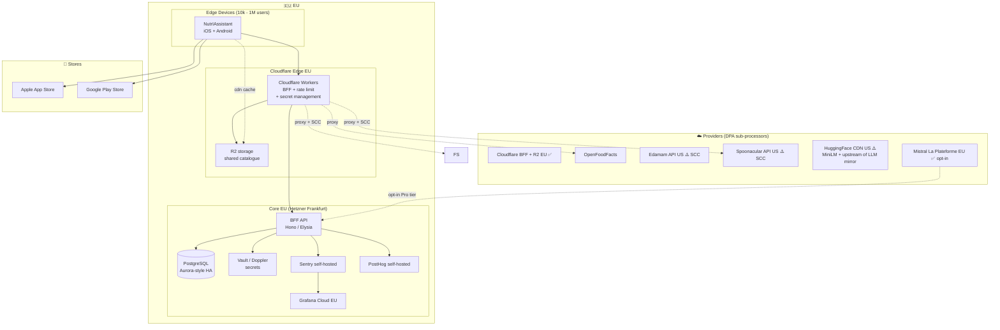

# 08 — Production Readiness

**Current state:** the app is not published. iOS (`ios/`) and Android (`android/`) infrastructure is generated, New Architecture is enabled, custom native modules exist (`modules/liquid-glass`, `modules/expo-pdf-text`), and the project is EAS-friendly. This section defines the TO-BE path to reach stores with full compliance.

## 8.1. Target architecture (TO-BE)



**Cloud decisions, justified**:

- **Cloudflare** edge: minimum European latency, native rate limit and secret management, predictable pricing.
- **Hetzner Frankfurt** (over Coolify or Plane.so): explicit EU sovereignty, alternative to AWS/GCP that require Schrems II TIAs.
- **PostgreSQL** on Supabase EU or Neon EU: simple, no overhead.
- **Mistral La Plateforme** as opt-in cloud AI fallback: European alternative to OpenAI/Anthropic.
- ✅ **Multi-region with EU data residency**: EU users → EU data. A US launch implies AWS us-east-1 replication.

## 8.2. Apple App Store compliance

| Guideline section | State | Required actions |
|---|---|---|
| **5. Legal** | 🔴 Privacy policy not published | Draft and publish at `nutriassistant.ai/privacy`, link from Settings and App Store Connect |
| **1.5 Developer Information** | 🟡 Settings has contact but lacks a canonical URL | Improve `app/settings.tsx:531-534` with a direct link to a support page |
| **Privacy Nutrition Labels (App Privacy Details)** | 🔴 Not declared — since it is on-device only, declare correctly: "Data Not Collected" in most categories, but **declare** that catalog queries reach OFF / Edamam / Spoonacular via our `api.nutriassistant.org` BFF | Complete the mapping of [§5.1](./05-privacy-model.md#51-personal-data-inventory) ↔ Apple categories (Health & Fitness; Sensitive Info; Identifiers; Diagnostics; Usage Data) |
| **App Tracking Transparency (ATT)** | ✅ Not applicable — no cross-app tracking | n/a |
| **HealthKit** | ✅ `NSHealthShareUsageDescription` declared, no write (`app.json:18-19, 22-25`) | Document in App Store Connect that HealthKit data never leaves the device |
| **Apple Intelligence / Foundation Models** | n/a — we use Qwen 3, not Foundation Models | n/a |
| **Subscriptions / IAP** | n/a in MVP — free model | To be confirmed for the Pro version |
| **3.1 In-App Purchase** | n/a | n/a |
| **4.0 Design** | ✅ Native Liquid Glass on iOS 26 (`modules/liquid-glass/`) | Verify HIG in internal review |
| **2.5.1 Software Requirements** | ✅ minimumOsVersion iOS 18.1 (`app.json:13`) | Consider lowering to 16.0 to broaden reach |

**Privacy Nutrition Labels — proposed declaration**:

| Category | Collected? | Linked to user | Used for tracking |
|---|---|---|---|
| Contact Info | No | n/a | n/a |
| Health & Fitness | **Yes** (weight, height, allergies, conditions, HealthKit data, clinical PDFs) | **Yes** (to the local account) | **No** |
| Financial Info | No | n/a | n/a |
| Location | No | n/a | n/a |
| Sensitive Info | **Yes** (Art. 9 health data) | Yes | No |
| Contacts | No | n/a | n/a |
| User Content | **Yes** (chat text, notes, favorite recipes) | Yes | No |
| Browsing History | No | n/a | n/a |
| Search History | No | n/a | n/a |
| Identifiers | No (when no backend) → when a BFF exists, declare a pseudonymized device_id | n/a → future Yes | No |
| Purchases | No | n/a | n/a |
| Usage Data | **Yes** (when telemetry is introduced) | No (pseudonymized) | No |
| Diagnostics | **Yes** (when Sentry is introduced) | No | No |
| Other Data | No | n/a | n/a |

## 8.3. Google Play Store compliance

| Section | State | Actions |
|---|---|---|
| **Data Safety Section** | 🔴 Not declared | Same mapping as Apple, complete the form in Play Console |
| **Health Connect API** | ✅ Implemented (`src/modules/health/providers/healthConnect.ts`), permissions in `app.json:35-38` | Request the Health Connect declaration form in Play Console |
| **Sensitive Permissions** | ✅ Limited permissions (`app.json:34-38`: CAMERA, RECORD_AUDIO, READ_STEPS, READ_ACTIVE_CALORIES_BURNED) | Justify usage in Play Console; remove `READ_AUDIO` if recording is unused |
| **AI-Generated Content policy** | 🔴 Not declared | Label the app as using generative AI, indicate moderation, indicate content is generated on-device |
| **Target API Level** | ✅ React Native 0.83 + New Architecture → API 35+ | Keep current (Play requires annual bumps) |
| **64-bit requirement** | ✅ arm64-v8a (CMake config in `android/app/.cxx`) | n/a |
| **App bundle (AAB)** | n/a — generated automatically by EAS | n/a |
| **Notifications policy** | ✅ `expo-notifications` used only to inform of model status, no marketing | Document in the forms |

## 8.4. Cross-border data transfers

| Target region | Legal framework | Implications |
|---|---|---|
| EU (Spain, first region) | GDPR + LOPDGDD (BOE-A-2018-16673) | Mandatory DPIA (Art. 35), SCC with US providers |
| United Kingdom | UK GDPR | Equivalent to EU GDPR; ICO; separate certification |
| United States (California) | CCPA / CPRA | "Do not sell my info" + access/erasure |
| Brazil | LGPD | Similar to GDPR; ANPD |
| China | PIPL | Mandatory local hosting; SCC; security assessment |
| India | DPDP Act | Explicit consent; data fiduciary |

**Suggested launch plan**:

1. Spain (LOPDGDD + GDPR).
2. Rest of EU (same framework).
3. UK (adapt Schrems II → UK ICO).
4. US (CCPA, separate Privacy Center).
5. LATAM (LGPD for Brazil, general framework for the rest).

## 8.5. Technical scaling

| AS-IS component | Anticipated bottleneck | TO-BE component | Justification |
|---|---|---|---|
| Local SQLite | n/a (per device) | Keep. Add optional replication via Postgres + RxDB | For sync across family devices |
| AsyncStorage for profiles | n/a | Move progressively to SQLite | Better concurrency and querying |
| On-device image processing | ⚠️ Does not yet exist | Backend image pipeline (Cloud Run / Lambda) with a small vision model | Food recognition from photo when prioritized |
| Recipe-catalog sync | Latency with Edamam/Spoonacular (already proxied through the BFF with edge caching) | Own CDN (Cloudflare R2) with a curated catalog refreshed nightly | Better UX, lower cost |
| Messaging queue | n/a | Pub/Sub or NATS, only if server-side telemetry is introduced | Decouple ingestion from processing |
| Cache layer | BFF edge cache (Cloudflare `caches.default`) for catalog responses; AsyncStorage 30s TTL for Spoonacular quota | Redis EU + semantic cache of cloud AI responses | If cloud Pro AI is introduced |
| Rate limiting | Local (Spoonacular calls/day) | BFF with per-device-id token bucket | Anti-abuse |
| AI anti-abuse | n/a | Pattern detection (high QPS, adversarial prompts) | When cloud exists |

## 8.6. AI model strategy in production

**Recommended tiering**:

| Tier | Model | Trigger | Cost |
|---|---|---|---|
| Free (default) | **Qwen 3 1.7B on-device** | Always | €0 |
| Pro (opt-in) | **Mistral Large 2 (EU)** via BFF | Premium user + opt-in consent | ~$0.001/turn |
| Premium | **Claude Sonnet 4.6** (with SCC + TIA) | Complex tasks (full monthly plan, PDF >50p) | ~$0.005/turn |

**Semantic cache**:

- Nutrition-question repetition is high (*"what to have for dinner low in sodium"*, *"gluten-free recipes"*).
- Implement prompt embedding → look up in Redis with threshold 0.92 → on hit, return cached answer + indicate to the user "cached response".
- Benefit: reduces Pro/Premium cost by 60-80%.

**Decision tree — Fine-tuning vs RAG vs prompting**:

```
Do you need product-specific knowledge (memories, profile)?
├── Yes → RAG ✅ (this is what we already do)
└── No
    └── Do you need consistent style / format?
        ├── Yes → System prompt + few-shot ✅
        └── No
            └── Do you want to reduce latency/cost at scale?
                ├── Yes, with an in-house >10k dataset → Fine-tuning
                └── No → Stick with prompting
```

For NutrIAssistant the answer is **RAG + prompting (already implemented)**. Fine-tuning brings no value today.

**If interviewing at Deepset.ai (Haystack alignment)**: the current code is a direct analog of the Haystack pattern — `topicGate` ≈ pre-pipeline filter, `retrievePdfChunks` ≈ Retriever, `buildSystemPrompt` ≈ PromptBuilder, `generateOnDevice` ≈ Generator. The main difference is that the whole pipeline runs in the client and the nodes are not explicitly declared as a Haystack graph. A natural port would extract the logic to a Haystack 2.x `Pipeline` with `InMemoryEmbeddingRetriever` (local) + `LocalLLMGenerator` (Qwen via llama.cpp).

## 8.7. Deployment roadmap

| Phase | Milestone | Compliance blocker | Estimate |
|---|---|---|---|
| **Phase 1: Closed MVP** (TestFlight + Internal Testing) | Stable app, no crashes, polished onboarding, on-device AI working | Published privacy policy (minimum viable), consent screens, Sentry, full erasure | 4-6 weeks |
| **Phase 2: Open beta** (TestFlight Public Link + Closed Play Track) | 200 beta users, feedback collection, telemetry instrumentation | DPIA draft, SBOM, Dependabot, CI secret scanning | 6-8 weeks |
| **Phase 3: Public launch — Spain** | Apple App Store + Google Play | Final DPIA, ROPA, policy at `/privacy`, designated DPO, signed SCC, complete Privacy Nutrition Labels + Data Safety Section | 8-12 weeks after Phase 2 |
| **Phase 4: EU expansion** | Launch in EU-27 + UK | Legal translations (FR, DE, IT, PT, NL...) | 4-8 weeks |
| **Phase 5: Pro tier** | Opt-in cloud AI + semantic cache + cross-device sync | Renewed granular consent, production BFF, Stripe integration | 12-16 weeks |
| **Phase 6: B2B2C white label** | Mercadona / Carrefour pilot | DSA + Data Processing Agreement per retailer | 16-24 weeks |

## 8.8. Business model and data monetization

**Potentially monetizable data assets (with informed consent and aggregation):**

| Asset | Potential client | Modality | Risk / blockers |
|---|---|---|---|
| Allergy distribution by postal code | Manufacturers (Danone, Nestlé) and chains | Quarterly aggregate report | DPIA essential, k-anonymity ≥50 |
| Trends in scanned products | Manufacturers and retailers | B2B dashboard | Needs >10k MAU for significance |
| NutriScore ranking per category | Retailers for assortment optimization | B2B API | Aggregated public OFF data — low differentiating value |
| Anonymized school-menu insights | Education authorities, AEPED, foundations | Open Data reports | Sensitive minor data — requires robust parental consent |
| **B2B2C white-label** (Mercadona, Carrefour) | Retailers | SaaS + revshare | Most profitable model but demands SLAs and customer success |

**Business model recommendation**:

- **Year 1**: focus on B2C free product to build a user base. Monetize via donations / Pro tier ($5/month).
- **Year 2**: launch B2B2C white-label with a pilot retailer. 30% revenue share.
- **Year 3+**: sell aggregated anonymized insights to the food industry.

## 8.9. Sustainability

| Aspect | NutrIAssistant AS-IS | Proposed improvement |
|---|---|---|
| Model efficiency | Qwen 3 1.7B quantized — one of the most efficient in class | Consider Qwen 3 0.6B for low-end devices (measurable quality tradeoff) |
| Carbon-aware | n/a (on-device inference) | Once the BFF exists, schedule batch jobs (sync, reindexing) in green windows (Cloudflare workers already use renewable-powered regions) |
| CO₂ label | n/a | Differentiator: show "this chat generated X grams of CO₂" (educational impact) |
| Model download | ~1 GB initial → CDN traffic | Consider a smaller model for data-limited users |
| Re-render frequency | New Architecture + React Compiler enabled | ✅ |

## 8.10. Critical risks (top 5)

| # | Risk | Likelihood | Impact | Mitigation |
|---|---|---|---|---|
| 1 | **Bundled API secrets exposed** → revoked by provider → broken app | High (anyone with `strings` can extract them) | Critical (app unusable for everyone until release) | BFF ([§8.5](#85-technical-scaling)), credential rotation upon discovered exfiltration |
| 2 | **Clinical-PDF breach in `documentDirectory`** via jailbreak/root | Low-Medium | Critical (Art. 9, AEPD fine up to 4% of annual revenue) | Encrypt PDFs at rest ([§3.5](./03-security-encryption.md#35-threat-model-simplified-stride) STRIDE), optional biometric lock |
| 3 | **App Store rejection** due to mis-declared Privacy Nutrition Labels | Medium (common on first submission) | High (delays launch 2-4 weeks) | Internal pre-review + legal advice |
| 4 | **Qwen 3 fails to load on old devices** | Medium-High (devices <8GB RAM) | High (broken UX; user abandons) | Graceful fallback: explain minimum requirement + offer "AI-chat off" mode |
| 5 | **Inability to fulfill DSR in <30d** due to partial erasure | High (handler is empty today) | Critical (AEPD fine) | Implement full erasure **before** launch — blocker |

**Prioritized recommendations (section 8):**

1. **Block the launch** until full erasure is implemented and the privacy policy is published.
2. **Internal pre-review of Privacy Nutrition Labels** with a GDPR advisor before the first submission.
3. **Fallback plan** for old devices: detect RAM <6GB and offer chat-less mode.
4. **Move secrets to the BFF** before the open beta.
5. **Enable EAS Update** for JS hotfixes without store review (note: requires registering it in `eas.json`).
