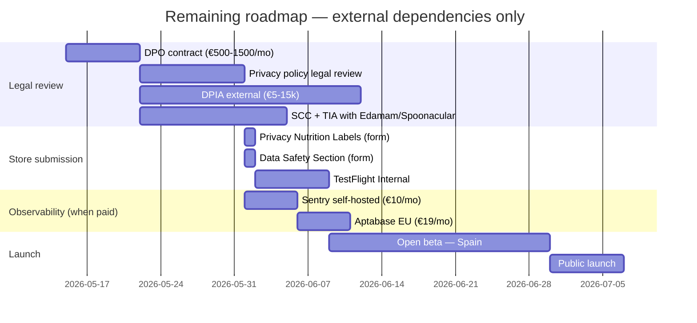

# 09 — Prioritized Improvement Plan

**Status (2026-05-14):** ~21 of the 28 findings have been closed during a five-sprint engineering pass (commit `aaa3179`). The 6 items that remain require external spend (DPO, DPIA consultancy, Sentry hosting, Aptabase, SCC negotiation) and are tracked as **DEFERRED**. Effort is in T-shirt sizing (S = <2 days, M = <2 weeks, L = >2 weeks).

| # | Finding | Section | Severity | Effort | Impact | Status |
|---|---|---|---|---|---|---|
| 1 | ~~Full data erasure not implemented~~ | [§5.4](./05-privacy-model.md#54-data-subject-rights-implemented-in-the-app) | ~~🔴 High~~ | S | Critical | ✅ Done — `src/services/dataErasure.ts`, wired in `app/settings.tsx`. Wipes 12 tables + 16 AsyncStorage keys + FileSystem + master key. 3 tests. |
| 2 | ~~`EXPO_PUBLIC_*` secrets in the bundle~~ | [§3.6](./03-security-encryption.md#36-secrets-management-in-the-repo) | ~~🔴 High~~ | M | Critical | ✅ Done (commit `1647aac`). All upstreams via BFF; zero third-party API keys in the binary. |
| 3 | Privacy policy not published | [§5.5](./05-privacy-model.md#55-gdpr-roadmap-8-steps--current-status) step 3 | **🔴 High** | S | Critical (App Store block) | ⚠️ Engineering done — `app/legal/privacy.tsx` renders `assets/legal/privacy-policy-v1.{en,es}.md`. **DEFERRED**: legal-counsel review of the final text + publication to a public URL. |
| 4 | No Sentry / observability → Art. 33 impossible | [§7](./07-observability.md) | **🔴 High** | S | Critical | ⚠️ Engineering done — `src/utils/logger.ts` with PII scrubbing replaces 55 `console.*` calls; `src/services/auditLog.ts` + migration 014 persist a local encrypted audit log. **DEFERRED**: Sentry self-hosted instance (~€10/mo Hetzner). |
| 5 | ~~Medical disclaimer missing in chat~~ | [§4.6](./04-ai-architecture.md#46-ai-governance) | ~~🔴 High~~ | S | High (Art. 22 + civil liability) | ✅ Done — persistent non-dismissible banner under the AIAssistant header, EN+ES. |
| 6 | ~~Granular Art. 9 consent not implemented~~ | [§5.2](./05-privacy-model.md#52-legal-basis-and-consent) | ~~🔴 High~~ | M | Critical | ✅ Done — `src/modules/consent/ConsentContext.tsx` with 3 toggles (health, ai, documents). Onboarding step + Settings UI for Art. 7.3 revocation. Audit logs every toggle change. |
| 7 | DPIA not performed | [§5.5](./05-privacy-model.md#55-gdpr-roadmap-8-steps--current-status) step 8 | **🔴 High** | M (outsourceable) | Critical | ❌ **DEFERRED** — €5-15k external consultancy (Garrigues, Ecix, KPMG). Required before AEPD submission. |
| 8 | DPO not designated | [§5.5](./05-privacy-model.md#55-gdpr-roadmap-8-steps--current-status) step 1 | **🔴 High** | S | High | ❌ **DEFERRED** — €500-1500/mo fractional DPO contract. |
| 9 | ~~Art. 9 field encryption coverage gaps~~ (weight, height, allergies, dateOfBirth) | [§3.1](./03-security-encryption.md#31-data-encryption-policy) | ~~🟡 Medium-High~~ | M | High | ✅ Done — all four fields use the `enc:v1:` pattern in `family_profiles`. Migration on boot upgrades pre-Sprint-2 installs. 5 tests. |
| 10 | ~~Clinical PDFs unencrypted at rest~~ | [§3.5](./03-security-encryption.md#35-threat-model-simplified-stride) STRIDE | ~~🟡 Medium-High~~ | M | Critical if jailbreak | ✅ Done — `src/services/secureFileStore.ts` wraps every upload with `encryptBytes`; files land as `<id>.pdf.enc`. Boot migration rewrites legacy plaintext. 5 tests. |
| 11 | ~~SHA256 verification of the `.pte` model~~ | [§3.5](./03-security-encryption.md#35-threat-model-simplified-stride) STRIDE | ~~🟡 Medium~~ | S | Medium-High | ✅ Engineering done — `verifyArtifactSha256()` + `EXPECTED_*_SHA256` constants in `onDeviceLlm.ts`. Pins remain empty until the BFF upload runbook produces the hashes. |
| 12 | ~~Automatic retention (sweeper)~~ | [§2.9](./02-data-model-architecture.md#29-table--pii-catalog) | ~~🟡 Medium~~ | M | High (Art. 5.1.e) | ✅ Done — `src/services/dataRetention.ts` runs once per day at boot. Rules: scan_history 180d, meal_plans 90d, conversation_summaries 30d, audit_log 365d. |
| 13 | ~~Privacy Nutrition Labels + Data Safety Section~~ | [§8.2-8.3](./08-production-readiness.md#82-apple-app-store-compliance) | ~~🟡 Medium-High~~ | S | Critical (store block) | ⚠️ Documented in `docs/store-readiness/privacy-labels.md` with field-by-field guidance. **DEFERRED**: filling the App Store Connect + Play Console forms at submission time. |
| 14 | ~~Model Card published for the deployed AI~~ | [§4.6](./04-ai-architecture.md#46-ai-governance) | ~~🟡 Medium~~ | S | Medium | ✅ Done — `docs/MODEL_CARD.md` following the Google template. |
| 15 | SCC with Edamam + Spoonacular + Transfer Impact Assessment | [§5.6](./05-privacy-model.md#56-international-transfers-schrems-ii) | **🟡 Medium-High** | M | High | ❌ **DEFERRED** — legal negotiation with the upstream providers. |
| 16 | ~~Dependabot + CI secret scanning~~ | [§3.6](./03-security-encryption.md#36-secrets-management-in-the-repo), [§3.7](./03-security-encryption.md#37-dependencies-and-supply-chain) | ~~🟡 Medium~~ | S | Medium | ✅ Done — `.github/dependabot.yml` (weekly, both app + BFF) + `.github/workflows/gitleaks.yml`. |
| 17 | ~~CycloneDX SBOM + license check~~ | [§3.7](./03-security-encryption.md#37-dependencies-and-supply-chain) | ~~🟢 Low-Medium~~ | S | Low-Medium | ✅ Done — `.github/workflows/sbom.yml` emits SBOM per release + license whitelist (AGPL/GPL/LGPL fail the build). |
| 18 | ~~ROPA (Records of Processing Activities)~~ | [§5.5](./05-privacy-model.md#55-gdpr-roadmap-8-steps--current-status) step 4 | ~~🟡 Medium-High~~ | S | High | ✅ Done — `docs/legal/ROPA.md` with 18 processing activities (AEPD-shaped). |
| 19 | Non-PII telemetry / events (Aptabase/PostHog EU) | [§4.7](./04-ai-architecture.md#47-engagement-model), [§7](./07-observability.md) | **🟡 Medium** | M | High (measure engagement) | ❌ **DEFERRED** — Aptabase €19/mo or PostHog self-host. The logger hook is in place so wiring will be drop-in. |
| 20 | ~~Zod runtime validation on external API payloads~~ | [§6.4](./06-data-governance.md#64-data-quality) | ~~🟢 Medium~~ | M | Medium | ✅ Done — boundary schemas on OpenFoodFacts (strict), Edamam + Spoonacular (permissive `.passthrough()`). Drift surfaces as `upstream_schema_drift` log. |
| 21 | ~~Declare FKs in a migration~~ | [§6.4](./06-data-governance.md#64-data-quality) | ~~🟢 Low~~ | S | Low | ✅ Done — migration 015 creates `member_index` and rebuilds `member_memories`/`doc_chunks`/`conversation_summaries` with real `ON DELETE CASCADE` FKs. `profileStorage` syncs the index. |
| 22 | ~~Consolidate master catalogs in `src/domain/masterData.ts`~~ | [§6.3](./06-data-governance.md#63-master--reference-data) | ~~🟢 Low~~ | M | Medium | ✅ Done — `src/domain/masterData.ts` with `EU_14_ALLERGENS`, `CONDITIONS_LIST`, `DIET_VALUES`, `SPOONACULAR_CUISINE_QUERIES`. Coherence test verifies every catalog entry has EN+ES i18n + allergen-keyword rule. |
| 23 | ~~Fallback plan for older devices (RAM <6GB)~~ | [§8.10](./08-production-readiness.md#810-critical-risks-top-5) risk 4 | ~~🟡 Medium~~ | S | Medium-High (UX) | ✅ Done — `src/services/deviceCapabilities.ts` probes `expo-device.totalMemory`; <6 GB persistently disables the AI download + FAB. |
| 24 | ~~Encrypted local audit log~~ | [§3.4](./03-security-encryption.md#34-observability-policy-security-lens), [§5.4](./05-privacy-model.md#54-data-subject-rights-implemented-in-the-app) | ~~🟡 Medium~~ | M | High | ✅ Done — migration 014 + `src/services/auditLog.ts`. Payloads AES-GCM-encrypted, metadata in cleartext for Art. 33 enumeration. `pseudonymise()` hashes IDs in payloads. "My activity" surface in `app/audit-log.tsx`. |
| 25 | ~~Master-key rotation~~ | [§3.2](./03-security-encryption.md#32-key-storage-policy) | ~~🟢 Low~~ | M | Medium | ✅ Done — `src/services/keyRotation.ts` with stream batching (100 DB rows + 1 PDF at a time, ~5 MB peak heap). Settings UI exposes the trigger. Atomic key swap only after every decrypt succeeds. |
| 26 | ~~Persistent "not medical advice" disclaimer~~ | [§4.6](./04-ai-architecture.md#46-ai-governance) | ~~🔴 High~~ | S | High | ✅ Done — duplicate of #5. |
| 27 | ~~Parental verification for child profiles~~ | [§5.7](./05-privacy-model.md#57-data-of-minors) | ~~🟡 Medium~~ | S | High | ✅ Done — required checkbox in `app/onboarding.tsx` for members with age <14; audit event `parental_consent_granted` records `(memberIndex, age, policyVersion)`. |
| 28 | ~~Remove unused medical fields~~ | [§5.3](./05-privacy-model.md#53-gdpr-principles-applied-to-the-design) | ~~🟢 Low~~ | S | Low | ✅ Done — `bloodPressure`, `hrv`, `spO2`, `restingHeartRate` removed from `FamilyMember` and the profile screen (data minimization, Art. 5.1.c). |

## Summary

| Status | Count | Detail |
|---|---|---|
| ✅ Resolved in code | 21 | Items 1, 2, 5, 6, 9, 10, 11, 12, 14, 16, 17, 18, 20, 21, 22, 23, 24, 25, 26, 27, 28 |
| ⚠️ Code done, external action pending | 2 | Item 3 (legal text + publication), 13 (forms filled at submission) |
| ⚠️ Logger in place, no remote sink yet | 1 | Item 4 (Sentry hosting deferred) |
| ❌ Deferred (external spend required) | 4 | Items 7 (DPIA), 8 (DPO), 15 (SCC), 19 (telemetry SaaS) |

## What's left to launch in Spain

Engineering can sit idle on this branch — every blocker that can be closed without external contracts has been closed. The DPIA + DPO are the gating dependencies for the rest.
