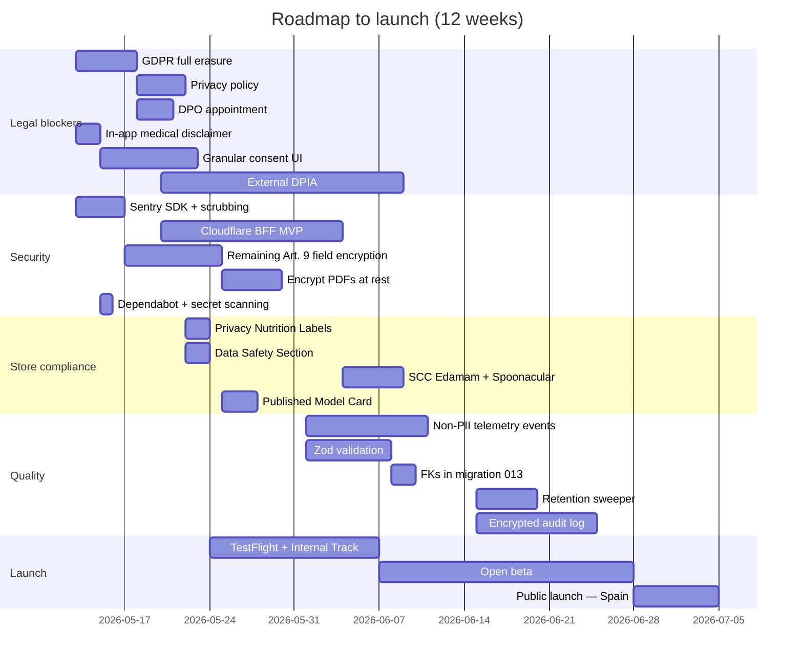

# 09 — Prioritized Improvement Plan

**Current state:** the table below consolidates the findings from sections 0–8, ordered by severity. Effort is in T-shirt sizing (S = <2 days, M = <2 weeks, L = >2 weeks). The recommended order is based on (severity × impact) / effort, prioritizing launch blockers.

| # | Finding | Section | Severity | Effort | Impact | Attack order |
|---|---|---|---|---|---|---|
| 1 | Full data erasure not implemented (empty handler) | [§5.4](./05-privacy-model.md#54-data-subject-rights-implemented-in-the-app) | **🔴 High** | S | Critical (blocks launch under GDPR Art. 17) | 1 |
| 2 | ~~`EXPO_PUBLIC_*` with FatSecret + Spoonacular secrets in the bundle~~ ✅ **Resolved** — all upstreams now reached via BFF, zero third-party API keys in the bundle | [§3.6](./03-security-encryption.md#36-secrets-management-in-the-repo) | ✅ Done | M | Critical | — |
| 3 | Privacy policy not published | [§5.5](./05-privacy-model.md#55-gdpr-roadmap-8-steps--current-status) step 3 | **🔴 High** | S | Critical (App Store block) | 3 |
| 4 | No Sentry / observability → Art. 33 impossible | [§7](./07-observability.md) | **🔴 High** | S | Critical | 4 |
| 5 | Medical disclaimer missing in chat | [§4.6](./04-ai-architecture.md#46-ai-governance) | **🔴 High** | S | High (Art. 22 + civil liability) | 5 |
| 6 | Granular Art. 9 consent not implemented | [§5.2](./05-privacy-model.md#52-legal-basis-and-consent) | **🔴 High** | M | Critical | 6 |
| 7 | DPIA not performed | [§5.5](./05-privacy-model.md#55-gdpr-roadmap-8-steps--current-status) step 8 | **🔴 High** | M (outsourceable) | Critical | 7 |
| 8 | DPO not designated | [§5.5](./05-privacy-model.md#55-gdpr-roadmap-8-steps--current-status) step 1 | **🔴 High** | S | High | 8 |
| 9 | At-rest encryption does not cover every Art. 9 field (weight, height, allergies, dateOfBirth) | [§3.1](./03-security-encryption.md#31-data-encryption-policy) | **🟡 Medium-High** | M | High | 9 |
| 10 | Clinical PDFs unencrypted at rest | [§3.5](./03-security-encryption.md#35-threat-model-simplified-stride) STRIDE | **🟡 Medium-High** | M | Critical if jailbreak | 10 |
| 11 | SHA256 verification of the `.pte` model | [§3.5](./03-security-encryption.md#35-threat-model-simplified-stride) STRIDE | **🟡 Medium** | S | Medium-High | 11 |
| 12 | Automatic retention (sweeper) | [§2.9](./02-data-model-architecture.md#29-table--pii-catalog), [§5.3](./05-privacy-model.md#53-gdpr-principles-applied-to-the-design) | **🟡 Medium** | M | High (Art. 5.1.e) | 12 |
| 13 | Privacy Nutrition Labels + Data Safety Section | [§8.2-8.3](./08-production-readiness.md#82-apple-app-store-compliance) | **🟡 Medium-High** | S | Critical (store block) | 13 |
| 14 | Model Card published for the deployed AI | [§4.6](./04-ai-architecture.md#46-ai-governance) | **🟡 Medium** | S | Medium | 14 |
| 15 | SCC with Edamam + Spoonacular + Transfer Impact Assessment | [§5.6](./05-privacy-model.md#56-international-transfers-schrems-ii) | **🟡 Medium-High** | M | High | 15 |
| 16 | Dependabot + CI secret scanning | [§3.6](./03-security-encryption.md#36-secrets-management-in-the-repo), [§3.7](./03-security-encryption.md#37-dependencies-and-supply-chain) | **🟡 Medium** | S | Medium | 16 |
| 17 | CycloneDX SBOM + license check | [§3.7](./03-security-encryption.md#37-dependencies-and-supply-chain) | **🟢 Low-Medium** | S | Low-Medium | 17 |
| 18 | ROPA (Records of Processing Activities) | [§5.5](./05-privacy-model.md#55-gdpr-roadmap-8-steps--current-status) step 4 | **🟡 Medium-High** | S | High | 18 |
| 19 | Non-PII telemetry / events (Aptabase/PostHog EU) | [§4.7](./04-ai-architecture.md#47-engagement-model), [§7](./07-observability.md) | **🟡 Medium** | M | High (measure engagement) | 19 |
| 20 | Zod runtime validation on external API payloads | [§6.4](./06-data-governance.md#64-data-quality) | **🟢 Medium** | M | Medium | 20 |
| 21 | Declare FKs in a migration 013 + tests | [§6.4](./06-data-governance.md#64-data-quality) | **🟢 Low** | S | Low | 21 |
| 22 | Consolidate master catalogs in `src/domain/masterData.ts` | [§6.3](./06-data-governance.md#63-master--reference-data) | **🟢 Low** | M | Medium | 22 |
| 23 | Fallback plan for older devices (RAM <6GB) | [§8.10](./08-production-readiness.md#810-critical-risks-top-5) risk 4 | **🟡 Medium** | S | Medium-High (UX) | 23 |
| 24 | Encrypted local audit log (DSR + Art. 22 evidence) | [§3.4](./03-security-encryption.md#34-observability-policy-security-lens), [§5.4](./05-privacy-model.md#54-data-subject-rights-implemented-in-the-app) | **🟡 Medium** | M | High | 24 |
| 25 | Scheduled master-key rotation | [§3.2](./03-security-encryption.md#32-key-storage-policy) | **🟢 Low** | M | Medium | 25 |
| 26 | Persistent "not medical advice" disclaimer in the chat | [§4.6](./04-ai-architecture.md#46-ai-governance) | **🔴 High** | S | High | 26 |
| 27 | Parental verification for child profiles | [§5.7](./05-privacy-model.md#57-data-of-minors) | **🟡 Medium** | S | High | 27 |
| 28 | Remove unused medical fields (`bloodPressure`, `hrv`, `spO2`) or justify them | [§5.3](./05-privacy-model.md#53-gdpr-principles-applied-to-the-design) | **🟢 Low** | S | Low (meets minimization) | 28 |

## Recommended sequence to reach launch (next 90 days)

