# 11 — Extended Diagrams & Visualizations

**Current state:** sections 1–10 already contain ~12 Mermaid diagrams of type `flowchart`, `erDiagram` and `gantt`. This section adds **17 more diagrams** covering types not used before (C4 stand-in, sequence, state, mindmap, journey, quadrant, pie, timeline, sankey) plus **3 ASCII infographics** for concepts that Mermaid does not render well (trust boundaries, storage map, concentric security layers).

The one-page **integrator diagram** ("if the evaluator only sees one image, let it be this one") has been hoisted to the top of [`README.md`](./README.md#one-page-picture).

**Why Mermaid:** the document must be **reproducible and portable** for the reader. Mermaid renders natively in GitHub, GitLab, VSCode (with extension), Obsidian, Bitbucket, Azure DevOps, Notion, Quarto and Pandoc — zero friction. Flashier alternatives (Excalidraw, draw.io, Lucidchart, Figma) require a separate viewer or are binary (breaking text-based version control). ASCII infographics complement Mermaid where a quick visual scheme is needed without dependencies.

**How to read this section:** each diagram carries (i) **intent** — the concrete question it answers, (ii) the diagram, (iii) **reading keys**, and where applicable, (iv) cross-references to the sections 1–10 that elaborate in prose.

## 11.1. C4 model — structural views

Simon Brown's C4 model proposes 4 abstraction levels (Context, Container, Component, Code). Mermaid does not implement C4 officially, but `flowchart` with subgraphs and a consistent style reproduces the visual language without loss.

### 11.1.1. C4 Level 1 — System context diagram

**Intent:** *who interacts with NutrIAssistant and which other systems does it communicate with?*

```mermaid
flowchart TB
    classDef person fill:#08427b,stroke:#073b6f,color:#fff
    classDef system fill:#1168bd,stroke:#0b4884,color:#fff
    classDef external fill:#999,stroke:#6b6b6b,color:#fff

    U([👤 Adult user<br/>family super-user]):::person
    M([👶 Minor member<br/>profile without AI access]):::person
    DPO([🛡️ DPO<br/>data protection]):::person

    NIA[/<b>NutrIAssistant</b><br/>iOS + Android mobile app<br/>local-first, on-device AI/]:::system

    OFF([🥫 OpenFoodFacts<br/>barcode → product]):::external
    ED([🥗 Edamam<br/>via BFF · Mediterranean catalog]):::external
    SP([🍲 Spoonacular<br/>API key · multi-cuisine catalog]):::external
    HF([🤖 HuggingFace CDN<br/>.pte model downloads]):::external
    AH([❤️ Apple HealthKit<br/>iOS native]):::external
    HC([🏃 Health Connect<br/>Android native]):::external
    KC([🔐 iOS Keychain / Android Keystore<br/>OS-managed key store]):::external
    AEPD([⚖️ AEPD<br/>supervisory authority]):::external

    U -->|uses, configures family| NIA
    M -.->|profile managed by guardian| NIA
    DPO -->|oversees compliance| NIA

    NIA -->|GET barcode JSON| OFF
    NIA -->|GET recipes JSON + OAuth| FS
    NIA -->|GET recipes JSON + API key| SP
    NIA -->|GET model.pte tokenizers| HF
    NIA -->|reads HKQuantityTypeSteps| AH
    NIA -->|reads Steps + ActiveCaloriesBurned| HC
    NIA -->|persists nutri_master_key_v1| KC
    NIA -. Art. 33 breach notification <72h .-> AEPD
```

**Reading keys:**

- **Personal data leaves the device zero times**. All catalog calls are routed through the BFF (`api.nutriassistant.org`) which forwards anonymous queries to OFF / Edamam / Spoonacular; no PII transits.
- HealthKit and Health Connect are **OS APIs**, not external services — data does not traverse the internet beyond what Apple/Google decide based on OS-level user consent.
- The dashed line to AEPD is **reactive** (only in case of a breach), not continuous.
- References: [§2.1](./02-data-model-architecture.md#21-logical-architecture-diagram-as-is), [§5.6](./05-privacy-model.md#56-international-transfers-schrems-ii), [§5.5](./05-privacy-model.md#55-gdpr-roadmap-8-steps--current-status).

### 11.1.2. C4 Level 2 — Container diagram

**Intent:** *what large technology pieces live inside the device and how do they communicate?*

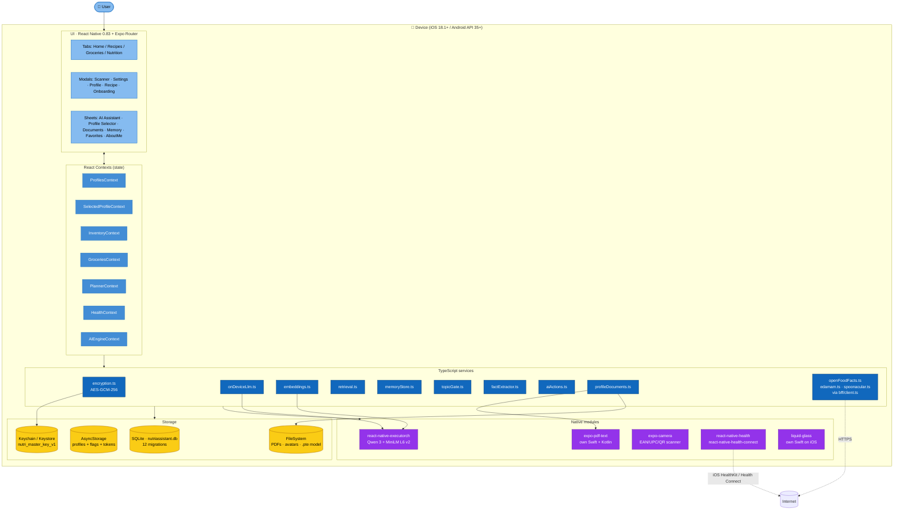
```mermaid
flowchart TB
    classDef ui fill:#85bbf0,stroke:#1168bd,color:#000
    classDef ctx fill:#438dd5,stroke:#1168bd,color:#fff
    classDef svc fill:#1168bd,stroke:#073b6f,color:#fff
    classDef store fill:#facc15,stroke:#a16207,color:#000
    classDef native fill:#9333ea,stroke:#6b21a8,color:#fff

    U([👤 User]):::ui

    subgraph Device["📱 Device (iOS 18.1+ / Android API 35+)"]
        direction TB

        subgraph UI["UI · React Native 0.83 + Expo Router"]
            Tabs[Tabs: Home / Recipes / Groceries / Nutrition]:::ui
            Modals[Modals: Scanner · Settings · Profile · Recipe · Onboarding]:::ui
            Sheets[Sheets: AI Assistant · Profile Selector · Documents · Memory · Favorites · AboutMe]:::ui
        end

        subgraph Contexts["React Contexts (state)"]
            P[ProfilesContext]:::ctx
            SP_[SelectedProfileContext]:::ctx
            I[InventoryContext]:::ctx
            G[GroceriesContext]:::ctx
            Pl[PlannerContext]:::ctx
            H[HealthContext]:::ctx
            AI[AIEngineContext]:::ctx
        end

        subgraph Services["TypeScript services"]
            Enc[encryption.ts<br/>AES-GCM-256]:::svc
            LLM[onDeviceLlm.ts]:::svc
            Emb[embeddings.ts]:::svc
            Ret[retrieval.ts]:::svc
            Mem[memoryStore.ts]:::svc
            TG[topicGate.ts]:::svc
            FX[factExtractor.ts]:::svc
            Act[aiActions.ts]:::svc
            PD[profileDocuments.ts]:::svc
            Net[openFoodFacts.ts<br/>edamam.ts · spoonacular.ts<br/>via bff/client.ts]:::svc
        end

        subgraph Storage["Storage"]
            SQL[(SQLite · nutriassistant.db<br/>12 migrations)]:::store
            AS[(AsyncStorage<br/>profiles + flags + tokens)]:::store
            FSys[(FileSystem<br/>PDFs · avatars · .pte model)]:::store
            KCS[(Keychain / Keystore<br/>nutri_master_key_v1)]:::store
        end

        subgraph Native["Native modules"]
            Exe[react-native-executorch<br/>Qwen 3 + MiniLM L6 v2]:::native
            PdfNat[expo-pdf-text<br/>own Swift + Kotlin]:::native
            CamNat[expo-camera<br/>EAN/UPC/QR scanner]:::native
            HKNat[react-native-health<br/>react-native-health-connect]:::native
            GlassNat[liquid-glass<br/>own Swift on iOS]:::native
        end
    end

    U --> UI
    UI <--> Contexts
    Contexts --> Services
    Services --> Storage
    Services --> Native

    Enc --> KCS
    LLM --> Exe
    Emb --> Exe
    PD --> PdfNat
    PD --> FSys
    Net -. HTTPS .-> Cloud[(Internet)]
    HKNat -. iOS HealthKit / Health Connect .-> Cloud
```

**Reading keys:**

- **Contexts** are the only way to mutate state — UI components never touch services or stores directly.
- There are **two in-house native modules** (`expo-pdf-text` for PDF text extraction, `liquid-glass` for the iOS 26 effect) — the rest are standard packages.
- Encryption (`encryption.ts`) is traversed by nearly every service that persists sensitive data.
- References: [§2.1](./02-data-model-architecture.md#21-logical-architecture-diagram-as-is), [§4](./04-ai-architecture.md) (AI services), [§3](./03-security-encryption.md) (encryption).

### 11.1.3. C4 Level 3 — AI Engine component

**Intent:** *how are the internal pieces that produce an AI chat response connected?*

```mermaid
flowchart LR
    classDef in fill:#fde68a,stroke:#a16207
    classDef gate fill:#fca5a5,stroke:#b91c1c
    classDef build fill:#bfdbfe,stroke:#1d4ed8
    classDef llm fill:#c4b5fd,stroke:#7c3aed
    classDef out fill:#86efac,stroke:#15803d
    classDef store fill:#facc15,stroke:#a16207

    UQ[User query]:::in
    Img[Optional base64 image]:::in

    UQ --> Age{age >= 18?<br/>aiAccess.ts}:::gate
    Age -- no --> Hidden[FAB hidden<br/>sheet auto-close]
    Age -- yes --> TG{Topic Gate<br/>classify EN+ES stems}:::gate
    TG -- out --> Ref[Localized canned refusal]:::out
    TG -- in/ambiguous --> Busy{llmBusyRef?<br/>singleton lock}:::gate
    Busy -- 10s wait .-> Wait[modelPreparingMessage]:::out
    Busy -- free --> Reads[Parallel reads]

    subgraph Reads["Parallel reads"]
        direction TB
        R1[getAllRecipes 40]
        R2[getRecipesByIds favorites]
        R3[getTopMemoriesForMember K=5]
        R4[embedTextOrNull query]
        R5[getSchoolMenuEntries school-age]
    end

    Reads --> Rk1[rankByKeywordOverlap pantry K=10]:::build
    Reads --> Rk2[rankByKeywordOverlap recipes K=8]:::build
    R4 --> Ret[retrievePdfChunks<br/>cosine top K=2 threshold 0.4]:::build
    Rk1 --> BP
    Rk2 --> BP
    Ret --> BP
    R3 --> BP
    R5 --> BP[buildSystemPrompt<br/>cap 4500 chars]:::build

    BP --> Gen[generateOnDevice<br/>Qwen 3 1.7B Quantized]:::llm
    UQ --> Hist[buildPromptWithHistory<br/>last 4 turns]
    Hist --> Gen

    Gen -- token stream --> Strip[stripThinkingBlock<br/>regex think]:::build
    Strip --> UI_[setMessages display]:::out

    Gen --> Parse[parseActions<br/>actions JSON]:::build
    Parse -- valid --> ApplyA[applyAIActions<br/>filter unknown ids]:::out
    Parse --> Sched[scheduleFactExtraction<br/>debounce 2s]:::build
    Sched --> FE[extractFactsFromTurn<br/>JSON facts]:::llm
    FE --> Pend[PendingFact banner UI]:::out
    Pend -- accept --> AddM[addMemberMemory<br/>encrypt + insert]:::store

    Img -. ⚠️ GAP vision model not integrated .-> Gen
```

**Reading keys:**

- **Triple age defense**: `Hidden` (FAB), host-level sheet close, refusal in `sendMessage` — defense-in-depth (ADR-004).
- The **Topic Gate** saves ~2-5s of inference on off-topic questions (ADR-005).
- The **5 parallel reads** avoid a waterfall — explicitly designed via `Promise.all` in `AIContext.tsx:220-234`.
- The **fact extractor** runs debounced and never persists without human acceptance (ADR-006).
- References: [§4.2](./04-ai-architecture.md#42-ai-pipeline-as-is-and-to-be) AS-IS pipeline, [§4.5](./04-ai-architecture.md#45-rag-architecture) RAG, [§4.6](./04-ai-architecture.md#46-ai-governance) AI governance.

### 11.1.4. C4 Level 3 — Encryption + Profile Storage component

**Intent:** *how does a sensitive datum travel from the UI to encryption into AsyncStorage / SQLite?*

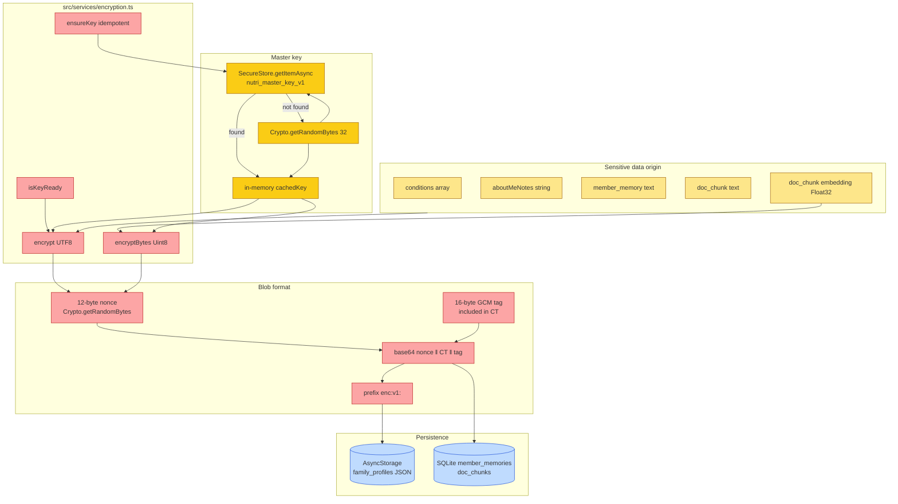
```mermaid
flowchart TB
    classDef src fill:#fde68a,stroke:#a16207
    classDef crypto fill:#fca5a5,stroke:#b91c1c
    classDef key fill:#facc15,stroke:#a16207
    classDef store fill:#bfdbfe,stroke:#1d4ed8

    subgraph Sources["Sensitive data origin"]
        Cond[conditions array]:::src
        About[aboutMeNotes string]:::src
        MemTxt[member_memory text]:::src
        DocTxt[doc_chunk text]:::src
        Emb[doc_chunk embedding Float32]:::src
    end

    subgraph Crypto["src/services/encryption.ts"]
        EK[ensureKey idempotent]:::crypto
        IsR[isKeyReady]:::crypto
        Encrypt[encrypt UTF8]:::crypto
        EncryptB[encryptBytes Uint8]:::crypto
    end

    subgraph Key["Master key"]
        SS[SecureStore.getItemAsync<br/>nutri_master_key_v1]:::key
        Cache[in-memory cachedKey]:::key
        Rand[Crypto.getRandomBytes 32]:::key
    end

    subgraph Format["Blob format"]
        Sentinel[prefix enc:v1:]:::crypto
        Nonce[12-byte nonce<br/>Crypto.getRandomBytes]:::crypto
        Tag[16-byte GCM tag<br/>included in CT]:::crypto
        B64[base64 nonce ‖ CT ‖ tag]:::crypto
    end

    subgraph Destinations["Persistence"]
        AS_[(AsyncStorage<br/>family_profiles JSON)]:::store
        SQL_[(SQLite member_memories<br/>doc_chunks)]:::store
    end

    EK --> SS
    SS -- not found --> Rand
    SS -- found --> Cache
    Rand --> Cache
    Rand --> SS

    Sources --> Encrypt
    Emb --> EncryptB
    IsR --> Encrypt
    Cache --> Encrypt
    Cache --> EncryptB

    Encrypt --> Nonce
    EncryptB --> Nonce
    Nonce --> B64
    Tag --> B64
    B64 --> Sentinel

    Sentinel --> AS_
    B64 --> SQL_
```

**Reading keys:**

- **A single master key** (`nutri_master_key_v1`) encrypts everything. No rotation implemented (⚠️ GAP [§3.2](./03-security-encryption.md#32-key-storage-policy)).
- **Embeddings are encrypted as bytes** (`encryptBytes`) because they are `Float32Array`; everything else as UTF-8 (`encrypt`).
- The `enc:v1:` prefix lets us detect legacy plaintext during migrations (ADR-002).
- ⚠️ The scheme covers 4 PII fields but leaves `weight`, `height`, `dateOfBirth`, `allergies`, `bloodPressure`, `hrv`, `spO2`, `avatarUrl`, and the PDFs in `FileSystem` exposed ([§3.1](./03-security-encryption.md#31-data-encryption-policy) coverage).

### 11.1.5. C4 Level 3 — RAG Pipeline component (PDF → response)

**Intent:** *how does a clinical PDF uploaded by the user end up injected into the assistant's response?*


```mermaid
flowchart LR
    classDef io fill:#fde68a,stroke:#a16207
    classDef proc fill:#bfdbfe,stroke:#1d4ed8
    classDef llm fill:#c4b5fd,stroke:#7c3aed
    classDef store fill:#facc15,stroke:#a16207

    Pdf[/Clinical PDF<br/>uploaded by user/]:::io

    subgraph Upload["Upload"]
        Pick[DocumentPicker]:::proc
        Copy[FileSystem.copyAsync<br/>documentDirectory/profile-documents/&lt;member&gt;]:::proc
    end

    subgraph Native["Native module expo-pdf-text"]
        Ext[extractPdfText<br/>Swift PDFKit / Android PdfRenderer]:::proc
    end

    subgraph Build["Building pipeline"]
        Trunc[truncate to 8000 chars]:::proc
        Chunk[chunkPdfText<br/>sentence-aware 80-450]:::proc
        Sum[summarizeDocument<br/>LLM cap 500 chars]:::llm
    end

    subgraph Vec["Vectorization"]
        EmbF[embedTextOrNull<br/>MiniLM L6 v2 384-dim]:::llm
        EncryB[encryptBytes embedding]:::proc
        EncryT[encrypt text]:::proc
    end

    subgraph Persist["Persistence"]
        Ins[insertDocChunk]:::proc
        DC[(doc_chunks BLOB)]:::store
        Meta[ProfileDocument.aiSummary]:::store
    end

    subgraph Query["Query time"]
        Q[user query]:::io
        EmbQ[embedTextOrNull query]:::llm
        Get[getDocChunksForMember]:::proc
        Cos[cosineSimilarity scan<br/>threshold 0.4]:::proc
        Top[top K=2 chunks]:::proc
        BP[buildSystemPrompt<br/>injects filename + text]:::proc
        LLM_[generateOnDevice<br/>Qwen 3]:::llm
    end

    Pdf --> Pick --> Copy --> Ext
    Ext --> Trunc --> Chunk --> EmbF
    Ext --> Sum
    EmbF --> EncryB
    Chunk --> EncryT
    EncryB --> Ins
    EncryT --> Ins
    Ins --> DC
    Sum --> Meta

    Q --> EmbQ --> Cos
    Get --> Cos
    DC --> Get
    Cos --> Top --> BP
    Meta --> BP
    BP --> LLM_
```

**Reading keys:**

- **Brute-force full-scan cosine** with no index (HNSW/IVF) because there are <100 chunks per family ([§4.5](./04-ai-architecture.md#45-rag-architecture)).
- The **`aiSummary`** is persisted on `ProfileDocument` (part of `family_profiles` in AsyncStorage) and **always injected** into the prompt even when the query retrieves no similar chunks — a fallback layer.
- ⚠️ The physical PDF remains **in cleartext** under `FileSystem.documentDirectory` ([§3.5](./03-security-encryption.md#35-threat-model-simplified-stride) STRIDE: Information Disclosure on jailbreak).

## 11.2. Sequence diagrams — system dynamics

The structural C4 diagrams show *what is there*. Sequence diagrams show *when* and *in what order* things happen — key for understanding latency, parallelism, and error ordering.

### 11.2.1. Sequence — App cold boot

**Intent:** *what exactly happens between tap-on-icon and a usable app?*

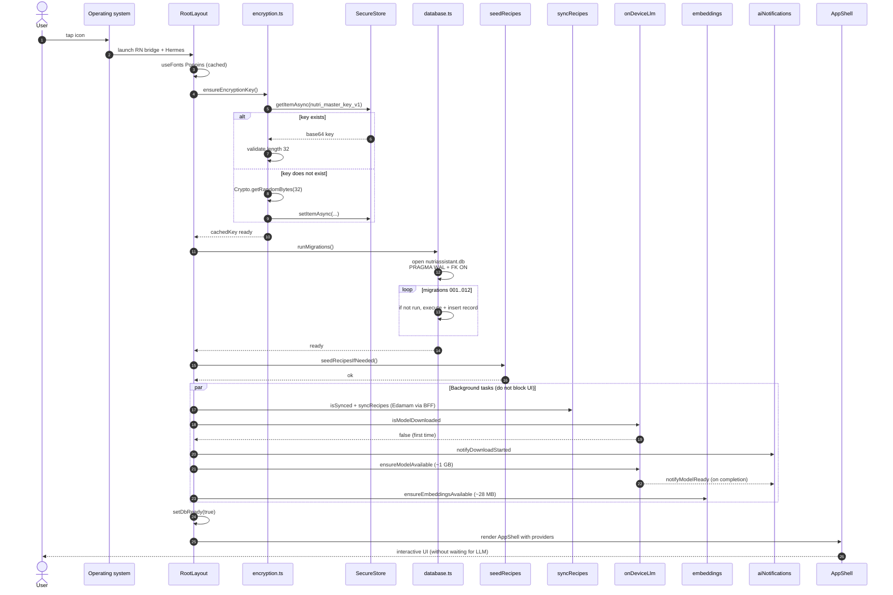
```mermaid
sequenceDiagram
    autonumber
    actor U as User
    participant OS as Operating system
    participant RL as RootLayout
    participant Enc as encryption.ts
    participant SS as SecureStore
    participant DB as database.ts
    participant Seed as seedRecipes
    participant Sync as syncRecipes
    participant LLM as onDeviceLlm
    participant Emb as embeddings
    participant Notif as aiNotifications
    participant Shell as AppShell

    U->>OS: tap icon
    OS->>RL: launch RN bridge + Hermes
    RL->>RL: useFonts Poppins (cached)
    RL->>Enc: ensureEncryptionKey()
    Enc->>SS: getItemAsync(nutri_master_key_v1)
    alt key exists
        SS-->>Enc: base64 key
        Enc->>Enc: validate length 32
    else key does not exist
        Enc->>Enc: Crypto.getRandomBytes(32)
        Enc->>SS: setItemAsync(...)
    end
    Enc-->>RL: cachedKey ready
    RL->>DB: runMigrations()
    DB->>DB: open nutriassistant.db<br/>PRAGMA WAL + FK ON
    loop migrations 001..012
        DB->>DB: if not run, execute + insert record
    end
    DB-->>RL: ready
    RL->>Seed: seedRecipesIfNeeded()
    Seed-->>RL: ok
    par Background tasks (do not block UI)
        RL->>Sync: isSynced + syncRecipes (Edamam via BFF)
        RL->>LLM: isModelDownloaded
        LLM-->>RL: false (first time)
        RL->>Notif: notifyDownloadStarted
        RL->>LLM: ensureModelAvailable (~1 GB)
        LLM-->>Notif: notifyModelReady (on completion)
        RL->>Emb: ensureEmbeddingsAvailable (~28 MB)
    end
    RL->>RL: setDbReady(true)
    RL->>Shell: render AppShell with providers
    Shell-->>U: interactive UI (without waiting for LLM)
```

**Reading keys:**

- The **master key must be ready before the migrations** because some tables (`member_memories`, `doc_chunks`) will only be read with a valid key ([§3.2](./03-security-encryption.md#32-key-storage-policy)).
- The **LLM does not block the UI** — the app is usable during model download. The chat stays "pending model" until `notifyModelReady` (`app/_layout.tsx:128-145`).
- The **three parallel tasks** (recipe sync + LLM + embeddings) are critical for an acceptable first-launch experience.

### 11.2.2. Sequence — End-to-end AI chat turn

**Intent:** *what really happens from "send" tap to seeing a response?*

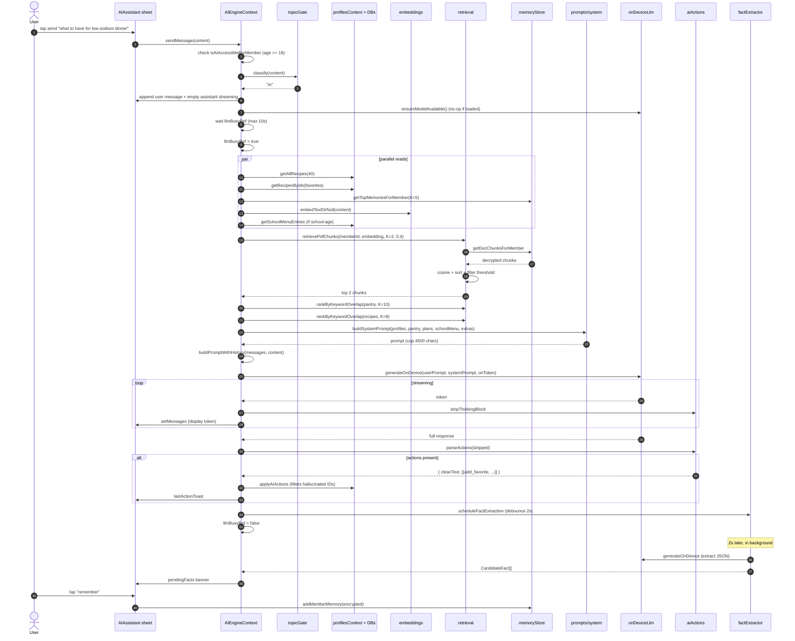
```mermaid
sequenceDiagram
    autonumber
    actor U as User
    participant UI as AIAssistant sheet
    participant Ctx as AIEngineContext
    participant Gate as topicGate
    participant ProDB as profilesContext + DBs
    participant EmbM as embeddings
    participant Ret as retrieval
    participant Mem as memoryStore
    participant PB as prompts/system
    participant LLM as onDeviceLlm
    participant Parse as aiActions
    participant FX as factExtractor

    U->>UI: tap send "what to have for low-sodium dinner"
    UI->>Ctx: sendMessage(content)
    Ctx->>Ctx: check isAIAccessibleForMember (age >= 18)
    Ctx->>Gate: classify(content)
    Gate-->>Ctx: "in"
    Ctx->>UI: append user message + empty assistant streaming
    Ctx->>LLM: ensureModelAvailable() (no-op if loaded)
    Ctx->>Ctx: wait llmBusyRef (max 10s)
    Ctx->>Ctx: llmBusyRef = true

    par parallel reads
        Ctx->>ProDB: getAllRecipes(40)
        Ctx->>ProDB: getRecipesByIds(favorites)
        Ctx->>Mem: getTopMemoriesForMember(K=5)
        Ctx->>EmbM: embedTextOrNull(content)
        Ctx->>ProDB: getSchoolMenuEntries (if school-age)
    end

    Ctx->>Ret: retrievePdfChunks(memberId, embedding, K=2, 0.4)
    Ret->>Mem: getDocChunksForMember
    Mem-->>Ret: decrypted chunks
    Ret->>Ret: cosine + sort + filter threshold
    Ret-->>Ctx: top 2 chunks

    Ctx->>Ret: rankByKeywordOverlap(pantry, K=10)
    Ctx->>Ret: rankByKeywordOverlap(recipes, K=8)
    Ctx->>PB: buildSystemPrompt(profiles, pantry, plans, schoolMenu, extras)
    PB-->>Ctx: prompt (cap 4500 chars)
    Ctx->>Ctx: buildPromptWithHistory(messages, content)
    Ctx->>LLM: generateOnDevice(userPrompt, systemPrompt, onToken)
    loop streaming
        LLM-->>Ctx: token
        Ctx->>Parse: stripThinkingBlock
        Ctx->>UI: setMessages (display token)
    end
    LLM-->>Ctx: full response
    Ctx->>Parse: parseActions(stripped)
    alt actions present
        Parse-->>Ctx: { cleanText, [{add_favorite, ...}] }
        Ctx->>ProDB: applyAIActions (filters hallucinated IDs)
        Ctx->>UI: lastActionToast
    end
    Ctx->>FX: scheduleFactExtraction (debounce 2s)
    Ctx->>Ctx: llmBusyRef = false
    Note over FX: 2s later, in background
    FX->>LLM: generateOnDevice (extract JSON)
    FX-->>Ctx: CandidateFact[]
    Ctx->>UI: pendingFacts banner
    U->>UI: tap "remember"
    UI->>Mem: addMemberMemory(encrypted)
```

**Reading keys:**

- **Streaming** is done via the `onToken` callback (`onDeviceLlm.ts:160-163`) — the user sees the response grow letter by letter.
- The **fact extractor never blocks** the main response — it runs 2s later, in the background ([§4.6](./04-ai-architecture.md#46-ai-governance) ADR-006).
- The **`llmBusyRef`** guarantees that two turns do not overlap on the same executorch singleton — without it, the app entered a deceptive "preparing model" state (`AIContext.tsx:194-210`).
- The action parser **discards hallucinated IDs** rather than applying them blindly (`ProfilesContext.tsx:296-319`).

### 11.2.3. Sequence — Proposed GDPR full erasure

**Intent:** *what happens when the user taps "Delete all data" — and why today this arrow is broken?*

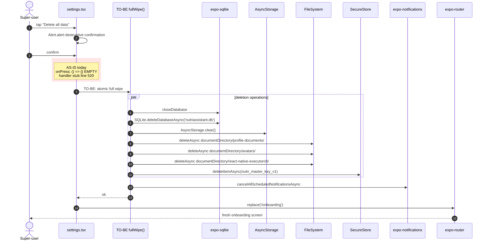
```mermaid
sequenceDiagram
    autonumber
    actor U as Super-user
    participant Set as settings.tsx
    participant Wipe as TO-BE fullWipe()
    participant DB as expo-sqlite
    participant AS as AsyncStorage
    participant FS as FileSystem
    participant SS as SecureStore
    participant Notif as expo-notifications
    participant Router as expo-router

    U->>Set: tap "Delete all data"
    Set->>Set: Alert.alert destructive confirmation
    U->>Set: confirm
    rect rgba(255,0,0,0.1)
        Note over Set: AS-IS today<br/>onPress: () => {} EMPTY<br/>handler stub line 520
    end
    Set->>Wipe: TO-BE: atomic full wipe

    par deletion operations
        Wipe->>DB: closeDatabase
        Wipe->>DB: SQLite.deleteDatabaseAsync('nutriassistant.db')
        Wipe->>AS: AsyncStorage.clear()
        Wipe->>FS: deleteAsync documentDirectory/profile-documents/
        Wipe->>FS: deleteAsync documentDirectory/avatars/
        Wipe->>FS: deleteAsync documentDirectory/react-native-executorch/
        Wipe->>SS: deleteItemAsync(nutri_master_key_v1)
    end

    Wipe->>Notif: cancelAllScheduledNotificationsAsync
    Wipe-->>Set: ok
    Set->>Router: replace('/onboarding')
    Router-->>U: fresh onboarding screen
```

**Reading keys:**

- This is the **#1 critical finding** ([§9](./09-improvement-plan.md)). Today literally `onPress: () => {}` is empty (`app/settings.tsx:520`).
- The **order matters**: if SecureStore is wiped before SQLite, encrypted chunks become unrecoverable — that is **desirable** (honors the right to be forgotten) but atomicity matters to avoid an inconsistent state.
- Without this flow a GDPR-compliant launch is impossible.

### 11.2.4. Sequence — Barcode scan

**Intent:** *what travels over the network on a product scan?*

```mermaid
sequenceDiagram
    autonumber
    actor U as User
    participant Cam as expo-camera
    participant Scr as scanner.tsx
    participant OFF as openFoodFacts.ts
    participant Inet as Internet (TLS)
    participant OFFCloud as world.openfoodfacts.org
    participant Score as nutriscore.ts
    participant Aller as allergenEngine.ts
    participant SDB as scannerDB

    U->>Cam: aim at EAN13
    Cam->>Scr: onBarcodeScanned({data: "8410069101226"})
    Scr->>Scr: Haptics.success + lock with scannedRef
    Scr->>OFF: getProductByBarcode(data)
    OFF->>Inet: fetch HTTPS world.openfoodfacts.org/api/v2/product/8410069101226.json
    Note over Inet: ⚠️ Payload: only the barcode (no PII)
    Inet->>OFFCloud: GET
    OFFCloud-->>Inet: JSON
    Inet-->>OFF: status 1 + product
    OFF->>OFF: mapNutriments (g→mg scales)
    OFF-->>Scr: OFFScanResult
    Scr->>Aller: detectAllergens (EU-14 regex)
    Scr->>Aller: checkFamilyCompatibility (per member)
    Aller-->>Scr: Record<memberId, CompatibilityResult>
    alt nutriscore_grade missing
        Scr->>Score: computeNutriScore(nutritionalInfo)
        Score-->>Scr: A|B|C|D|E
    end
    Scr->>SDB: saveScanResult (SQLite insert)
    Scr-->>U: show result sheet + compatibility row
```

**Reading keys:**

- **The only thing that travels over the internet is the barcode** — a commercial product identifier, not PII.
- Family compatibility assessment (`checkFamilyCompatibility`) happens **on the device** — health data never enters the network.
- The allergen engine is heuristic (regex over ingredient text) — limitation documented in [§6.3](./06-data-governance.md#63-master--reference-data).

## 11.3. State diagrams — entity behavior

### 11.3.1. On-device LLM lifecycle

**Intent:** *what states can the LLM traverse and how do they map to UX?*

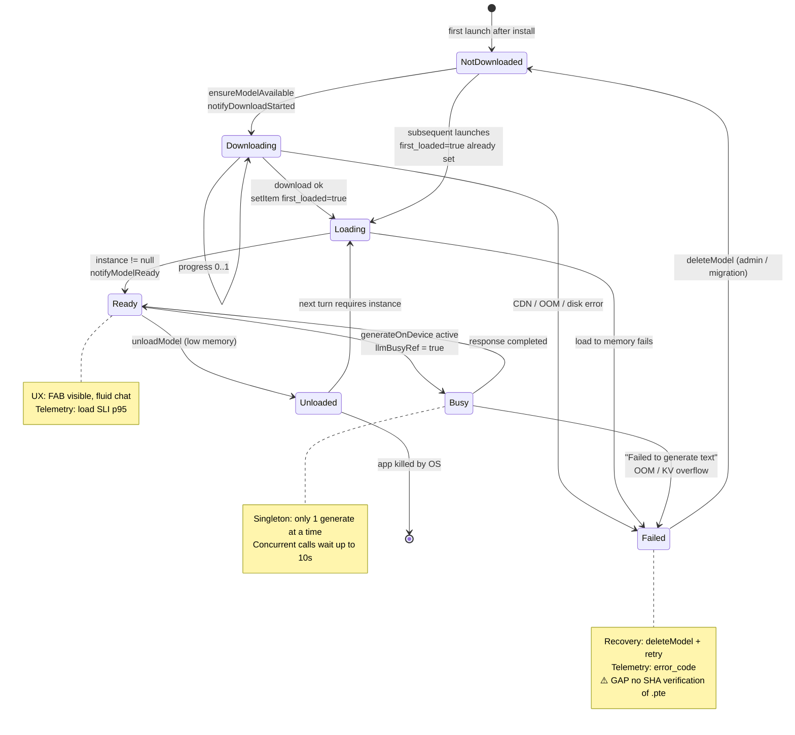
```mermaid
stateDiagram-v2
    [*] --> NotDownloaded: first launch after install

    NotDownloaded --> Downloading: ensureModelAvailable<br/>notifyDownloadStarted
    Downloading --> Downloading: progress 0..1
    Downloading --> Failed: CDN / OOM / disk error
    Downloading --> Loading: download ok<br/>setItem first_loaded=true
    NotDownloaded --> Loading: subsequent launches<br/>first_loaded=true already set

    Loading --> Failed: load to memory fails
    Loading --> Ready: instance != null<br/>notifyModelReady
    Failed --> NotDownloaded: deleteModel (admin / migration)

    Ready --> Busy: generateOnDevice active<br/>llmBusyRef = true
    Busy --> Ready: response completed
    Busy --> Failed: "Failed to generate text"<br/>OOM / KV overflow

    Ready --> Unloaded: unloadModel (low memory)
    Unloaded --> Loading: next turn requires instance
    Unloaded --> [*]: app killed by OS

    note right of Ready
        UX: FAB visible, fluid chat
        Telemetry: load SLI p95
    end note

    note right of Failed
        Recovery: deleteModel + retry
        Telemetry: error_code
        ⚠️ GAP no SHA verification of .pte
    end note

    note right of Busy
        Singleton: only 1 generate at a time
        Concurrent calls wait up to 10s
    end note
```

**Reading keys:**

- The `Failed` state is **recoverable** via `deleteModel` + `ensureModelAvailable` (purges artifacts + re-downloads, `onDeviceLlm.ts:138-148`).
- The `Ready → Unloaded` transition is forced by the OS under low-memory conditions, not by the app. The app detects it lazily on the next turn (`AIContext.tsx:183`).
- `Busy` is a **singleton lock** because executorch does not support concurrent inferences ([§4](./04-ai-architecture.md) implicit ADR).

### 11.3.2. Clinical-PDF state

**Intent:** *what happens to a PDF between upload and value delivery in chat?*

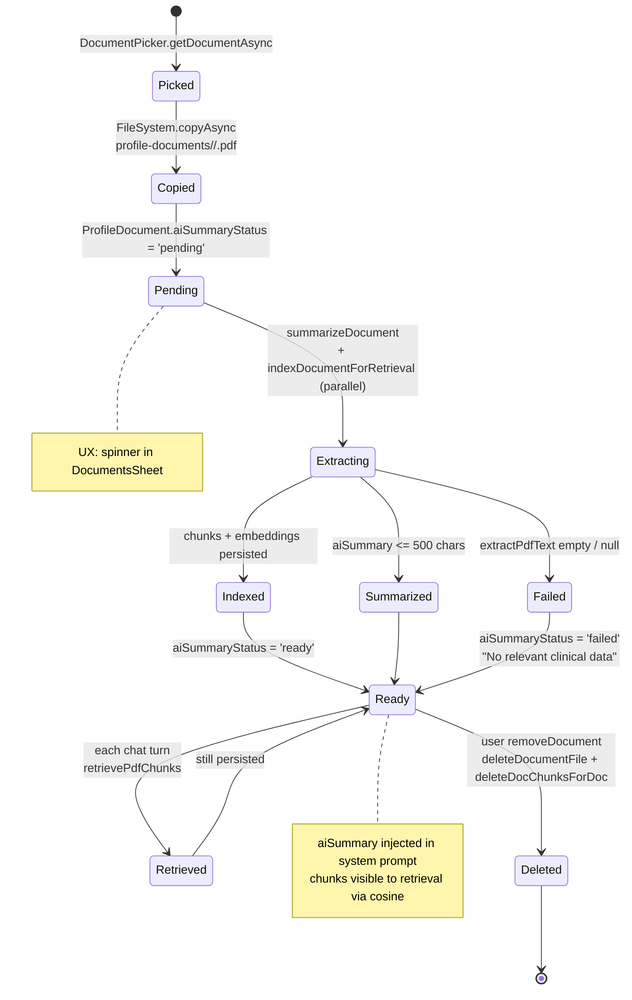
```mermaid
stateDiagram-v2
    [*] --> Picked: DocumentPicker.getDocumentAsync
    Picked --> Copied: FileSystem.copyAsync<br/>profile-documents/<member>/<id>.pdf
    Copied --> Pending: ProfileDocument.aiSummaryStatus = 'pending'

    Pending --> Extracting: summarizeDocument<br/>+ indexDocumentForRetrieval (parallel)
    Extracting --> Failed: extractPdfText empty / null
    Extracting --> Indexed: chunks + embeddings persisted
    Extracting --> Summarized: aiSummary <= 500 chars
    Indexed --> Ready: aiSummaryStatus = 'ready'
    Summarized --> Ready
    Failed --> Ready: aiSummaryStatus = 'failed'<br/>"No relevant clinical data"

    Ready --> Retrieved: each chat turn<br/>retrievePdfChunks
    Retrieved --> Ready: still persisted

    Ready --> Deleted: user removeDocument<br/>deleteDocumentFile + deleteDocChunksForDoc
    Deleted --> [*]

    note right of Pending
        UX: spinner in DocumentsSheet
    end note
    note right of Ready
        aiSummary injected in system prompt
        chunks visible to retrieval via cosine
    end note
```

**Reading keys:**

- The **two sub-processes** (`summarizeDocument` and `indexDocumentForRetrieval`) are **independent and best-effort**: if embeddings is not loaded, summarization still runs — the PDF ends with a summary but no retrieval ([§4.5](./04-ai-architecture.md#45-rag-architecture)).
- `aiSummaryStatus = 'failed'` does not mean the PDF is lost; it means the LLM extracted nothing useful — the user still sees it in the list.

### 11.3.3. Migration runner

**Intent:** *what does the runner do at startup, and how does it recover from a corrupt state?*

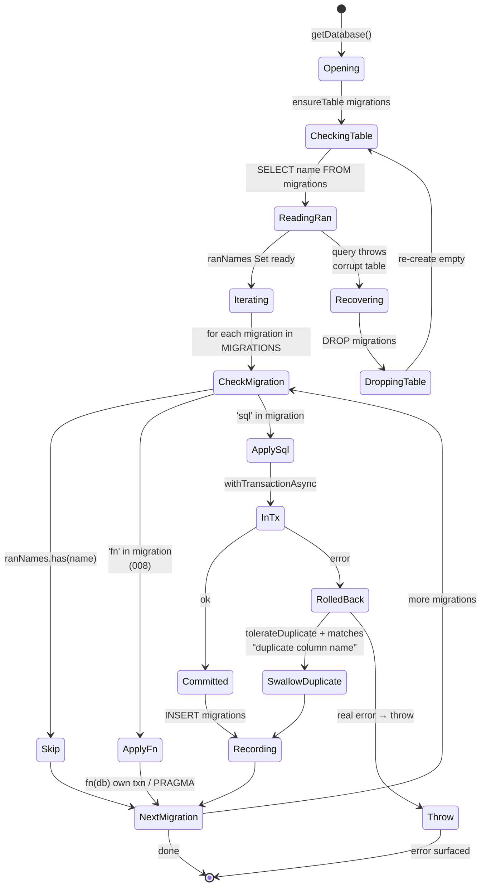
```mermaid
stateDiagram-v2
    [*] --> Opening: getDatabase()
    Opening --> CheckingTable: ensureTable migrations
    CheckingTable --> ReadingRan: SELECT name FROM migrations
    ReadingRan --> Iterating: ranNames Set ready
    ReadingRan --> Recovering: query throws<br/>corrupt table
    Recovering --> DroppingTable: DROP migrations
    DroppingTable --> CheckingTable: re-create empty
    Iterating --> CheckMigration: for each migration in MIGRATIONS

    state CheckMigration <<choice>>
    CheckMigration --> Skip: ranNames.has(name)
    CheckMigration --> ApplyFn: 'fn' in migration<br/>(008)
    CheckMigration --> ApplySql: 'sql' in migration

    Skip --> NextMigration
    ApplyFn --> NextMigration: fn(db) own txn / PRAGMA
    ApplySql --> InTx: withTransactionAsync
    InTx --> Committed: ok
    InTx --> RolledBack: error
    Committed --> Recording: INSERT migrations
    RolledBack --> SwallowDuplicate: tolerateDuplicate + matches<br/>"duplicate column name"
    RolledBack --> Throw: real error → throw
    SwallowDuplicate --> Recording
    Recording --> NextMigration

    NextMigration --> CheckMigration: more migrations
    NextMigration --> [*]: done
    Throw --> [*]: error surfaced
```

**Reading keys:**

- The `Recovering → DroppingTable` path is the **structural safety net**: if the `migrations` table is corrupted (rare but seen in dev), it is rebuilt because every migration is idempotent (`database.ts:99-115`, ADR-003).
- `tolerateDuplicate` only absorbs **that specific error** (`/duplicate column name/i`). Any other error propagates.

## 11.4. Mindmaps — visual taxonomies

### 11.4.1. GDPR-category personal-data taxonomy

**Intent:** *how are the ~25 personal data items handled by the app classified under GDPR?*

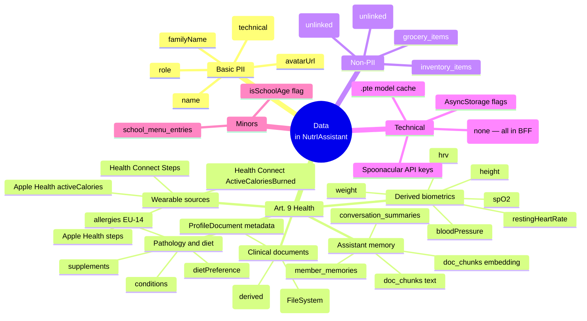
```mermaid
mindmap
  root((Data<br/>in NutrIAssistant))
    Basic PII
      name
      role
      avatarUrl
      familyName
      device_id (technical)
    Art. 9 Health
      Derived biometrics
        weight
        height
        bloodPressure
        restingHeartRate
        hrv
        spO2
      Pathology and diet
        allergies EU-14
        conditions
        dietPreference
        supplements
      Clinical documents
        ProfileDocument metadata
        physical PDF (FileSystem)
        aiSummary (derived)
      Assistant memory
        member_memories
        doc_chunks text
        doc_chunks embedding
        conversation_summaries
      Wearable sources
        Apple Health steps
        Apple Health activeCalories
        Health Connect Steps
        Health Connect ActiveCaloriesBurned
    Non-PII
      inventory_items
      recipes (unlinked)
      grocery_items
      scan_history (unlinked)
    Technical
      (none — all in BFF)
      Spoonacular API keys
      .pte model cache
      AsyncStorage flags
    Minors
      isSchoolAge flag
      school_menu_entries
```

**Reading keys:**

- The **"Art. 9 Health"** branch carries most of the GDPR risk — it justifies the DPIA and Art. 9.2.a consent ([§5.1](./05-privacy-model.md#51-personal-data-inventory), [§5.8](./05-privacy-model.md#58-special-category-data-processing-art-9)).
- "Minors" is cross-cutting: any child datum automatically inherits the verifiable parental consent requirement ([§5.7](./05-privacy-model.md#57-data-of-minors)).

### 11.4.2. Technology-stack mindmap

**Intent:** *panoramic view of the tooling in a single image.*

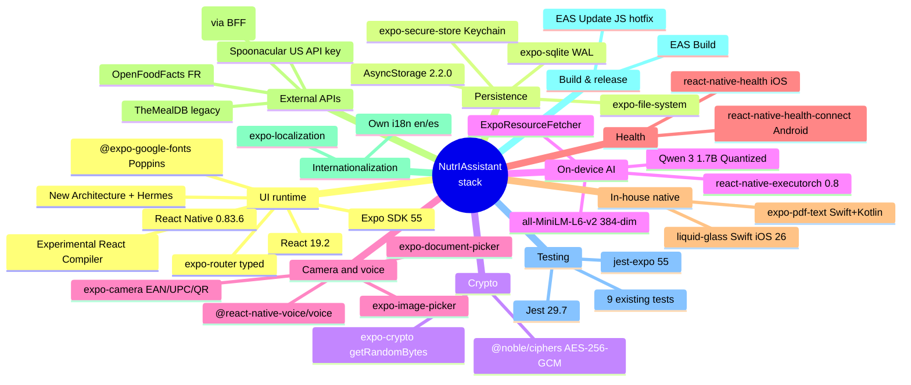
```mermaid
mindmap
  root((NutrIAssistant<br/>stack))
    UI runtime
      React 19.2
      React Native 0.83.6
      Expo SDK 55
      expo-router typed
      New Architecture + Hermes
      Experimental React Compiler
      @expo-google-fonts Poppins
    Persistence
      expo-sqlite WAL
      AsyncStorage 2.2.0
      expo-secure-store Keychain
      expo-file-system
    Crypto
      @noble/ciphers AES-256-GCM
      expo-crypto getRandomBytes
    On-device AI
      react-native-executorch 0.8
      Qwen 3 1.7B Quantized
      all-MiniLM-L6-v2 384-dim
      ExpoResourceFetcher
    Camera and voice
      expo-camera EAN/UPC/QR
      expo-image-picker
      expo-document-picker
      @react-native-voice/voice
    Health
      react-native-health iOS
      react-native-health-connect Android
    In-house native
      expo-pdf-text Swift+Kotlin
      liquid-glass Swift iOS 26
    External APIs
      OpenFoodFacts FR
      Edamam (via BFF)
      Spoonacular US API key
      TheMealDB legacy
    Internationalization
      expo-localization
      Own i18n en/es
    Build & release
      EAS Build
      EAS Update JS hotfix
    Testing
      Jest 29.7
      jest-expo 55
      9 existing tests
```

## 11.5. User journeys — typical paths

### 11.5.1. First-time onboarding

**Intent:** *what sensations does a new user go through on first launch?*

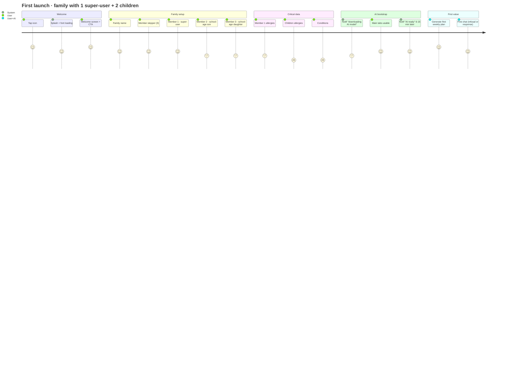
```mermaid
journey
    title First launch · family with 1 super-user + 2 children
    section Welcome
      Tap icon: 5: User
      Splash + font loading: 4: System
      Welcome screen + CTA: 5: User
    section Family setup
      Family name: 4: User
      Member stepper (3): 4: User
      Member 1 - super-user: 4: User
      Member 2 - school-age son: 3: User
      Member 3 - school-age daughter: 3: User
    section Critical data
      Member 1 allergies: 3: User
      Children allergies: 2: User
      Conditions: 2: User
    section AI bootstrap
      Notif "downloading AI model": 3: System
      Main tabs usable: 4: User
      Notif "AI ready" 6-15 min later: 4: System
    section First value
      Generate first weekly plan: 5: User+AI
      First chat (refusal or response): 4: User+AI
```

**Reading keys:**

- The scores (1=bad, 5=good) reflect perceived friction. **Children allergies** is the highest-friction moment — the parent must remember/look up.
- The **gap between usable tabs and AI ready** is where users are lost if the download fails.

### 11.5.2. Typical week of an engaged user

**Intent:** *what does an engaged user do in a normal week?*

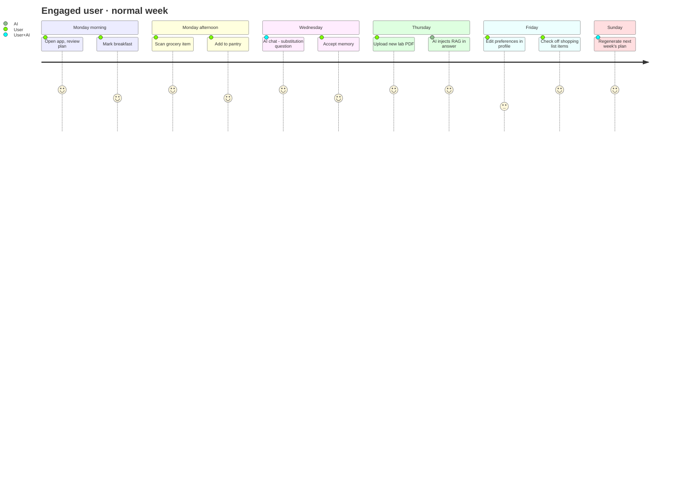
```mermaid
journey
    title Engaged user · normal week
    section Monday morning
      Open app, review plan: 5: User
      Mark breakfast: 4: User
    section Monday afternoon
      Scan grocery item: 5: User
      Add to pantry: 4: User
    section Wednesday
      AI chat - substitution question: 5: User+AI
      Accept memory: 4: User
    section Thursday
      Upload new lab PDF: 5: User
      AI injects RAG in answer: 5: AI
    section Friday
      Edit preferences in profile: 3: User
      Check off shopping list items: 5: User
    section Sunday
      Regenerate next week's plan: 5: User+AI
```

## 11.6. Quadrant charts — visual prioritization

### 11.6.1. Risk matrix — likelihood × impact

**Intent:** *among the 5 critical threats ([§3.5](./03-security-encryption.md#35-threat-model-simplified-stride), [§8.10](./08-production-readiness.md#810-critical-risks-top-5)), where does each sit and which to tackle first?*

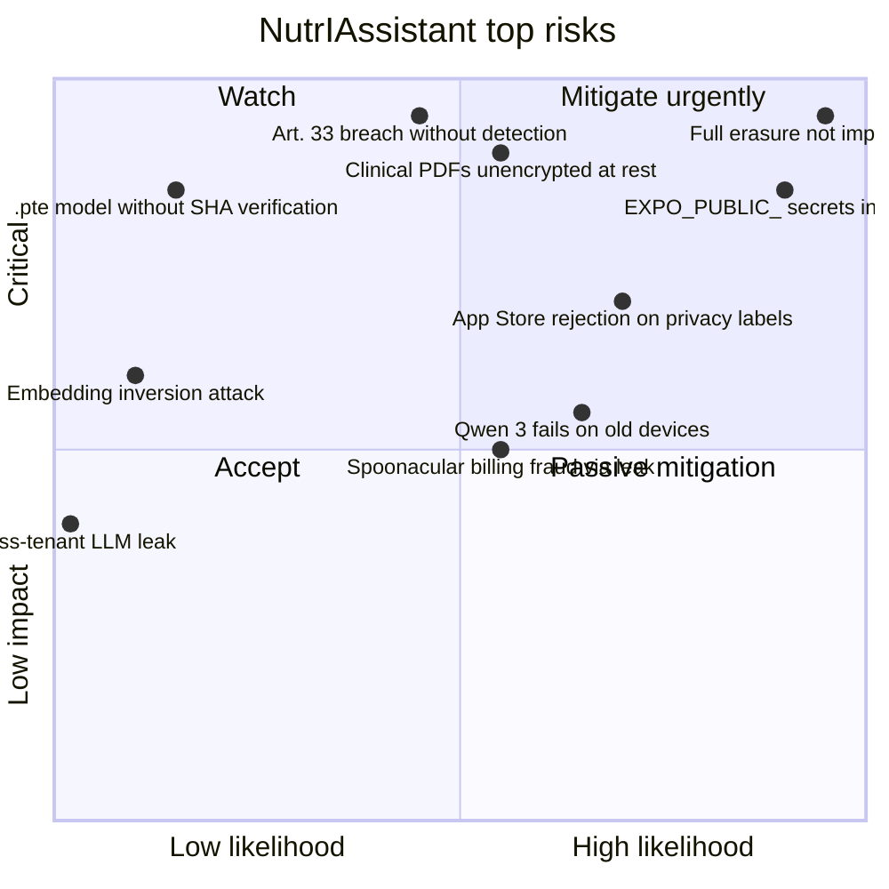
```mermaid
quadrantChart
    title NutrIAssistant top risks
    x-axis "Low likelihood" --> "High likelihood"
    y-axis "Low impact" --> "Critical"
    quadrant-1 "Mitigate urgently"
    quadrant-2 "Watch"
    quadrant-3 "Accept"
    quadrant-4 "Passive mitigation"
    "EXPO_PUBLIC_ secrets in bundle": [0.9, 0.85]
    "Full erasure not implemented": [0.95, 0.95]
    "Clinical PDFs unencrypted at rest": [0.55, 0.9]
    "App Store rejection on privacy labels": [0.7, 0.7]
    ".pte model without SHA verification": [0.15, 0.85]
    "Qwen 3 fails on old devices": [0.65, 0.55]
    "Embedding inversion attack": [0.1, 0.6]
    "Cross-tenant LLM leak": [0.02, 0.4]
    "Spoonacular billing fraud via leak": [0.55, 0.5]
    "Art. 33 breach without detection": [0.45, 0.95]
```

**Reading keys:**

- The top-right quadrant **"Mitigate urgently"** concentrates the **3 launch blockers** ([§9](./09-improvement-plan.md) items 1-2 and the PDF one).
- "Cross-tenant LLM leak" has near-zero probability because the app is **single-tenant per device** (ADR-001).

### 11.6.2. Improvement plan — impact × effort

**Intent:** *of the 28 items in [§9](./09-improvement-plan.md), where is the "low-hanging fruit" (high impact, low effort)?*

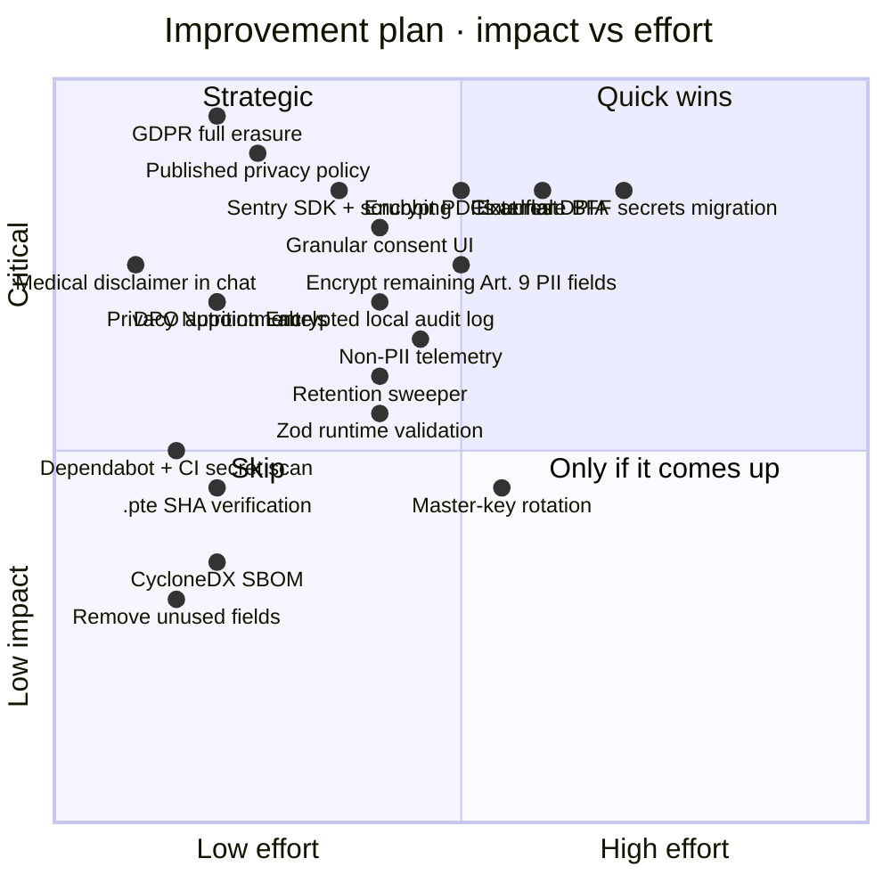
```mermaid
quadrantChart
    title Improvement plan · impact vs effort
    x-axis "Low effort" --> "High effort"
    y-axis "Low impact" --> "Critical"
    quadrant-1 "Quick wins"
    quadrant-2 "Strategic"
    quadrant-3 "Skip"
    quadrant-4 "Only if it comes up"
    "GDPR full erasure": [0.2, 0.95]
    "Published privacy policy": [0.25, 0.9]
    "Sentry SDK + scrubbing": [0.35, 0.85]
    "Medical disclaimer in chat": [0.1, 0.75]
    "DPO appointment": [0.2, 0.7]
    "Cloudflare BFF secrets migration": [0.7, 0.85]
    "Encrypt PDFs at rest": [0.5, 0.85]
    "Granular consent UI": [0.4, 0.8]
    "Encrypt remaining Art. 9 PII fields": [0.5, 0.75]
    "External DPIA": [0.6, 0.85]
    "Privacy Nutrition Labels": [0.2, 0.7]
    "Dependabot + CI secret scan": [0.15, 0.5]
    "Encrypted local audit log": [0.4, 0.7]
    "Non-PII telemetry": [0.45, 0.65]
    "Zod runtime validation": [0.4, 0.55]
    "Retention sweeper": [0.4, 0.6]
    "Master-key rotation": [0.55, 0.45]
    ".pte SHA verification": [0.2, 0.45]
    "Remove unused fields": [0.15, 0.3]
    "CycloneDX SBOM": [0.2, 0.35]
```

**Reading keys:**

- **Quick wins ordered**: medical disclaimer → remove unused fields → model SHA verification → SBOM → privacy labels → Dependabot.
- The **high strategic** items (BFF, DPIA, encrypt PDFs) are large but necessary for a responsible launch.

## 11.7. Distributions — pie charts

### 11.7.1. Encryption coverage by field category

**Intent:** *what percentage of sensitive fields is actually encrypted at rest today?*

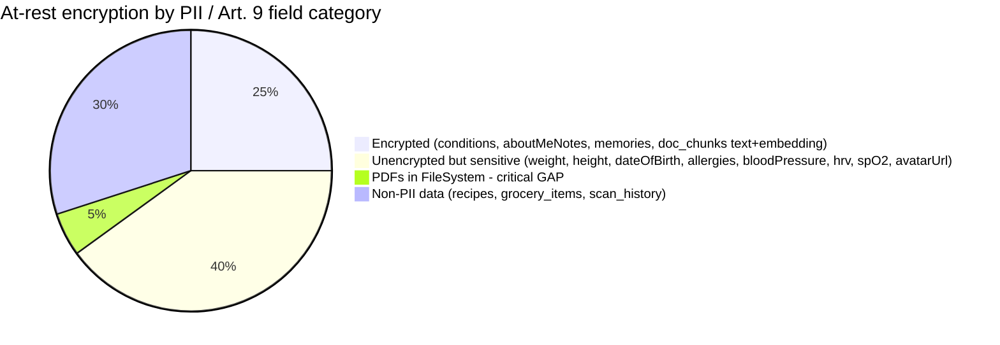
```mermaid
pie title At-rest encryption by PII / Art. 9 field category
    "Encrypted (conditions, aboutMeNotes, memories, doc_chunks text+embedding)" : 5
    "Unencrypted but sensitive (weight, height, dateOfBirth, allergies, bloodPressure, hrv, spO2, avatarUrl)" : 8
    "PDFs in FileSystem - critical GAP" : 1
    "Non-PII data (recipes, grocery_items, scan_history)" : 6
```

**Reading keys:**

- Roughly **5 of 13 critical PII fields** are encrypted — ~38% coverage.
- The physical PDFs in `FileSystem.documentDirectory` are the **most severe gap** ([§3.5](./03-security-encryption.md#35-threat-model-simplified-stride) STRIDE).

### 11.7.2. `console.*` log distribution by domain

**Intent:** *if we migrate to a structured logger, where do the logs live today?*

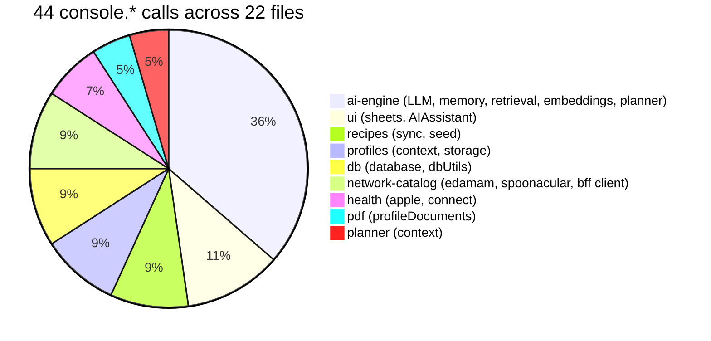
```mermaid
pie title 44 console.* calls across 22 files
    "ai-engine (LLM, memory, retrieval, embeddings, planner)" : 16
    "ui (sheets, AIAssistant)" : 5
    "recipes (sync, seed)" : 4
    "profiles (context, storage)" : 4
    "db (database, dbUtils)" : 4
    "network-catalog (edamam, spoonacular, bff client)" : 4
    "health (apple, connect)" : 3
    "pdf (profileDocuments)" : 2
    "planner (context)" : 2
```

### 11.7.3. Origin of recipes in the DB

**Intent:** *how is the catalog distributed across sources after sync?*

```mermaid
pie title Expected distribution of recipes.source_api
    "edamam (Mediterranean seed + sync)" : 60
    "spoonacular (multi-cuisine sync)" : 25
    "user_created (user recipes)" : 10
    "ai_generated (future LLM)" : 4
    "themealdb (purged in migration 009)" : 1
```

**Reading keys:**

- TheMealDB is **purged by migration 009** — only orphan rows from a failed sync would remain.
- The catalog is **~85% third-party**, reinforcing the importance of Data Sharing Agreements ([§6.7](./06-data-governance.md#67-data-sharing-agreements-with-third-parties)).

## 11.8. Timelines

### 11.8.1. Evolution of the product's AI model

**Intent:** *narrative of on-device AI decisions from inception.*

```mermaid
timeline
    title Evolution of NutrIAssistant's LLM
    April 2026
        : Local-first architecture decision
        : Llama 3.2 1B via GGUF + llama.cpp
        : Recurrent prompt overflow with 2k tokens
    Early May 2026
        : Migration to react-native-executorch v0.7
        : ExpoResourceFetcher integrated
    Mid May 2026
        : Swap Llama 3.2 1B → Qwen 3 1.7B Quantized
        : Hard cap of 4500 chars on the system prompt
        : Encrypted memory layer (migration 011)
        : Age gate >=18 for AI chat
    June 2026 (TO-BE)
        : SHA256 verification of the .pte
        : Public Model Card
        : OOM detection + fallback to 0.6B
    Q3 2026 (TO-BE)
        : Pro tier opt-in cloud AI on Mistral La Plateforme
        : Semantic response cache
        : Experimental fine-tuning on balanced datasets
```

### 11.8.2. Compliance milestones to launch

**Intent:** *in what order and when do the legal requirements unblock?*

```mermaid
timeline
    title Compliance milestones · roadmap to launch
    Week 1
        : GDPR full erasure implemented
        : In-app medical disclaimer
        : Privacy policy drafted
    Week 2
        : Sentry SDK deployed
        : App Store Privacy Nutrition Labels
        : Play Store Data Safety Section
    Week 3-4
        : DPO contracted and public email
        : Granular consent UI 5 toggles
        : DPIA draft outsourced
    Week 5-6
        : SCC signed with Edamam + Spoonacular
        : Encrypt PDFs at rest
        : Encrypt remaining Art. 9 fields
    Week 7-8
        : Cloudflare BFF deployed
        : Local audit log migration 013
        : Non-PII telemetry active
    Week 9-10
        : ROPA published
        : Final DPIA + legal review
        : Internal store pre-review
    Week 11-12
        : TestFlight + Internal Track
        : Closed beta 200 users
    Week 13+
        : Open beta 14d
        : GDPR-compliant Spain launch
```

## 11.9. Sankey — quantitative flows

### 11.9.1. Data flow by sensitivity level

**Intent:** *how much sensitive data travels where?*

```mermaid
---
config:
  sankey:
    showValues: true
---
sankey-beta

Onboarding,Basic PII AsyncStorage,12
Onboarding,Art. 9 conditions encrypted,8
Onboarding,Art. 9 weight height plaintext,16
Onboarding,Allergies plaintext,16
Clinical PDF upload,Art. 9 doc_chunks encrypted SQLite,40
Clinical PDF upload,Art. 9 physical PDF plaintext FileSystem,40
AI chat,Art. 9 prompt RAM,30
AI chat,Art. 9 memories encrypted SQLite,15
Apple Health Health Connect,Art. 9 steps RAM,10
Apple Health Health Connect,Art. 9 active kcal RAM,10
Barcode scan,Non-PII catalog to OpenFoodFacts,20
Recipe sync,Non-PII catalog to Edamam Spoonacular via BFF,30

Basic PII AsyncStorage,Local-device only,12
Art. 9 conditions encrypted,Local-device only,8
Art. 9 weight height plaintext,Local-device only,16
Allergies plaintext,Local-device only,16
Art. 9 doc_chunks encrypted SQLite,Local-device only,40
Art. 9 physical PDF plaintext FileSystem,Local-device only,40
Art. 9 prompt RAM,Local-device only,30
Art. 9 memories encrypted SQLite,Local-device only,15
Art. 9 steps RAM,Local-device only,10
Art. 9 active kcal RAM,Local-device only,10
Non-PII catalog to OpenFoodFacts,External service non-PII only,20
Non-PII catalog to Edamam Spoonacular via BFF,External service non-PII only,30
```

**Reading keys:**

- **Every flow lands at "Local-device only"** confirming the local-first principle (ADR-001).
- Only non-PII data (barcodes, recipe search queries) reaches external services.
- Widths are relative — qualitative balance visualization, not absolute volumes.

## 11.10. ASCII infographics

For concepts that Mermaid does not render elegantly (overlapping trust boundaries, physical memory maps, concentric layer architectures).

### 11.10.1. Trust boundaries

**Intent:** *visualize which entities trust each other and where the control frontiers are.*

```
┌──────────────────────────────────────────────────────────────────────────┐
│  INTERNET ZONE (untrusted) — TLS terminated at the client, no pinning    │
│                                                                          │
│   ┌───────────┐  ┌───────────┐  ┌───────────┐  ┌───────────┐             │
│   │OpenFoodFa.│  │  Edamam   │  │Spoonacular│  │HuggingFace│             │
│   │ (FR / EU) │  │  (US ⚠️)  │  │  (US ⚠️)  │  │  (US ⚠️)  │             │
│   └─────┬─────┘  └─────┬─────┘  └─────┬─────┘  └─────┬─────┘             │
│         │              │              │              │                   │
│  ═══════╪══════════════╪══════════════╪══════════════╪══════════════════ │
│ CRYPTO  │ FRONTIER     │ (TLS)        │              │                   │
│  ═══════╪══════════════╪══════════════╪══════════════╪══════════════════ │
│         │              │              │              │                   │
│  ┌──────▼──────────────▼──────────────▼──────────────▼─────────────┐     │
│  │  DEVICE ZONE (semi-trusted — OS sandbox)                         │     │
│  │                                                                   │     │
│  │   ┌─────────────────────────────────────────────────────────┐    │     │
│  │   │  APP PROCESS (trusted)                                  │    │     │
│  │   │   ┌──────────────────────────────────────────────────┐  │    │     │
│  │   │   │  KEY ZONE (highest trust — hardware-backed)      │  │    │     │
│  │   │   │  ┌──────────────────────────────────────┐        │  │    │     │
│  │   │   │  │  iOS Keychain / Android Keystore     │        │  │    │     │
│  │   │   │  │  nutri_master_key_v1 (256-bit AES)   │        │  │    │     │
│  │   │   │  └──────────────────────────────────────┘        │  │    │     │
│  │   │   └──────────────────────────────────────────────────┘  │    │     │
│  │   │                                                          │    │     │
│  │   │   ┌──────────────────────┐  ┌──────────────────────┐    │    │     │
│  │   │   │ Field-encrypted SQL  │  │ AsyncStorage profiles│    │    │     │
│  │   │   │ (member_memories,    │  │ (partial enc:v1:)    │    │    │     │
│  │   │   │  doc_chunks)         │  │                       │    │    │     │
│  │   │   └──────────────────────┘  └──────────────────────┘    │    │     │
│  │   │                                                          │    │     │
│  │   │   ┌──────────────────────┐  ┌──────────────────────┐    │    │     │
│  │   │   │ FileSystem PDFs ⚠️    │  │ FileSystem avatars   │    │    │     │
│  │   │   │ (plaintext - GAP)    │  │ (plaintext - ok)     │    │    │     │
│  │   │   └──────────────────────┘  └──────────────────────┘    │    │     │
│  │   └──────────────────────────────────────────────────────────┘    │     │
│  │                                                                   │     │
│  │  Boundary: jailbreak/root breaks the OS sandbox                  │     │
│  └───────────────────────────────────────────────────────────────────┘     │
│                                                                          │
└──────────────────────────────────────────────────────────────────────────┘

Legend:
- "trusted" → can execute logic and decrypt
- "semi-trusted" → can execute but the OS isolates via sandbox
- "untrusted" → only receives TLS calls, never PII
- ═══ → mandatory encryption frontier
- ⚠️ → gap identified in §3
```

### 11.10.2. Device storage map

**Intent:** *if a user opens their backup with a file browser, what do they find?*

```
documentDirectory/
├── nutriassistant.db                   ← SQLite (critical fields encrypted)
├── nutriassistant.db-wal               ← WAL journal
├── nutriassistant.db-shm               ← shared memory file
├── profile-documents/
│   └── <member_id>/
│       └── <doc_id>.pdf                ⚠️ CLINICAL PDFs IN PLAINTEXT (GAP §3.5)
├── avatars/
│   └── avatar-<member_id>.jpg          → optional photos, not critical PII
└── react-native-executorch/
    ├── <hash>_qwen3_1_7b_q.pte         ← AI model (public asset, no PII)
    └── <hash>_tokenizer.json           ← public tokenizer

AsyncStorage (key/value, serialized JSON):
├── family_profiles                     → JSON with profiles (PARTIAL encryption)
│   • name, role, dateOfBirth, weight,  ⚠️ plaintext
│     height, allergies, …
│   • conditions, aboutMeNotes           ✅ enc:v1:<base64>
├── family_name                         → plaintext string
├── app_initialized                     → "true"|"false"
├── health_active_provider              → "apple_health"|"health_connect"|null
├── sp_quota_cache_v2                   ← cached BFF /v1/spoonacular/quota response (30s TTL)
├── sp_daily_calls                      ← Spoonacular daily counter
├── on_device_model_first_loaded_…     ← AI model flag
└── on_device_embeddings_first_loaded   ← embeddings flag

iOS Keychain / Android Keystore (hardware-backed):
└── nutri_master_key_v1                 ← 32-byte AES key (base64)

Implications for iCloud / Google Drive backup:
✅ Keychain: NOT included in iCloud Backup by default
⚠️ AsyncStorage + FileSystem: ARE included → all plaintext is
   exposed in the backup. Action: encrypt the rest + mark
   profile-documents/ with setAttributesAsync excludeFromBackup
```

### 11.10.3. Concentric security-layers model

**Intent:** *defense-in-depth abstraction for an executive slide.*

```
                       ┌────────────────────────────────────────────┐
                       │  LAYER 7 · POLICIES & PROCESSES            │
                       │  DPO · DPIA · ROPA · IR plan · SCC         │
                       │  ⚠️ CRITICAL GAP TODAY                      │
                       └──────────────────────┬─────────────────────┘
                                              │
                  ┌───────────────────────────▼──────────────────────────┐
                  │  LAYER 6 · OBSERVABILITY                              │
                  │  Audit log · Sentry · Metrics · Alerts                │
                  │  ⚠️ CRITICAL GAP TODAY                                │
                  └─────────────────────────┬─────────────────────────────┘
                                            │
              ┌─────────────────────────────▼───────────────────────────────┐
              │  LAYER 5 · ACCESS CONTROL                                    │
              │  isSuperUser · age gate >=18 · admin guard 1+ super-user     │
              │  🟡 PARTIAL (UI-only, missing gate in services)              │
              └───────────────────────────┬─────────────────────────────────┘
                                          │
        ┌─────────────────────────────────▼─────────────────────────────────┐
        │  LAYER 4 · FIELD-LEVEL ENCRYPTION                                  │
        │  AES-GCM-256 · enc:v1: prefix · conditions + memories + chunks     │
        │  🟡 PARTIAL (~38% of Art. 9 PII covered)                           │
        └────────────────────────────────┬───────────────────────────────────┘
                                         │
   ┌─────────────────────────────────────▼─────────────────────────────────┐
   │  LAYER 3 · TRANSPORT ENCRYPTION                                        │
   │  TLS 1.2/1.3 OS default · no pinning · no mTLS                         │
   │  ✅ FUNCTIONAL · 🟡 no pinning                                          │
   └───────────────────────────────────┬─────────────────────────────────────┘
                                       │
┌──────────────────────────────────────▼───────────────────────────────────┐
│  LAYER 2 · SECURE KEY STORAGE                                            │
│  iOS Keychain Class A · Android Keystore HW-backed · expo-secure-store   │
│  ✅ FUNCTIONAL · 🟡 no rotation                                            │
└──────────────────────────────────────┬────────────────────────────────────┘
                                       │
              ┌────────────────────────▼─────────────────────────┐
              │  LAYER 1 · OS SANDBOX                             │
              │  iOS App Sandbox · Android Application Sandbox    │
              │  ✅ Functional (provided by Apple/Google)         │
              └───────────────────────────────────────────────────┘
```
