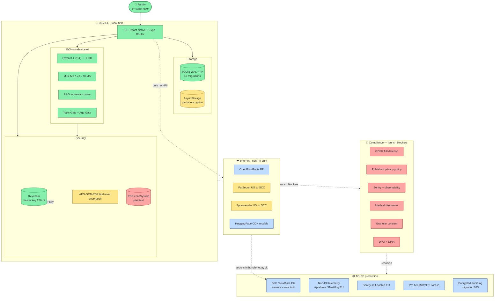

# Data, AI & Compliance Architecture

This area documents the data lifecycle, AI architecture, security model, privacy posture, governance, observability, and production-readiness of the NutrIAssistant app.

## One-page picture

If you only have time for one diagram, this is it.

**How to read this diagram:**
- **Green** = working correctly.
- **Amber** = partial / needs improvement.
- **Red** = critical gap, blocks launch.
- **Blue** = external entities / future state.

This is the honest snapshot: an exemplary local-first architecture, partial encryption, solid on-device AI, and a defined set of compliance blockers resolved through the concrete effort detailed in [`09-improvement-plan.md`](./09-improvement-plan.md).

## Document map

| # | File | What's inside |
|---|---|---|
| 00 | [Executive Summary](./00-executive-summary.md) | Stack snapshot, top-5 findings, top-5 recommendations, status table |
| 01 | [Data Lifecycle](./01-data-lifecycle.md) | Four canonical phases (ingestion → exploitation) mapped to the codebase |
| 02 | [Data Model & Architecture](./02-data-model-architecture.md) | AS-IS logical diagram, source classification, storage models, medallion mapping, ERD, table catalog |
| 03 | [Security & Encryption](./03-security-encryption.md) | At-rest / in-transit / field-level policy, key management, STRIDE, secrets, supply chain |
| 04 | [AI Architecture & Engagement](./04-ai-architecture.md) | Capability inventory, AS-IS / TO-BE pipeline, MLOps, RAG, AI governance, engagement KPIs |
| 05 | [Privacy Model](./05-privacy-model.md) | PII inventory, GDPR legal basis, data subject rights, minors, Art. 9, anonymization |
| 06 | [Data Governance](./06-data-governance.md) | Business glossary, data lineage, master data, quality, governance metrics, roles, DSAs |
| 07 | [Observability & Monitoring](./07-observability.md) | Logs/metrics/traces stack, dashboards, SLO/SLA, incident management, FinOps, compliance observability |
| 08 | [Production Readiness](./08-production-readiness.md) | TO-BE architecture, App/Play Store compliance, cross-border, scaling, monetization, risks |
| 09 | [Improvement Plan](./09-improvement-plan.md) | 28 prioritized items with effort/impact, 12-week Gantt |
| 10 | [Appendices](./10-appendices.md) | Glossary, course-curriculum mapping, bibliography, 8 ADRs |
| 11 | [Extended Diagrams](./11-diagrams.md) | C4 levels 1–3, sequence, state, mindmap, journey, quadrant, pie, timeline, sankey, ASCII infographics |

## Status at a glance

| Axis | Status | GDPR posture |
|---|---|---|
| Stack | ✅ Expo SDK 55, RN 0.83.6, TypeScript 5.9 | n/a |
| Primary storage | ✅ SQLite + AsyncStorage + Keychain/Keystore + FileSystem | 🟡 partial encryption |
| Key store | ✅ iOS Keychain / Android Keystore | 🟡 no rotation |
| External providers | ✅ OpenFoodFacts, FatSecret, Spoonacular, HuggingFace, Apple Health, Health Connect | 🔴 no DPIA, no SCC, no TIA |
| AI model | ✅ **100% on-device** (Qwen 3 1.7B Q + MiniLM L6 v2) | 🟢 privacy-by-design |
| Field-level encryption at rest | ✅ AES-256-GCM `@noble/ciphers` | 🟡 partial column coverage |
| Encryption in transit | ✅ OS-default TLS 1.2/1.3, no pinning | 🟡 |
| User authentication | 🔴 no login | 🔴 |
| Telemetry / APM | 🔴 `console.*` only | 🔴 (can't notify under Art. 33) |
| Data governance | 🔴 no catalog, lineage, contracts, or quality tests | 🔴 |
| GDPR rights in UI | 🟡 Export ✅, Erasure stub ⚠️ ([`app/settings.tsx:516`](../../app/settings.tsx)) | 🟡 |
| Medical RAG | ✅ encrypted chunks, top-K 2 cosine, threshold 0.4 | 🟢 |
| Automated decisions (Art. 22) | 🟡 suggestions only; needs explicit notice + granular opt-out | 🟡 |
| Minors | 🟡 age gate for AI chat (≥18, [`src/modules/ai-engine/aiAccess.ts:13-22`](../../src/modules/ai-engine/aiAccess.ts)) | 🟡 |

## Critical findings (top 5)

1. **🔴 Secrets in public bundle.** `EXPO_PUBLIC_FATSECRET_CLIENT_SECRET` and `EXPO_PUBLIC_SPOONACULAR_API_KEY` are compiled into the binary ([`.env:5-7`](../../.env), [`src/services/fatsecret.ts:7-8`](../../src/services/fatsecret.ts), [`src/services/spoonacular.ts:7`](../../src/services/spoonacular.ts)). Anyone can extract them with `strings` from the IPA/APK. Required mitigation before production: move behind a BFF.
2. **🔴 No observability.** No APM (Sentry/Datadog), no product analytics, no audit logs. Impossible to satisfy GDPR Art. 33–34 (breach notification) without traceability.
3. **🔴 Full data deletion not implemented.** The "Delete all data" button in [`app/settings.tsx:516-523`](../../app/settings.tsx) shows an Alert but the handler `onPress: () => {}` is empty. There is an explicit `// TODO: implement full data deletion`. Blocks the right to erasure under Art. 17.
4. **🟡 No AI usage notice or limitations disclaimer.** No "not medical advice" disclaimer in the app. The system prompt offers guidance based on conditions (hypertension, celiac, diabetes 1/2, etc. — [`src/services/prompts/system.ts:17-26`](../../src/services/prompts/system.ts)) without explicit Art. 9 consent.
5. **🟡 No DPIA despite Art. 9 health data processing.** The `conditions` field is encrypted, but systematic large-scale processing of health data triggers DPIA requirements at production scale.

See [`00-executive-summary.md`](./00-executive-summary.md) for the full status table and [`09-improvement-plan.md`](./09-improvement-plan.md) for the 28-item prioritized backlog.
