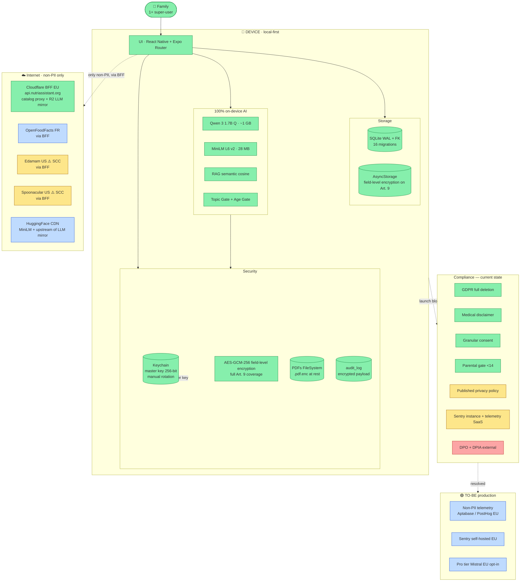

# Data, AI & Compliance Architecture

This area documents the data lifecycle, AI architecture, security model, privacy posture, governance, observability, and production-readiness of the NutrIAssistant app.

> **Recent architectural milestones:**
>
> - **2026-05-14 — GDPR engineering pass complete** (commit `aaa3179`). 21 of the 28 findings from §9 closed in a five-sprint sequence: Art. 17 full erasure, Art. 22 medical disclaimer, Art. 9.2.a granular consent (3 toggles), Art. 30/33 encrypted audit log, parental gate <14, PDFs encrypted at rest, full Art. 9 field coverage, master-key rotation, retention sweeper, ROPA + Model Card + incident-response runbook, Dependabot + gitleaks + SBOM. The 6 remaining items all require external spend (DPO, DPIA consultancy, Sentry hosting, Aptabase, SCC). See [`09-improvement-plan.md`](./09-improvement-plan.md) for the full status table.
> - **2026-05-13 — BFF deployed** (`api.nutriassistant.org`). `infra/bff/` proxies OpenFoodFacts, Edamam, and Spoonacular. Zero third-party API keys ship in the mobile bundle — all credentials live in Cloudflare's encrypted secret store. See [`infra/bff/README.md`](../../infra/bff/README.md) for the BFF architecture.
> - **2026-05-13 — FatSecret retired**, replaced by Edamam Recipe Search v2 as the Mediterranean catalog source. DB migration 013 purges legacy `fs-*` recipes. Edamam credentials never shipped in any binary; they only ever lived in the BFF.
> - **2026-05-13 — Shared BFF client extracted** to `src/services/bff/client.ts`. Provides one place for retry / timeout / telemetry instead of duplicating fetch wrappers per provider. Tested at `src/__tests__/services/bff/client.test.ts`.

## One-page picture

If you only have time for one diagram, this is it.

**How to read this diagram:**
- **Green** = working correctly.
- **Amber** = partial / needs improvement.
- **Red** = critical gap, blocks launch.
- **Blue** = external entities / future state.

This is the honest snapshot: an exemplary local-first architecture, partial encryption, solid on-device AI, and a defined set of compliance blockers resolved through the concrete effort detailed in [`09-improvement-plan.md`](./09-improvement-plan.md).

## Document map

| # | File | What's inside |
|---|---|---|
| 00 | [Executive Summary](./00-executive-summary.md) | Stack snapshot, top-5 findings, top-5 recommendations, status table |
| 01 | [Data Lifecycle](./01-data-lifecycle.md) | Four canonical phases (ingestion → exploitation) mapped to the codebase |
| 02 | [Data Model & Architecture](./02-data-model-architecture.md) | AS-IS logical diagram, source classification, storage models, medallion mapping, ERD, table catalog |
| 03 | [Security & Encryption](./03-security-encryption.md) | At-rest / in-transit / field-level policy, key management, STRIDE, secrets, supply chain |
| 04 | [AI Architecture & Engagement](./04-ai-architecture.md) | Capability inventory, AS-IS / TO-BE pipeline, MLOps, RAG, AI governance, engagement KPIs |
| 05 | [Privacy Model](./05-privacy-model.md) | PII inventory, GDPR legal basis, data subject rights, minors, Art. 9, anonymization |
| 06 | [Data Governance](./06-data-governance.md) | Business glossary, data lineage, master data, quality, governance metrics, roles, DSAs |
| 07 | [Observability & Monitoring](./07-observability.md) | Logs/metrics/traces stack, dashboards, SLO/SLA, incident management, FinOps, compliance observability |
| 08 | [Production Readiness](./08-production-readiness.md) | TO-BE architecture, App/Play Store compliance, cross-border, scaling, monetization, risks |
| 09 | [Improvement Plan](./09-improvement-plan.md) | 28 prioritized items with effort/impact, 12-week Gantt |
| 10 | [Appendices](./10-appendices.md) | Glossary, course-curriculum mapping, bibliography, 8 ADRs |
| 11 | [Extended Diagrams](./11-diagrams.md) | C4 levels 1–3, sequence, state, mindmap, journey, quadrant, pie, timeline, sankey, ASCII infographics |

## Status at a glance

| Axis | Status | GDPR posture |
|---|---|---|
| Stack | ✅ Expo SDK 55, RN 0.83.6, TypeScript 5.9 | n/a |
| Primary storage | ✅ SQLite + AsyncStorage + Keychain/Keystore + FileSystem | 🟡 partial encryption |
| Key store | ✅ iOS Keychain / Android Keystore | 🟡 no rotation |
| External providers | ✅ OpenFoodFacts, Edamam, Spoonacular **all via BFF**; LLM artifacts via Cloudflare R2 (HuggingFace upstream); MiniLM embeddings still direct from HuggingFace; Apple Health, Health Connect | 🔴 no DPIA, no SCC, no TIA |
| AI model | ✅ **100% on-device** (Qwen 3 1.7B Q + MiniLM L6 v2) | 🟢 privacy-by-design |
| Field-level encryption at rest | ✅ AES-256-GCM on `weight`, `height`, `dateOfBirth`, `allergies`, `conditions`, `aboutMeNotes`, member memories, doc chunks, audit log payload | 🟢 full Art. 9 coverage |
| PDFs at rest | ✅ `.pdf.enc` via `src/services/secureFileStore.ts` | 🟢 (with caveat: iCloud/GDrive backup still happens — ciphertext only, see [§3](./03-security-encryption.md)) |
| Master-key rotation | ✅ Manual via Settings, stream-batched (`src/services/keyRotation.ts`) | 🟢 |
| Encryption in transit | ✅ OS-default TLS 1.2/1.3, no pinning | 🟡 |
| User authentication | 🔴 no login | 🔴 |
| Telemetry / APM | 🟡 Central logger with PII scrubbing + encrypted audit log; **Sentry hosting deferred** | 🟡 |
| Data governance | 🟡 Catalogs consolidated, ROPA published, FKs with cascade; no quality-test dashboard yet | 🟡 |
| GDPR rights in UI | ✅ Art. 15 export (zip), Art. 17 erasure (atomic), Art. 7.3 consent revocation, "My activity" surface | 🟢 |
| Medical RAG | ✅ encrypted chunks, top-K 2 cosine, threshold 0.4 | 🟢 |
| Automated decisions (Art. 22) | ✅ persistent disclaimer + 3 granular consent toggles | 🟢 |
| Minors | ✅ Age gate ≥18 for AI + parental consent checkbox <14 (`app/onboarding.tsx`) | 🟢 |

## Critical findings — remaining gaps (post commit `aaa3179`)

1. **✅ Secrets in public bundle — RESOLVED.** All three upstreams (OFF, Edamam, Spoonacular) reach the user only through the BFF at `api.nutriassistant.org`. Zero third-party API keys in the bundle.
2. **✅ Full data deletion — RESOLVED.** `src/services/dataErasure.ts` performs an atomic wipe of 12 tables + 16 AsyncStorage keys + FileSystem subtrees + Keychain master key. UI in Settings with two-step confirmation. Art. 17.
3. **✅ Medical disclaimer — RESOLVED.** Persistent non-dismissible banner in `src/components/layout/AIAssistant.tsx`, EN+ES. Art. 22.
4. **✅ Granular consent — RESOLVED.** 3 toggles (`health`, `ai`, `documents`) captured in onboarding and revocable in Settings (Art. 7.3). Audit logged.
5. **🟡 Observability — partial.** Logger with PII scrubbing + encrypted local audit log are in place. Sentry self-hosted EU + Aptabase telemetry are **deferred** pending the ~€30/mo budget approval.
6. **❌ DPIA + DPO + SCC — deferred.** These require external spend (€5-15k consultancy / €500-1500/mo / legal negotiation). The technical inputs they consume (ROPA, Model Card, incident-response runbook) are all ready in `docs/legal/` and `docs/runbooks/`.

See [`00-executive-summary.md`](./00-executive-summary.md) for the full status table and [`09-improvement-plan.md`](./09-improvement-plan.md) for the 28-item status (21 done, 4 deferred for external spend, 3 partial-engineering-done-pending-publication).
